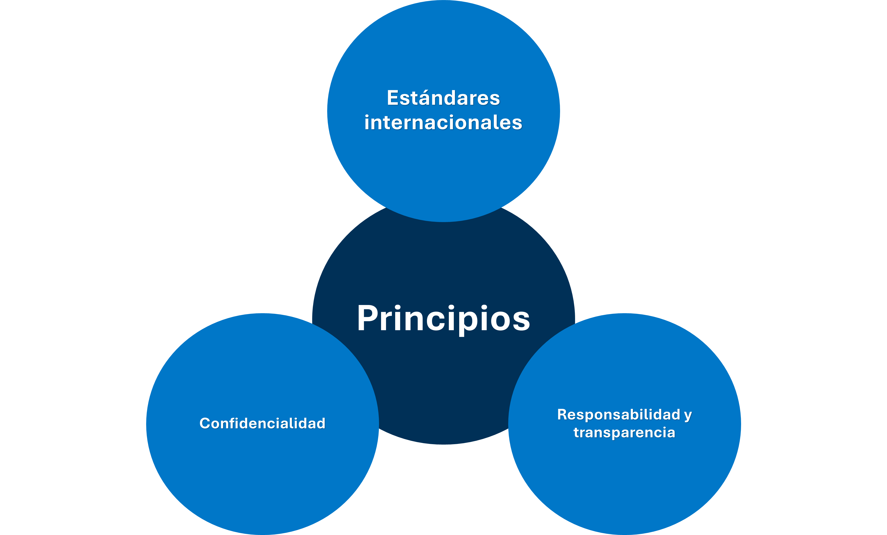
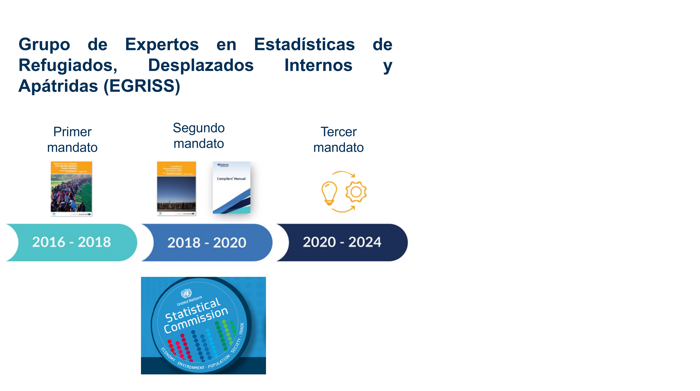
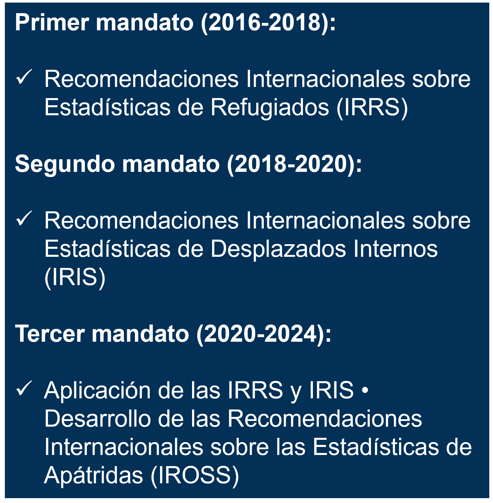

```{r setup, include = FALSE}
# remotes::install_github("mitchelloharawild/icons")
# devtools::install_github("hadley/emo")
library(knitr)                              # paquete que trae funciones utiles para R Markdown
library(tidyverse)                          # paquete que trae varios paquetes comunes en el tidyverse
library(datos)                              # paquete que viene con datos populares traducidos al español :)
library(emo)                                # paquete para emojislibrary(knitr)
library(tidyverse)
library(xaringanExtra)
library(icons) # # install.packages("remotes"); remotes::install_github("mitchelloharawild/icons")
library(fontawesome)

knitr::opts_chunk$set(echo = FALSE,         # FALSE: los bloques de código NO se muestran
                      dpi = 300,            # asegura gráficos de alta resolución
                      warning = FALSE,      # los mensajes de advertencia NO se muestran
                      error = FALSE)        # los mensajes de error NO se muestran
```

class: title-slide, middle, center
background-image: url(figures/Clases_Rladies_Slide1.png) 
background-position: 90% 75%, 75% 75%, center
background-size: 1210px,210px, cover

# `r rmarkdown::metadata$title`
----
## **`r rmarkdown::metadata$subtitle`**
### `r rmarkdown::metadata$author`
### `r rmarkdown::metadata$date`

---
name: hola
class: middle, center, inverse


# ¿Quiénes son las personas en situación de Desplazamiento Forzado Interno?  

## EGRISS (2020)


???
Se presenta un resumen de los elementos de definición. 

---
class: middle

.left-column[
# PDFI 
]
.right-column[
### Personas o grupos en situación de desplazamiento interno son quienes:  

1. Han sido **forzadas u obligadas** a huir o abandonar su hogar o lugar habitual de residencia.  
2. Que este desplazamiento tuvo lugar como resultado o para evitar los efectos de:  
**2.1. los conflictos armados**  
**2.2. violencia generalizada**  
**2.3. violaciones de derechos humanos**  
2.4. desastres naturales o causados por la acción humana  
3. Sin cruzar frontera internacionalmente reconocida alguna.
  
Para fines estadísticos las PDFI se distinguen de las personas **migrantes por cuestiones económicas y refugiadas** 

.footnote[
----
  Principios Rectores sobre Desplazamiento Forzado Interno (1998/2004).
]
]
---
class: center

## Iniciativas internacionales sobre las personas en situación de desplazamiento interno

.pull-left[
.left[

## Iniciativas

1. Cumbre Humanitaria Mundial (2016)   
2. Grupo de Alto Nivel del Secretario General de las Naciones Unidas sobre Desplazamiento Interno (2021)  
3. Resolución A/C.3/76/L.26/Rev.1(2021) de la Asamblea General  
4. Marco de Sendai para la Reducción del Riesgo de Desastres 2015-2030

]
]

.pull-right[
.left[
## Recomendaciones

1. Recopilación y análisis de datos:  
1.1. Establecer sistemas para recopilar, analizar y gestionar datos.
1.2. Aumento de la cobertura, calidad y disponibilidad. 
1.3. Datos desglosados. 
2. Uso de datos   
2.1. Emplear los datos para diseñar políticas, planes operativos y respuestas más eficaces. 

]
] 
---
name: adios
class: center, inverse
<br><br>
<br><br>
## Ahora ya conoces:  
.left[
✔️ los elementos que definen a las personas en situación de DFI  
✔️ la necesidad de contar con estadísticas oficiales sobre esta población 
]

## ¿Qué sigue?
.left[
➡️ se describirán las aplicaciones de las estadísticas sobre desplazamiento forzado en materia de políticas y programación y   
➡️ los desafíos que se enfrentan al producir datos sobre desplazados internos 
]
---
class: center, inverse

# Utilidad de producir estadísticas oficiales sobre DFI 
.pull-left[
## Para
.left[
## 1. Planear
## 2. Diseñar política pública  
## 3. Debate público
]
]

.pull-right[
## En áreas
.left[
## 1. Desarrollo sostenible
## 2. Paz
## 3. Seguridad
]
]
---

class: center, inverse

# Desafíos recurrentes
.pull-left[
## Desafío
.left[
### 1. Inconsistencias y variación 
### 2. Confiabilidad y precisión 
### 3. Exclusión
### 4. Coordinación 
]
]

.pull-right[
## En / De
.left[
### 1. Definiciones
### 2. Fuentes de datos
### 3. Muestra
### 4. Preguntas de identificación 
]
]

---
class: center
.center[
#Principios Fundamentales de las Estadísticas Oficiales de las Naciones Unidas
]




---
class: center
.center[
## EGRISS
]

.pull-left[
  .left[
    
  ]
  .pull-right[
  .right[
    
  ]
]
]
---


