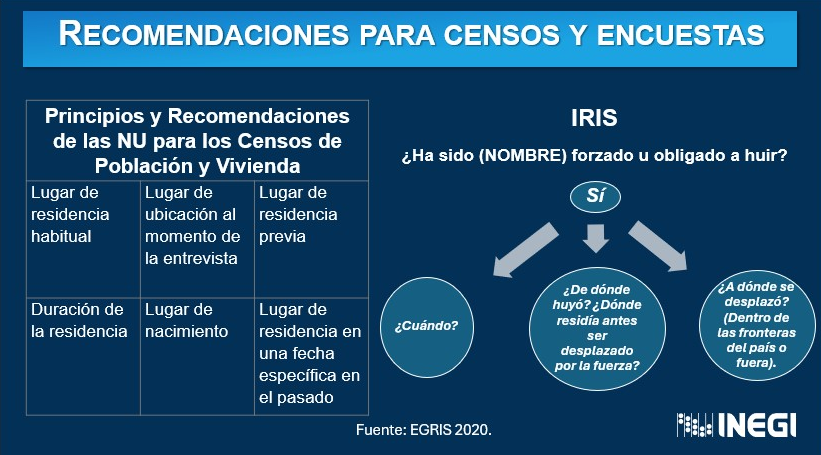

<style type="text/css">
.navbar {
  background-color: #0077C8 !important; /* Cambia este valor para ajustar el color del cintillo */
  border-color: #0077C8 !important; /* Opcional: cambia también el color del borde si es necesario */
}


TOC {
  color: #0077C8; 
}

.list-group-item.active, .list-group-item.active:focus, .list-group-item.active:hover {
    z-index: 2;
    color: #003057;
    background-color: #0077C8;
    border-color: #0077C8;
}

hr.cintillo {
  border: 3px solid #0077C8; /* Color y grosor del cintillo */
  margin: 20px 0; /* Espaciado arriba y abajo del cintillo */
}
</style>

<div style="color: #003057;">

```{r setup, include=FALSE}
knitr::opts_chunk$set(message=FALSE,warning=FALSE, cache=TRUE)
```
<hr style="border: 3px solid#0077C8;" />


# Lección 1. Recomendaciones para **censos** 


Recomendaciones para mejorar el uso de los *censos* para recopilar datos sobre desplazados internos.

Basándose en los Principios y recomendaciones de las Naciones Unidas para los censos de población y vivienda, el IRIS recomienda añadir preguntas específicas para captar mejor la información sobre el desplazamiento interno.

 </div>
  <div class="row-sm-3">
  
  


</a>
  </div>
  
  <p style="text-align:right; font-size: 12px; color: #706F6F;">
  Fuente: Naciones Unidas, IRIS
</p>


<br><br>
<hr style="border: 3px solid#0077C8;" />

# Lección 2. Recomendaciones para **encuestas** 

<iframe src="recomendaciones_encuestas.html" style="width: 800px; height: 600px; border: none;"></iframe>


<br><br>
<hr style="border: 3px solid#0077C8;" />


# Lección 3. Recomendaciones para **registros administrativos** 


Para los desplazados internos (IDPs), el IRIS recomienda que:

1. Los registros de población general deberían ser diseñados o modificados para incluir e identificar a los IDPs.
2. Se debe maximizar el número de bases de datos administrativas en las que se puedan identificar a los IDPs, ya sea incluyendo una variable específica o autorizando la vinculación entre diferentes bases de datos a una base de datos central que identifique a los IDPs con fines estadísticos.
3. Los titulares de registros entre varios actores nacionales e internacionales deberían usar terminología, definiciones, clasificaciones y convenciones de denominación de variables comunes.
4. Los datos derivados de los registros de IDPs deberían utilizarse para estadísticas en cumplimiento con la legislación relacionada con la privacidad y la protección de datos, y deben cumplir con las mejores prácticas de intercambio de datos.


<br><br>
<hr style="border: 3px solid#0077C8;" />


# Lección 4. Recomendaciones para **fuentes de datos alternativas** 

Las fuentes de datos alternativas, como los macrodatos y las técnicas relacionadas, como la integración de datos, también pueden presentar oportunidades importantes para mejorar la calidad de las estadísticas sobre desplazados internos.  

Los datos recopilados de diferentes fuentes servirán para distintos propósitos y tendrán sus propias limitaciones y lagunas. Cuando sea posible combinar datos de diferentes fuentes, los datos integrados pueden ofrecer un panorama más completo.

Por lo general, los datos administrativos se pueden combinar con datos de encuestas, o se pueden combinar dos o más fuentes administrativas. El método de integración aplicado depende del entorno de datos específico que prevalezca en un país determinado. Donde existen los Números de Identificación Personal (PINs), este proceso puede facilitarse más fácilmente.

En general, dos métodos principales de integración de datos son relevantes para las estadísticas de desplazamiento forzado, a saber:   
**1. la vinculación de registros y**   
**2. la concordancia estadística.**

Las siguientes son las recomendaciones clave de los Principios de la ONU que rigen las actividades estadísticas internacionales.  

### Recomendaciones Clave:

1. Adoptar un marco de aseguramiento de la calidad para la organización.

2. Esforzarse continuamente por mejorar la calidad y transparencia de las estadísticas mediante la introducción de innovaciones metodológicas y de sistemas.

3. Mejorar la competencia profesional del personal alentándolos a asistir a cursos de capacitación, publicar artículos científicos y participar en seminarios y conferencias.

4. Documentar y publicar los conceptos, definiciones, clasificaciones y metadatos utilizados por la organización.

5. Documentar cómo los datos son recopilados, procesados y difundidos por la organización (incluyendo información sobre los mecanismos de edición aplicados a los datos de los países y los métodos de agregación para calcular estimaciones regionales y globales).

6. Dar crédito, en la difusión de estadísticas internacionales, a la fuente original y utilizar los estándares de cita acordados al reutilizar estadísticas originalmente recopiladas por otros.

### Independencia de las Agencias Estadísticas

La independencia de una agencia estadística es fundamental para producir datos creíbles y estadísticas oficiales. Esto es particularmente importante para los datos sobre refugiados, desplazados internos (IDP) y apatridia, dada su sensibilidad política.

Consulta los criterios para garantizar la independencia de las agencias estadísticas.


# Lección 5. Recursos

[Descargar Recursos PDF](https://github.com/Danserca/DFIM/blob/master/docs/recursos_m3.pdf)

<br><br>

<hr style="border: 3px solid#0077C8;" />
# ¿Qué sigue?

➡️ Módulo 4. Metodología 

<br><br>
<br><br>
**Has llegado al final de este módulo. Esperamos que lo hayas disfrutado y te haya ayudado a comprender mejor las ventajas y desventajas de las diferentes fuentes de datos.**
