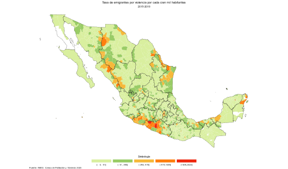
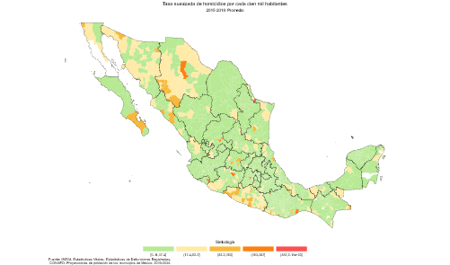
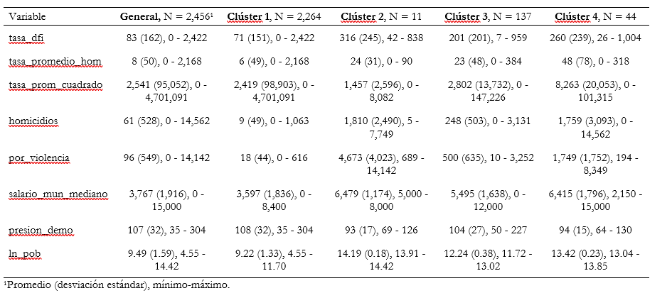

<style type="text/css">
.navbar {
  background-color: #0077C8 !important; /* Cambia este valor para ajustar el color del cintillo */
  border-color: #0077C8 !important; /* Opcional: cambia también el color del borde si es necesario */
}


TOC {
  color: #0077C8; 
}

.list-group-item.active, .list-group-item.active:focus, .list-group-item.active:hover {
    z-index: 2;
    color: #003057;
    background-color: #0077C8;
    border-color: #0077C8;
}

hr.cintillo {
  border: 3px solid #0077C8; /* Color y grosor del cintillo */
  margin: 20px 0; /* Espaciado arriba y abajo del cintillo */
}
</style>

<div style="color: #003057;">

```{r setup, include=FALSE}
knitr::opts_chunk$set(message=FALSE,warning=FALSE, cache=TRUE)
```
<hr style="border: 3px solid#0077C8;" />

# Siglas y acrónimos

<div class="two-columns">
<div class="column">
<p><strong><b>ACNUR.</b></strong> Oficina del Alto Comisionado de las Naciones Unidas para los Refugiados.</p>
<p><strong><b>AIC.</b></strong> Criterio de Información de Akaike.</p>
<p><strong><b>BIC.</b></strong> Criterio de Información Bayesiano.</p>
<p><strong><b>CCI.</b></strong> Corte Penal Internacional.</p>
<p><strong><b>CEAVE.</b></strong> Comisión Ejecutiva de Atención a Víctimas del Estado de Chihuahua.</p>
<p><strong><b>CENSO 2020.</b></strong> Censo de Población y Vivienda 2020.</p>
<p><strong><b>CMDPDH.</b></strong> Comisión Mexicana de Defensa y Promoción de los Derechos Humanos.</p>
<p><strong><b>CV.</b></strong> Coeficientes de Variación.</p>
<p><strong><b>DFI.</b></strong> Desplazamiento Forzado Interno/Desplazada Forzada Interna.</p>
<p><strong><b>DP2.</b></strong> Índice de intensidad migratoria.</p>
<p><strong><b>ECADEFI-CHIH.</b></strong> Encuesta para Caracterizar a la Población en Situación de Desplazamiento Forzado Interno en el Estado de Chihuahua.</p>
<p><strong><b>EGRISS.</b></strong> Grupo de Expertos en Estadísticas sobre Refugiados Desplazados Internos y Apátridas.</p>
<p><strong><b>ENADID.</b></strong> Encuesta Nacional de la Dinámica Demográfica.</p>
<p><strong><b>ENOE.</b></strong> Encuesta Nacional de Ocupación y Empleo.</p>
</div>

<div class="column">
<p><strong><b>ENVIPE.</b></strong> Encuesta Nacional de Victimización y Percepción sobre Seguridad Pública.</p>
<p><strong><b>HFSSSD.</b></strong> Encuesta de Alta Frecuencia de Sudán del Sur.</p>
<p><strong><b>ICTY.</b></strong> Tribunal Penal Internacional para la ex Yugoslavia.</p>
<p><strong><b>IDMC.</b></strong> Centro de Monitoreo de Desplazamiento Interno.</p>
<p><strong><b>INE.</b></strong> Instituto Nacional de Estadística.</p>
<p><strong><b>INEGI/Instituto.</b></strong> Instituto Nacional de Estadística y Geografía.</p>
<p><strong><b>IRIS.</b></strong> Recomendaciones Internacionales sobre Estadísticas de Personas Desplazadas Internamente.</p>
<p><strong><b>IRRS.</b></strong> Recomendaciones Internacionales sobre Estadísticas de Refugiados.</p>
<p><strong><b>JIPS.</b></strong> Joint IDP Profiling Service.</p>
<p><strong><b>ONE.</b></strong> Oficinas nacionales de estadística.</p>
<p><strong><b>PRINCIPIOS RECTORES.</b></strong> Principios Rectores de los Desplazamientos Internos de la Organización de las Naciones Unidas.</p>
<p><strong><b>SNIEG.</b></strong> Sistema Nacional de Información Estadística y Geográfica.</p>
<p><strong><b>SNIGSPIJ.</b></strong> Subsistema Nacional de Información sobre Gobierno Seguridad Pública e Impartición de Justicia.</p>
</div>
</div>


<br><br>
<hr style="border: 3px solid#0077C8;" />

# 1. Integración y reconciliación  

El EGRISS reconoce la complejidad de encontrar una única fuente de datos que proporcione una imagen completa y precisa de la población en situación DFI. Ante este desafío, el EGRISS (2023) propone la integración de diversas fuentes de información como estrategia fundamental para mejorar la cobertura, disponibilidad, frecuencia, oportunidad, calidad y precisión de las estadísticas sobre DFI.    

La integración de diferentes fuentes permite aprovechar las fortalezas de cada una y compensar sus posibles limitaciones individuales. Esto facilita la obtención de una visión más amplia y confiable de la situación del DFI, incluyendo a grupos poblacionales específicos que podrían quedar excluidos de una sola fuente. Además, estas técnicas racionalizan las tareas de las Oficinas Nacionales de Estadística (ONE) al enriquecer la información recopilada para producir estadísticas sin aumentar costos ni la carga de respuesta de los informantes (Naciones Unidas, 2020).  

La integración de fuentes puede ofrecer una imagen más completa del fenómeno, sobre todo en casos donde una encuesta tiene cobertura amplia pero información limitada sobre variables de DFI, y otra tiene cobertura limitada pero información más detallada sobre estas variables. La integración de datos es especialmente útil cuando ninguna de las fuentes cubre por completo ni de manera precisa a una población determinada, cuando hay diferentes estimaciones para el mismo fenómeno, como es el caso de las estadísticas sobre DFI en México, donde ninguna cifra ni estimación coincide, sino que, por el contrario, difieren considerablemente con se aprecia en la Tabla 3. Existen aproximaciones nacionales y por entidad federativa, en el marco y fuera del marco del del Sistema Nacional de Información Estadística y Geográfica (SNIEG).  


```{r, echo=FALSE, message=FALSE}
library(knitr)
library(kableExtra)

# Crear la tabla de datos
tabla_datos <- data.frame(
  Características = c("Objetivo general", "Periodo de referencia", "Selección de la muestra", 
                      "Unidades de observación", "Población objeto de estudio", "Periodo de levantamiento", 
                      "Cobertura geográfica"),
  ENVIPE_2018 = c("Estimar el número de víctimas y número de delitos ocurridos, cifra negra, costos de delitos, percepción de inseguridad…", 
                  "Enero – diciembre para victimización.", 
                  "Probabilístico: trietápico, estratificado y por conglomerados.", 
                  "Las viviendas seleccionadas, los hogares, los residentes del hogar y la persona seleccionada en el hogar.",
                  "Población de 18 años y más", 
                  "Marzo - abril 2018", 
                  "A nivel Nacional, Nacional urbano, Nacional rural, Entidad Federativa y 34 Áreas Metropolitanas de interés"),
  ENADID_2018 = c("Proporcionar información estadística … de la dinámica demográfica: fecundidad, mortalidad y migración (interna e internacional).", 
                  "Cinco años antes (agosto 2013).", 
                  "Probabilístico, bietápico y por conglomerado estratificado.", 
                  "Vivienda particular habitada, residente habitual, Hogar, migrante internacional, Mujer de 15 a 54 años.", 
                  "Residente habitual del hogar, residentes habituales y migrantes internacionales.", 
                  "3 de agosto al 5 de octubre de 2018.", 
                  "Nacional (urbano de 2 500 habitantes y más, rural hasta 2 499 habitantes), entidad federativa y tamaños de localidad."),
  Censo_2020 = c("Producir información sobre la dimensión, estructura y distribución espacial de la población", 
                 "Cinco años antes (marzo 2015).", 
                 "-", 
                 "-", 
                 "Residentes habituales del territorio nacional, las viviendas particulares, y migrantes internacionales.", 
                 "2 al 27 de marzo de 2020", 
                 "Nacional, entidad federativa, municipio o demarcación territorial, localidad, AGEB, manzana urbana."),
  IDMC = c("Proveer la Base de Datos Global sobre Desplazamientos Internos.", 
           "-", 
           "-", 
           "Hogares, Personas", 
           "DFI", 
           "-", 
           "Mundial")
)

# Crear la tabla
kable(tabla_datos, align = "c", caption = "<span style='font-size: 20px;'>Comparación de Características de Fuentes de Datos</span>") %>%
  kable_styling(full_width = TRUE, bootstrap_options = c("striped", "hover", "condensed"))
```


El SNIEG aborda el tema del DFI desde,  al menos, dos de sus subsistemas, desde el Subsistema Nacional de Información de Gobierno, Seguridad Pública e Impartición de Justicia y desde el Subsistema de Información Nacional de Información Demográfica. En el marco del primer subsistema, la ENVIPE proporciona información sobre las personas que se cambian de vivienda o lugar de residencia para protegerse de la delincuencia. En el marco del segundo, la Encuesta Nacional de la Dinámica Demográfica (ENADID) y el Censo 2020 permiten aproximarse al DFI.  

Esas fuentes tienen como objetivo recopilar información sobre temas similares, como la migración por inseguridad pública, delictiva o violencia, pero difieren en metodología de muestreo, diseño de cuestionario, periodo de referencia y población objetivo. 


Los métodos de estimación multifuente abordan desafíos específicos asociados con la comparación y reconciliación de datos de diferentes fuentes, como la alineación de categorías de variables, el manejo de valores atípicos y la corrección de sesgos de cobertura. Esto puede mejorar la calidad de las estimaciones y proporcionar una base más sólida para la toma de decisiones y políticas públicas relacionadas con la migración por violencia.
Las técnicas de integración se dividen en dos grandes tipos: de consolidación y vinculación. Las técnicas de consolidación consisten en crear un conjunto unificado de datos, de esta manera se consigue un mayor número de observaciones. Las técnicas de vinculación, en cambio, se refieren a los procedimientos mediante los que dos o más conjuntos de datos se unen a partir de una variable de identificación única, llave o clave, de esta manera se consiguen más atributos de las observaciones. En ambos casos las variables deben ser seleccionadas, transformadas y cargadas (proceso ETL, por sus siglas en inglés). A lo largo de este proceso es necesario verificar la coherencia y armonización de los conjuntos de datos (Naciones Unidas 2020, l. 808).  

Es de esperarse que entre fuentes haya diferencias en las definiciones de variables, de ahí que a partir de los valores observados disponibles es necesario estimar los valores para las variables objetivo de acuerdo con la definición deseada, a este paso se le denomina alineación de mediciones. Una vez realizadas la consolidación y vinculación, es posible implementar diversos métodos de estimación, a nivel micro y agregado. Cuando se trata de datos de encuesta se calculan las ponderaciones mediante regresión para todas las observaciones del nuevo conjunto de datos obtenido a partir de la integración (Naciones Unidas 2020). Las ponderaciones originales de cada una de las encuestas se ajustan calibrándolas, es decir, la ponderación de regresión se calibra sobre estos valores conocidos o estimados previamente.


<br><br>
<br><br>
<div style="text-align: center;">
  <p><strong>Figura 2. Tasa de personas que cambiaron de lugar de residencia y atribuyeron a la violencia dicho cambio por cada cien mil habitantes, 2015-2019</strong></p>
  
  
</div>

  
<br><br>
<hr style="border: 3px solid#0077C8;" />

# 2. Estimación a partir de integración de ENADID (2018) y ENVIPE (2018)

### [**Descarga el proyecto aquí**](https://365inegi-my.sharepoint.com/:f:/g/personal/daniela_serrano_inegi_org_mx/EkfBlBSyLU5Jp3PURUpAJfwBMzCnl9w3Ci2eZlAES3pCfQ?e=1m6shK)
<br><br>

A partir de la integración de datos de distintas fuentes, se siguen diversas estrategias empíricas para estimar el número de personas en situación de DFI asociado a la delincuencia, inseguridad y violencia. Para estimar el número de personas en situación de DFI en México, se consolidaron y armonizaron los conjuntos de datos de la ENVIPE 2018 y la ENADID 2018. Basándose en las definiciones del EGRISS (2020, 2023), se crearon variables para identificar a las personas en situación de DFI. Los ponderadores de la muestra se calibraron para corregir posibles sesgos y asegurar la representatividad de la población objetivo. Se empleó el método de estimación Horvitz-Thompson para estimar el número de personas en situación de DFI a nivel nacional y por entidad federativa. Finalmente, se evaluó la confiabilidad de los resultados a partir de la estimación de los coeficientes de variación (CV). 

Por defecto, las funciones como svymean y svytotal en el paquete survey utilizan el estimador de Horvitz-Thompson, siempre que los pesos se hayan definido correctamente en svydesign. Esto se basa en la teoría muestral de que el peso es el inverso de la probabilidad de selección, lo cual es el principio del estimador Horvitz-Thompson.

Por otra parte, se analizaron las macro determinantes de la emigración. Para esto, se consideraron las emigraciones por razón de inseguridad delictiva y violencia y por razones distintas a esta, tales como las emigraciones por razones de trabajo, escuela o familia. Se utilizaron datos agregados a nivel municipal del Censo 2020 y de las estadísticas vitales. Se hicieron los cálculos para cada municipio y se establecieron las variables auxiliares. Se estimaron modelos de regresión.

## 3.1. Calibración del ponderador en integración de la ENVIPE 2018 y ENADID 2018   

Para estimar el número de personas en situación de DFI atribuido a la violencia se emplearon métodos de integración de datos, se calibraron los ponderadores, de esta manera, se ajustaron los pesos muestrales para que las estimaciones del nuevo conjunto de datos integrado reflejen adecuadamente a la población conocida. Esta técnica se informa de las características conocidas de la población y de muestreos de base. Las primeras se obtuvieron del Censo 2020; para los segundos se consultaron y siguieron los marcos conceptuales y diseños muestrales de los programas estadísticos utilizados (INEGI 2019c; 2020; 2019a; 2018b; 2019b) La disposición de una mayor información puede contribuir a mejorar la precisión de los estimadores, reduciendo el error muestral y los coeficientes de variación.  

### 3.1.1. Datos  
Se usaron datos de la ENVIPE 2018 y la ENADID 2018, por sus similitudes en periodos de levantamiento de información y diseño muestral. Con estos datos se llevó a cabo un proceso de preparación, transformación y creación de variables de interés para ambas encuestas.

En el caso de la ENADID 2018 se unieron las tablas que componen su base de datos, a partir de las llaves primarias. La base de datos de esta encuesta se estructura en 4 tablas. Solo se unieron las tablas con las variables de interés. En este caso se unieron la Tabla de hogares (THogar) y la tabla de datos sociodemográficos de (TSDem). La primera tabla THogar concentra información relativa a los hogares dentro de las viviendas seleccionadas para la aplicación de la encuesta, específicamente en esta tabla se incluyen la contabilización del número de integrantes del hogar, de identificación, UPM, VIV_SEL, y consecutivo del hogar; variables de Identificación Geográfica, ENT y TAM_LOC. Se incluye un ponderador FAV_VIV y variables de estratificación. La tabla THogar incluye dos variables de identificación única a nivel registro: Llave de vivienda y Llave de hogar. La segunda tabla, TSDem, contiene las variables de identificación upm, viv_sel, hogar, n_ren que sirven para relacionar todas las tablas de la encuesta, así como variables de identificación geográfica: la Entidad federativa (ent) y Tamaño de localidad (tam_loc). Además, contiene variables de interés como: Sexo, Edad, Entidad de residencia en 2017, Causa de migración reciente. 


```{r, echo=FALSE, warning=FALSE, message=FALSE}
library(knitr)
library(kableExtra)

# Crear la tabla con los datos
tabla_dfi <- data.frame(
  Instrumento  = c("Censo Nacional de Población y Vivienda 2020 (Censo 2020)",
                             "Encuesta Nacional de Victimización y Percepción sobre Seguridad Pública (ENVIPE)",
                             "Encuesta Nacional de la Dinámica Demográfica (ENADID)",
                             "Encuesta Nacional de Ocupación y Empleo (ENOE)",
                             "Encuesta para Caracterizar a la Población en situación de Desplazamiento Forzado Interno en el Estado de Chihuahua (ECADEFI - CHIH)",
                             "IDMC",
                             "Recomendaciones EGRISS"),
  Años = c("2020", "2011-2021", "2014 y 2018", "2005-2021", "2021", "2009-2023", "2023"),
  Pregunta = c("¿En qué municipio (alcaldía) vivía (NOMBRE) en marzo de 2015? ¿Por qué (NOMBRE) dejó de vivir en (MUNICIPIO O ALCALDÍA O PAÍS)?",
               "Durante (AÑO), para protegerse de la delincuencia, ¿en este hogar se realizó algún tipo de medida como... cambiarse de vivienda o lugar de residencia?",
               "Hace un año, en agosto de 2017, ¿en qué estado de la República Mexicana o país vivía (NOMBRE)? ¿Por qué (NOMBRE) dejó de vivir en (ENTIDAD O PAÍS...?",
               "¿En qué municipio (alcaldía) vivía ... hace un año? ¿Cuál es el motivo principal por el que se fue? ...Inseguridad pública",
               "De enero de 2008 a la fecha, ¿algún integrante de esta (su) vivienda, incluido(a) usted, tuvo que cambiar de vivienda?",
               "Seguimiento de los desplazamientos por eventos para analizar y producir estimaciones basadas en la ubicación, fecha del incidente, desencadenantes, causas y duración.",
               "P1. Mientras vivía en [país de la encuesta], ¿[usted/NOMBRE] alguna vez tuvo que huir de su hogar? P2. ¿Cuál es la razón principal por la que [usted/NOMBRE] tuvo que huir de casa?"),
  'Categorias de respuesta' = c("Por inseguridad delictiva o violencia",
                           "Delincuencia",
                           "Por inseguridad pública o violencia",
                           "Inseguridad pública",
                           "Por enterarse o ser testigo de delitos en el entorno como robo, asalto, extorsión, homicidios, etcétera",
                           "N/A",
                           "Razones de seguridad, conflictos armados y violencia generalizada"),
  stringsAsFactors = FALSE
)

# Crear la tabla utilizando kableExtra
tabla_dfi %>%
  kbl(caption = "Tabla 2. Aproximaciones nacionales al DFI", align = "l") %>%
  kable_styling(full_width = TRUE, bootstrap_options = c("striped", "hover", "condensed", "responsive")) %>%
  add_footnote(c("Fuente: elaboración propia con datos de INEGI, EGRISS e IDMC."))

```

### Entorno de trabajo y librerías

Antes de importar los datos, cargamos las librerías necesarias para el análisis:  

Para realizar análisis de datos de manera eficiente, se utilizaron los siguientes paquetes en R: dplyr es esencial para manipular y transformar los datos de forma ágil, como seleccionar variables, filtrar observaciones y crear nuevas columnas. foreign permite leer archivos DBF, un formato común en bases de datos sociales. survey es fundamental para el análisis de datos provenientes de encuestas complejas, considerando el diseño muestral. janitor facilita la limpieza y organización de los nombres de las columnas, asegurando una mejor legibilidad y consistencia. Finalmente, openxlsx se empleó para exportar los resultados del análisis a archivos de Excel, un formato ampliamente utilizado para compartir y presentar los hallazgos.

```{r, eval=FALSE}
rm(list=ls()); graphics.off(); options(scipen = 999)
paquetes <- c(
  "dplyr", "janitor", "survey", "openxlsx", "tidyverse",
  "data.table", "readxl", "writexl", "PracTools", "haven", 
  "knitr", "kableExtra", "equatiomatic"
)
for (i in paquetes) {if (!require(i, character.only = TRUE)) {install.packages(i);library(i, character.only = TRUE)} else {library(i, character.only = TRUE)}}
```

### Cargar y preparar datos de ENADID 2018

En esta fase describe la limpieza de los datos y su preparación para el análisis. Está formada por subprocesos que verifican, limpian y transforman los datos de entrada, de modo que puedan analizarse. 
Leemos y preparamos los datos de ENADID. Esto incluye la limpieza de variables y la creación de nuevas variables necesarias para el análisis.

Empezamos cargando los datos de la [ENADID 2018](https://www.inegi.org.mx/contenidos/programas/enadid/2018/datosabiertos/conjunto_de_datos_enadid_2018_csv.zip)

```{r, eval=FALSE}
# Cargar ENADID para integración
# Leer datos y asignarlos a objeto
enadid_thogar <- read_csv("data/conjunto_de_datos_thogar_enadid_2018/conjunto_de_datos/conjunto_de_datos_thogar_enadid_2018.csv")
enadid_tsdem <- read_csv("data/TSDem.csv")


# Unir conjunto de datos 
enadid <- enadid_tsdem %>% left_join(enadid_thogar) %>% clean_names()

```

Una vez que se unieron ambas tablas, se obtuvo un conjunto de datos a nivel individual de 385,978 observaciones. A partir de este conjunto se creó la variable emi_int_viol para identificar a las personas que experimentaron un cambio de residencia entre la fecha del levantamiento de la información y agosto de 2017 (un año atrás) y atribuyeron el cambio a situaciones de inseguridad pública o violencia. 
Con fines de validación, se estimó la población de 5 años y más de edad migrante interna, por entidad federativa de residencia en agosto de 2013 según causa de la migración. A partir del método de cálculo utilizado se llegó al mismo resultado que el INEGI publica en los Tabulados. No se pudo validar directamente la cifra de interés, es decir, la población de 5 años y más de edad migrante interna, por entidad federativa de residencia en agosto de 2017 según causa de la migración ya que no es parte de la información que se publica en los Tabulados.     Para fines de calibración, adicionalmente, se creó la variable edad_quin para clasificar a los individuos en grupos quinquenales de edad, tomando como base la variable continua de edad. Para poder unir esta base a la de la ENVIPE, se renombraron las variables de manera que coincidieran. Asimismo, se seleccionaron solo las variables iniciales de interés. 

```{r, eval=FALSE}
# Renombrar y crear variables 
enadid <- enadid %>% 
  rename(cve_ent=ent)
enadid$p3_19ac <- ifelse(enadid$p3_19ac == "99", NA, enadid$p3_19ac)
enadid$p3_12ac <- ifelse(enadid$p3_12ac == "99", NA, enadid$p3_12ac)
enadid$edad <- ifelse(enadid$edad == "999", NA, enadid$edad)
enadid$edad <- as.numeric(enadid$edad)
enadid$misma_res <- ifelse(enadid$cve_ent == enadid$p3_12ac, 1, 0) #identificar a las personas que experimentaron un cambio de residencia entre la fecha del levantamiento de la información y agosto de 2017 (un año atrás) 

# Se considera emigrante por inseguridad y violencia
enadid$emi_int_viol <- ifelse(enadid$p3_13== 8 & enadid$misma_res == 0, 1, 0) #Atribuyeron el cambio a situaciones de inseguridad pública o violencia 


# Conversión a tipo numérico las variables de tipo factor y homologacion de nombre con ENVIPE
enadid$fac_ele <- as.numeric(as.character(enadid$fac_viv))
```

Creamos una nueva variable, edad_quin, a partir de la variable edad de la ENADID. Esta nueva variable categoriza a los individuos en quinquenios de edad, lo cual es útil para análisis demográficos y sociales y recalibrar.


```{r, eval=FALSE}
# Crear la variable de factor edad_quin con los niveles especificados

# Crear los cortes para definir los niveles de la variable edad_quin
cortes <- c(0, 4, 9, 14, 19, 24, 29, 34, 39, 44, 49, 54, 59, 64, 130)

# Crear la variable factor edad_quin
enadid$edad_quin <- cut(as.numeric(enadid$edad), breaks = cortes, labels = c("pob_00_04", "pob_05_09", 
                                                                             "pob_10_14", "pob_15_19", "pob_20_24", 
                                                                             "pob_25_29", "pob_30_34", "pob_35_39", 
                                                                             "pob_40_44", "pob_45_49", "pob_50_54", 
                                                                             "pob_55_59", "pob_60_64", "pob_65_mm"), include.lowest = TRUE)


enadid_int <- enadid %>% dplyr::select(edad, edad_quin, sexo, upm, upm_dis, est_dis, fac_ele, cve_ent, emi_int_viol)


# Conversión a tipo numérico las variables de tipo factor
enadid_int$sexo <- as.factor(as.numeric(enadid_int$sexo))

```

### Cargar y preparar datos de ENVIPE 2018

De manera similar, preparamos los datos de ENVIPE.


La base de datos de la ENVIPE 2021 se integra por 6 tablas, de las cuales solo se necesitaron dos, Tabla de residentes del hogar (TSDem) y Tabla de percepción sobre seguridad y desempeño institucional (TPer_Vic1). La primera contiene las características sociodemográficas de los integrantes del hogar y sirvió para conocer el número de integrantes de cada hogar. La Tabla de percepción sobre seguridad y desempeño institucional (TPer_Vic1) contiene información relacionada con la percepción sobre seguridad pública en el ámbito geográfico del informante, las conductas antisociales en su entorno inmediato y los cambios de hábitos por temor a ser víctima de la delincuencia en 2017. A partir de esta Tabla se identificaron los hogares que habían cambiado de vivienda o residencia por temor a la delincuencia entre 2017 y la fecha del levantamiento de la ENVIPE. 
Al igual que se hizo con la ENADID 2018, se creó la variable emi_int_viol. En este caso, la variable identifica a las personas que declararon haberse cambiado de vivienda o residencia como medida de protección ante la delincuencia, dada a partir de la variable original AP4_11_10. La variable emi_int_viol tomó el valor de 1 cuando AP4_11_10 tomó el valor de “1”, y 0 cuando AP4_11_10 tomó el valor de “0”. Una vez que se obtuvieron las variables necesarias, ambas tablas se unieron mediante el identificador de hogar (ID_HOG) y se seleccionaron solo las 9 variables de interés.   


Se obtuvo un conjunto de datos a nivel individual de 91,541 observaciones.  

La ENVIPE 2021 cuenta con ocho factores de expansión, FAC_VIV, FAC_HOG, FAC_ELE, FAC_DEL, FAC_VIV_AM, FAC_HOG_AM , FAC_ELE_AM y FAC_DEL_AM. El primero está asociado a la vivienda (FAC_VIV), el segundo corresponde a los hogares (FAC_HOG); el tercero está relacionado con las personas de 18 años y más (FAC_ELE) y el cuarto expande cada delito captado en el módulo sobre victimización (FAC_DEL). Además, debido al interés para obtener estimaciones sobre determinados indicadores de la ENVIPE 2021 en ciudades o áreas metropolitanas, se han añadido el factor vivienda de área metropolitana (FAC_VIV_AM), el factor hogar de área metropolitana (FAC_HOG_AM), el factor de personas elegidas en el área metropolitana (FAC_ELE_AM) y el factor delito del área metropolitana (FAC_DEL_AM). Estos cuatro factores son análogos a los asociados a los hogares, pero ajustados a las 33 áreas metropolitanas que se detallan en la tabla posterior (INEGI 2018a).  

El factor vivienda (FAC_VIV) es el ponderador que se utiliza para estimar resultados de las preguntas que se refieren a las viviendas y la población en general. El factor hogar (FAC_HOG)  es el ponderador que se utiliza para estimar resultados de las preguntas que se refieren a los hogares y la población en general. El factor de personas elegidas (FAC_ELE) es el ponderador para estimar resultados de las preguntas de percepción de la seguridad pública y la victimización de la población de 18 años y más. El factor delito es el ponderador que se utiliza para estimar resultados de los delitos registrados en el “Módulo de delitos”. Los factores con terminación _AM están ajustados para las 33 áreas metropolitanas (INEGI, 2018a).  

De acuerdo con el Marco conceptual de la ENVIPE 2018, la prevención y protección ante el delito es uno de los componentes y aspectos conceptuales en las encuestas de victimización. En este componente se incluyen preguntas sobre el tipo de precauciones para protegerse o prevenir el delito. En la ENVIPE 2018 se consideró que el cambio de rutinas es un importante indicador de inseguridad porque es una manifestación real del temor a la delincuencia que incide en la vida de las personas. Una de las medidas de protección que considera es el cambio de vivienda, desde esta perspectiva, el cambio de vivienda sería un proxy de temor al delito, es decir, una medida indirecta de la variable de interés, delincuencia. Las variables proxy son comúnmente utilizadas en estudios empíricos cuando la variable de interés no puede ser observada directamente o cuando los datos disponibles son limitados. Sin embargo, es importante tener en cuenta que una variable proxy no siempre refleja con precisión la variable subyacente que se intenta medir, y su uso conlleva limitaciones y riesgos de sesgos.  
	
Considerando lo anterior y como primera aproximación, se buscó determinar el número de hogares que, durante el año 2017, tomaron medidas para protegerse de la delincuencia, como mudarse de vivienda o residencia. La estimación inicial, basada en la pregunta de la encuesta "¿Durante 2017, para protegerse de la delincuencia, ¿en este hogar se realizó algún tipo de medida como cambiarse de vivienda o lugar de residencia?", arrojó un total de 315,330 hogares.  
	
Al tratarse de una pregunta sobre la percepción de la seguridad pública, surge la posibilidad de utilizar el factor de expansión de personas elegidas (FAC_ELE) para realizar estimaciones poblacionales. Este método, sin embargo, no coincide con los resultados publicados en los tabulados oficiales. El estimador Horvitz-Thompson, basado en el FAC_ELE, estima un total de 715 mil 971 personas que tomaron medidas para protegerse de la delincuencia, mientras que los tabulados oficiales reportan un total de un millón 133 mil 041 personas. Asimismo se buscó replicar el método de cálculo del INEGI. Para conseguirlo, el factor de expansión que corresponde a los hogares se multiplicó por el número de integrantes del hogar y así se obtuvo un nuevo factor base de expansión. Este método supone que todas las personas integrantes del hogar cambiaron de vivienda o lugar de residencia por la misma razón y más o menos en las mismas condiciones. Sin embargo, el EGRISS (2023) sugiere que no siempre todos los integrantes de un hogar son personas en situación de DFI, sino que las personas en dicha situación “pueden vivir en campamentos exclusivos o en casas entre la población general, ya sea como parte de otro hogar o como un hogar independiente” (EGRISS 2023c, 16). Adicionalmente, la información sobre actitudes, intenciones de mudarse y poder de toma de decisiones en el hogar puede variar según el género de la persona informante. Para garantizar datos más confiables es recomendable utilizar un protocolo de selección aleatoria de mujeres y hombres encuestados dentro de un hogar muestreado, o entrevistar a más de un miembro de cada hogar (EGRISS 2023c, 16).  

Por lo anterior, se usaron dos factores de expansión base para la ENVIPE, FAC_ELE y FAC_HOGAR multiplicado por el número de integrantes del hogar. A partir de estos pesos base de la ENVIPE 2018 y de los pesos base de la ENADID 2018 se realizó la calibración. Para lograrlo, ambos conjuntos de datos se integraron en uno solo, de manera vertical. Se obtuvo un solo conjunto con 477 mil 519 observaciones y nueve variables. 


```{r, eval=FALSE}
# Preparar ENVIPE
# Tablas que se usarán para los cálculos de Prevalencia Delictiva, Incidencia Delictiva y Cifra Negra
tsd <- read.dbf("data/TSDem.dbf") # Tabla del Sociodemográfico
tpv1<- read.dbf("data/TPer_Vic1.dbf") %>% 
  dplyr::select("ID_VIV", "ID_HOG", "ID_PER", "UPM", "VIV_SEL", "HOGAR", "RESUL_H", "R_SEL", "SEXO", "EDAD", "AREAM", "CVE_ENT", "NOM_ENT", "CVE_MUN", "FAC_ELE", "FAC_HOG", 
                "DOMINIO", "ESTRATO", "EST_DIS", "UPM_DIS", "CVE_ENT", "AP4_11_10") # Tabla Principal de Victimización 1

```

```{r, eval=FALSE}
# Conversión a tipo numérico las variables de tipo factor
tpv1$FAC_ELE <- as.numeric(as.character(tpv1$FAC_ELE))
tpv1$FAC_HOG <- as.numeric(as.character(tpv1$FAC_HOG))
tsd$FAC_HOG <- as.numeric(as.character(tsd$FAC_HOG))


# Construcción de la variable de Entidad, se substrae los dos primeros dígitos de la variable UPM
tpv1$ENT <- substr(tpv1$UPM,1,2)
```

```{r, eval=FALSE}
#Crear llaves

# Unir bases
# Pegar 
int_hog <- tsd %>% 
  group_by(ID_HOG) %>% 
  summarise(integrantes=n())

envipe <- tpv1 %>% 
  left_join(int_hog) %>% 
  dplyr::select(-ends_with(".y")) %>% 
  clean_names()
```

Al igual que ocn la ENADID, creamos una nueva variable, edad_quin, a partir de la variable edad de la ENADID. Esta nueva variable categoriza a los individuos en quinquenios de edad, lo cual es útil para análisis demográficos y sociales y recalibrar.

```{r, eval=FALSE}
# Construcción de las variables
# envipe$emi_int_viol <- ifelse(envipe$ap4_11_10%in%"1",1,0)
envipe$emi_int_viol <- case_when(envipe$ap4_11_10=="1"~1, TRUE ~ 0)

# Crear los cortes para definir los niveles de la variable edad_quin
cortes <- c(0, 4, 9, 14, 19, 24, 29, 34, 39, 44, 49, 54, 59, 64, 130)

# Crear la variable factor edad_quin
envipe$edad_quin <- cut(as.numeric(envipe$edad), breaks = cortes, labels = c("pob_00_04", "pob_05_09", 
                                                                             "pob_10_14", "pob_15_19", "pob_20_24", 
                                                                             "pob_25_29", "pob_30_34", "pob_35_39", 
                                                                             "pob_40_44", "pob_45_49", "pob_50_54", 
                                                                             "pob_55_59", "pob_60_64", "pob_65_mm"), include.lowest = TRUE)

# Se genera un factor a partir del factor de expansion de hogar multiplicado por el número de habitantes promedio en 2017/ TAMAÑO DEL HOGAR (VER https://www.inegi.org.mx/contenidos/programas/enh/2017/doc/enh2017_resultados.pdf)
envipe <- envipe %>% 
  mutate(fac_ele=as.numeric(fac_hog)*integrantes)
# Seleccionar variables para integrar

envipe_int <- envipe %>% dplyr::select(edad, edad_quin, edad, sexo, upm, upm_dis, est_dis, fac_ele, cve_ent, emi_int_viol)

# Conversión a tipo numérico las variables de tipo factor
envipe_int$upm <- as.character(as.factor(envipe_int$upm))
envipe_int$upm_dis <- as.character(as.factor(envipe_int$upm_dis))
envipe_int$est_dis <- as.character(as.factor(envipe_int$est_dis))
envipe_int$cve_ent <- as.character(as.factor(envipe_int$cve_ent))
```

Unimos las bases de datos de ENADID y ENVIPE para la estimación conjunta.
```{r, eval=FALSE}
## Unir bases
integrar <- rbind(enadid_int, envipe_int) 
```

### Raking
Un método comúnmente utilizado de algoritmos de calibración es el raking (también conocido como ajuste proporcional iterativo) (Deming y Stephan 1940). Este método emplea el algoritmo de Newton-
Raphson (Deville y Sarndal 1992; Deville, Sarndal, y Sautory 1993). De acuerdo con Deville, Sarndal, y Sautory (1993), este algoritmo ofrece una solución general, eficiente y distinta de la versión clásica W. E. Deming (ajuste proporcional iterativo). La diferencia, consiste en que el primero es una generalización del segundo, busca la convergencia y optimización mediante la minimización de la función de distancia entre los pesos base u originales y los nuevos pesos. Para calcular los nuevos pesos, se resuelven las ecuaciones de calibración.  

El muestreo estratificado junto al ajuste proporcional iterativo, en particular, preserva las ventajas de la estratificación (que puede basarse en estratos geográficos) y de los  recuentos de grupos de edad conocidos (Deville, Sarndal, y Sautory 1993, 1015).  

El Instituto Nacional de Estadísticas y Estudios Económicos (INSEE por sus siglas en francés), agencia nacional de estadística francesa, desde 1940 emplea los métodos raking de calibración para producir ponderaciones para encuestas de hogares. Para esto desarrollaron el programa CALMAR de SAS.  

En este trabajo, las ponderaciones se crearon con la función raking del paquete survey de R (Lumley 2023), utilizando las distribuciones marginales de las variables de ajuste derivadas de datos de población de CONAPO, se usaron las categorías de los grupos quinquenales de edad y sexo y los pesos (factores de expansión) originales. De acuerdo con INEGI (2019b) los pesos son el inverso de la probabilidad de selección. Sin embargo, al usar dos factores de expansión base para la ENVIPE 2018, se hicieron dos recalibraciones y, por tanto, se obtuvieron dos resultados. Con los nuevos pesos obtenidos mediante la recalibración, se obtuvieron los estimadores Horvitz-Thompson del número de personas en situación de DFI en el país y para cada entidad federativa, junto con sus varianzas, errores y coeficientes de variación. A partir de estos últimos se evaluó la calidad de los resultados.  

El INEGI categoriza la confiabilidad de las estimaciones con base en los coeficientes de variación asociados (INEGI 2021). Si el coeficiente de variación está entre 0% y 15%, los datos se considera que tiene un alto grado de fiabilidad; si el coeficiente de variación es superior o igual al 15 % e inferior al 30 %, se considera que los datos tienen un grado tolerable de fiabilidad; y si el coeficiente de variación es mayor o igual al 30%, los datos deben ser recibidos con ciertas reservas debido a su baja confiabilidad. De esta forma, la estimación de emigrantes que atribuyen a la inseguridad pública y violencia el cambio de municipio de residencia entre marzo de 2015 y agostos de 2020 en México tuvo un alto nivel de confiabilidad. Respecto a las estimaciones a nivel entidad federativa, 27 entidades tuvieron estimaciones con un grado de confiabilidad tolerable y 5 con un grado de confiabilidad bajo.


Para ajustar los ponderadores base y obtener los ponderadores finales que reflejen adecuadamente el universo de estudio, calibramos los ponderadores base. Este proceso implica ajustar los ponderadores base, es decir, los calculados a partir de los diseños muestrales de las encuestas. Para lograrlo, se usa información adicional sobre la población total. 


```{r, eval=FALSE}
# 6. Calibración del ponderador
# Leer y unir bases de población
poblacion_municipal <- bind_rows(
  read_csv("data/data_t5_conapo/base_municipios_final_datos_01.csv", locale = locale(encoding = "latin1")),
  read_csv("data/data_t5_conapo/base_municipios_final_datos_02.csv", locale = locale(encoding = "latin1"))
) %>% clean_names()

# Arreglar claves de los municipios
poblacion_municipal <- poblacion_municipal %>% 
  mutate(entidad = ifelse(nchar(clave_ent) == 1,
                          paste0("0", clave_ent), clave_ent),
         clave_2 = ifelse(nchar(clave) == 4,
                          paste0("0", clave), clave))


# Filtrar por año y grupo de edad
poblacion_municipal$year <- poblacion_municipal$ano
pob_por_gpos_edad <- poblacion_municipal %>%
  filter(year == 2017)

# Calcular sumas por grupos
grupos <- pob_por_gpos_edad %>%
  group_by(edad_quin) %>%
  summarise(poblacion = sum(pob))

sexo <- pob_por_gpos_edad %>%
  group_by(sexo) %>%
  summarise(poblacion = sum(pob))

cve_ent <- pob_por_gpos_edad %>%
  group_by(entidad) %>%
  summarise(poblacion = sum(pob))

total <- pob_por_gpos_edad %>%
  summarise(poblacion = sum(pob))
edad_quin <- grupos[[2]]
sexo <- sexo[[2]]
cve_ent <- cve_ent[[2]]
N <-  total[[1]]
```
Los pasos que se siguen son: 

1. Identificar variables auxiliares para la calibración: seleccionar variables clave de la población total, como distribuciones por edad, género, ubicación geográfica...  

2. Calcular totales de población para variables de calibración: estos totales se obtienen del Censo 2020, también se pueden obtener de otras encuestas. 

Usamos *calibrate*: Esta función ajusta los pesos del diseño muestral para que coincidan con las distribuciones conocidas de ciertas variables en la población total, mejorando así la representatividad de la muestra.  

formula = ~as.factor(edad_quin) + as.factor(sexo): Especifica las variables que se utilizarán para calibrar los pesos. Aquí, edad_quin y sexo son las variables categóricas seleccionadas para la calibración.  

calfun = "raking": Especifica el método de calibración. El método "raking" ajusta iterativamente los pesos para que las margenes de las variables en la muestra coincidan con las margenes conocidas en la población.  

population = c("(Intercept)" = N, edad_quin[-1], sexo[-1]): Define las distribuciones conocidas de las variables en la población total que se utilizan para la calibración. Aquí, N representa el tamaño total de la población, y edad_quin[-1] y sexo[-1] representan las distribuciones de las categorías de edad y sexo (excepto la primera categoría, que se incluye implícitamente).  

Finalmente actualizamos los pesos muestrales. 


weights(calibracion): Extrae los pesos calibrados del objeto de calibración.  


integrar$fac_nuevo: Almacena los nuevos pesos calibrados en una nueva variable fac_nuevo dentro del conjunto de datos integrar.  


Este paso finaliza el proceso de calibración al actualizar los pesos muestrales en el conjunto de datos, lo que permite realizar análisis posteriores utilizando estos pesos ajustados.

La calibración es esencial para corregir posibles sesgos en la muestra, asegurando que las estimaciones sean representativas de la población total. Esto es especialmente relevante cuando se sabe que ciertas variables están sub o sobre-representadas en la muestra.
```{r, eval=FALSE}
# Paso 2: Crear el diseño muestral
diseño <- svydesign(
  ids = ~upm,
  strata = ~est_dis,
  weights = ~fac_ele,
  data = integrar,
  nest = TRUE
)
#options(survey.lonely.psu = "adjust")

calibracion <- calibrate(design = diseño,
                         formula = ~as.factor(edad_quin) + as.factor(sexo),
                         calfun = "raking",
                         population = c("(Intercept)" = N, edad_quin[-1], sexo[-1]))


integrar$fac_nuevo=weights(calibracion)
```
Con los nuevos pesos, configuramos el nuevo diseño muestral para estimar el número de PDFI en México. 

```{r, eval=FALSE}
# Paso 3: Crear el NUEVO diseño muestral
diseño2 <- svydesign(
  ids = ~upm,
  strata = ~est_dis,
  weights = ~fac_nuevo,
  data = integrar,
  nest = TRUE
)
#options(survey.lonely.psu = "adjust")
```

Y procedemos a obtener las estimaciones a nivel nacional y estatal. 
```{r, eval=FALSE}
# Cálculo del número de personas DFI por violencia
# Nacional
n_dfi_viol <- svytotal(~emi_int_viol, diseño2, na.rm = TRUE) 
# Entidad federativa
e_dfi_viol <- svyby(~emi_int_viol, by=~cve_ent, diseño2, 
                    svytotal, na.rm = TRUE) 

# Estimaciones, Error estándar, Coeficiente de variación, Intervalos de confianza
# Nacional
est_n_dfi_viol <- n_dfi_viol[[1]]
se_n_dfi_viol<- SE(n_dfi_viol)
cv_n_dfi_viol <- cv(n_dfi_viol)*100
li_n_dfi_viol <- confint(n_dfi_viol,level=0.90)[1,1]
ls_n_dfi_viol <- confint(n_dfi_viol,level=0.90)[1,2]
# Entidad federativa
est_e_dfi_viol<- e_dfi_viol[[2]]
se_e_dfi_viol <- SE(e_dfi_viol)
cv_e_dfi_viol <- cv(e_dfi_viol)*100
li_e_dfi_viol <- confint(e_dfi_viol,level=0.90)[,1]
ls_e_dfi_viol <- confint(e_dfi_viol,level=0.90)[,2]


# Formato #
Entidades<-c("Estados Unidos Mexicanos", "Aguascalientes", "Baja California", "Baja California Sur", 
             "Campeche", "Coahuila de Zaragoza", "Colima", "Chiapas", "Chihuahua", "Ciudad de México", 
             "Durango", "Guanajuato", "Guerrero", "Hidalgo", "Jalisco", "Estado de México", 
             "Michoacán de Ocampo", "Morelos", "Nayarit", "Nuevo León", "Oaxaca", "Puebla", "Querétaro", 
             "Quintana Roo", "San Luis Potosí", "Sinaloa", "Sonora", "Tabasco", "Tamaulipas", "Tlaxcala", 
             "Veracruz de Ignacio de la Llave", "Yucatán", "Zacatecas") 


est_dfi_viol <- data.frame(Entidades, est_dfi_viol = round(as.numeric(c(est_n_dfi_viol, est_e_dfi_viol)), 0))
se_dfi_viol <- data.frame(Entidades, se_dfi_viol = round(as.numeric(c(se_n_dfi_viol, se_e_dfi_viol)), 0))
cv_dfi_viol <- data.frame(Entidades, cv_dfi_viol = round(as.numeric(c(cv_n_dfi_viol, cv_e_dfi_viol)), 2))
lim_dfi_viol <- data.frame(Entidades, 
                           linf_dfi_viol = as.integer(c(li_n_dfi_viol, li_e_dfi_viol)),
                           lsup_dfi_viol = as.integer(c(ls_n_dfi_viol, ls_e_dfi_viol)))

# Elimina los nombres de fila
row.names(est_dfi_viol) <- row.names(se_dfi_viol) <- row.names(cv_dfi_viol) <- 
  row.names(lim_dfi_viol) <- NULL

# Exportar salida a un archivo de Excel #
# Lista de estimaciones
list_of_datasets <- list("Estimaciones" = est_dfi_viol, 
                         "Error Estandar" = se_dfi_viol, 
                         "Coef Variacion" = cv_dfi_viol, 
                         "Int Confianza" = lim_dfi_viol)

write.xlsx(list_of_datasets, 
           file = paste0("DFI_viol_envipe_enadid_FAC_HOG_", format(Sys.Date(), "%y%m%d"), ".xlsx"))

```

Una alternativa al método anterior de cálculo es usar solo el factor de expansión de la persona entrevistada *FAC_ELE*, en ambas encuestas. En lugar de usar FAC_HOG y multiplicarlo por los integrantes del hogar, como se hace con la ENVIPE. Es importante discutir e indagar más acerca de la probabilidad de que en efecto los desplazamientos forzados en su mayoría ocurran en familia. La revisión de la literatura no arrojó información ni se encontró recomenDación que aplique a este caso.  


<br><br>

```{r, eval=FALSE}
## B. MÉTODO DE CÁLCULO USANDO FAC_ELE == fac_ele

# rm(list=ls()); graphics.off(); options(scipen = 999)
# paquetes=c("tidyverse", "date", "data.table", "questionr", "readxl", "writexl", "openxlsx", "foreign", "survey", "PracTools", "haven","knitr","kableExtra")
# for (i in paquetes) {if (!require(i, character.only = TRUE)) {install.packages(i);library(i, character.only = TRUE)} else {library(i, character.only = TRUE)}}

# Cargar ENADID para integración
# Leer datos y asignarlos a objeto
enadid_thogar <- read_csv("data/conjunto_de_datos_thogar_enadid_2018/conjunto_de_datos/conjunto_de_datos_thogar_enadid_2018.csv")
enadid_tsdem <- read_csv("data/TSDem.csv")


# Unir conjunto de datos 
enadid <- enadid_tsdem %>% left_join(enadid_thogar) %>% clean_names()

# Renombrar y crear variables 
enadid <- enadid %>% 
  rename(cve_ent=ent)
enadid$p3_19ac <- ifelse(enadid$p3_19ac == "99", NA, enadid$p3_19ac)
enadid$p3_12ac <- ifelse(enadid$p3_12ac == "99", NA, enadid$p3_12ac)
enadid$edad <- ifelse(enadid$edad == "999", NA, enadid$edad)
enadid$edad <- as.numeric(enadid$edad)
enadid$misma_res_5A <- ifelse(enadid$cve_ent == enadid$p3_19ac, 1, 0)
enadid$misma_res <- ifelse(enadid$cve_ent == enadid$p3_12ac, 1, 0)

# Se considera emigrante por inseguridad y violencia
enadid$emi_int_viol_5A <- ifelse(enadid$p3_20 == 8 & enadid$misma_res_5A == 0, 1, 0)
enadid$emi_int_viol <- ifelse(enadid$p3_13== 8 & enadid$misma_res == 0, 1, 0)


# Conversión a tipo numérico las variables de tipo factor y homologacion de nombre con ENVIPE
enadid$fac_ele <- as.numeric(as.character(enadid$fac_viv))

# Crear la variable de factor edad_quin con los niveles especificados

# Crear los cortes para definir los niveles de la variable edad_quin
cortes <- c(0, 4, 9, 14, 19, 24, 29, 34, 39, 44, 49, 54, 59, 64, 130)

# Crear la variable factor edad_quin
enadid$edad_quin <- cut(as.numeric(enadid$edad), breaks = cortes, labels = c("pob_00_04", "pob_05_09", 
                                                                             "pob_10_14", "pob_15_19", "pob_20_24", 
                                                                             "pob_25_29", "pob_30_34", "pob_35_39", 
                                                                             "pob_40_44", "pob_45_49", "pob_50_54", 
                                                                             "pob_55_59", "pob_60_64", "pob_65_mm"), include.lowest = TRUE)


enadid_int <- enadid %>% dplyr::select(edad, edad_quin, sexo, upm, upm_dis, est_dis, fac_ele, cve_ent, emi_int_viol)


# Conversión a tipo numérico las variables de tipo factor
enadid_int$sexo <- as.factor(as.numeric(enadid_int$sexo))
# Preparar ENVIPE
# Tablas que se usarán para los cálculos de Prevalencia Delictiva, Incidencia Delictiva y Cifra Negra
envipe <- read.dbf("data/TPer_Vic1.dbf") %>%
  dplyr::select("ID_VIV", "ID_HOG", "ID_PER", "UPM", "VIV_SEL", "HOGAR", "RESUL_H", "R_SEL", "SEXO", "EDAD", "AREAM", "CVE_ENT", "NOM_ENT", "CVE_MUN", "FAC_ELE", "FAC_HOG",
                "DOMINIO", "ESTRATO", "EST_DIS", "UPM_DIS", "CVE_ENT", "AP4_11_10") # Tabla Principal de Victimización 1

# Conversión a tipo numérico las variables de tipo factor
envipe$FAC_ELE <- as.numeric(as.character(envipe$FAC_ELE))


# Construcción de la variable de Entidad, se substrae los dos primeros dígitos de la variable UPM
envipe$ENT <- substr(envipe$UPM,1,2)
envipe <- envipe %>% clean_names()

#Crear llaves

# Construcción de las variables
# envipe$emi_int_viol <- ifelse(envipe$ap4_11_10%in%"1",1,0)
envipe$emi_int_viol <- case_when(envipe$ap4_11_10=="1"~1, TRUE ~ 0)

# Crear los cortes para definir los niveles de la variable edad_quin
cortes <- c(0, 4, 9, 14, 19, 24, 29, 34, 39, 44, 49, 54, 59, 64, 130)

# Crear la variable factor edad_quin
envipe$edad_quin <- cut(as.numeric(envipe$edad), breaks = cortes, labels = c("pob_00_04", "pob_05_09",
                                                                             "pob_10_14", "pob_15_19", "pob_20_24",
                                                                             "pob_25_29", "pob_30_34", "pob_35_39",
                                                                             "pob_40_44", "pob_45_49", "pob_50_54",
                                                                             "pob_55_59", "pob_60_64", "pob_65_mm"), include.lowest = TRUE)

# Seleccionar variables para integrar
envipe_int <- envipe %>% dplyr::select(edad, edad_quin, edad, sexo, upm, upm_dis, est_dis, fac_ele, cve_ent, emi_int_viol)

# Conversión a tipo numérico las variables de tipo factor
envipe_int$upm <- as.character(as.factor(envipe_int$upm))
envipe_int$upm_dis <- as.character(as.factor(envipe_int$upm_dis))
envipe_int$est_dis <- as.character(as.factor(envipe_int$est_dis))
envipe_int$cve_ent <- as.character(as.factor(envipe_int$cve_ent))

## Unir bases
integrar <- rbind(enadid_int, envipe_int)

# 6. Calibración del ponderador
# Leer y unir bases de población
poblacion_municipal <- bind_rows(
  read_csv("data/data_t5_conapo/base_municipios_final_datos_01.csv", locale = locale(encoding = "latin1")),
  read_csv("data/data_t5_conapo/base_municipios_final_datos_02.csv", locale = locale(encoding = "latin1"))
) %>% clean_names()

# Arreglar claves de los municipios
poblacion_municipal <- poblacion_municipal %>%
  mutate(entidad = ifelse(nchar(clave_ent) == 1,
                          paste0("0", clave_ent), clave_ent),
         clave_2 = ifelse(nchar(clave) == 4,
                          paste0("0", clave), clave))


# Filtrar por año y grupo de edad
poblacion_municipal$year <- poblacion_municipal$ano
pob_por_gpos_edad <- poblacion_municipal %>%
  filter(year == 2017)

# Calcular sumas por grupos
grupos <- pob_por_gpos_edad %>%
  group_by(edad_quin) %>%
  summarise(poblacion = sum(pob))

sexo <- pob_por_gpos_edad %>%
  group_by(sexo) %>%
  summarise(poblacion = sum(pob))

cve_ent <- pob_por_gpos_edad %>%
  group_by(entidad) %>%
  summarise(poblacion = sum(pob))

total <- pob_por_gpos_edad %>%
  summarise(poblacion = sum(pob))


edad_quin <- grupos[[2]]
sexo <- sexo[[2]]
cve_ent <- cve_ent[[2]]
N <-  total[[1]]

# Paso 2: Crear el diseño muestral
diseño <- svydesign(
  ids = ~upm,
  strata = ~est_dis,
  weights = ~fac_ele,
  data = integrar,
  nest = TRUE
)
#options(survey.lonely.psu = "adjust")

calibracion <- calibrate(design = diseño,
                         formula = ~as.factor(edad_quin) + as.factor(sexo),
                         calfun = "raking",
                         population = c("(Intercept)" = N, edad_quin[-1], sexo[-1]))


integrar$fac_nuevo=weights(calibracion)

# Paso 3: Crear el NUEVO diseño muestral
diseño2 <- svydesign(
  ids = ~upm,
  strata = ~est_dis,
  weights = ~fac_nuevo,
  data = integrar,
  nest = TRUE
)
#options(survey.lonely.psu = "adjust")

# Cálculo del número de personas DFI por violencia
# Nacional
n_dfi_viol <- svytotal(~emi_int_viol, diseño2, na.rm = TRUE) 
# Entidad federativa
e_dfi_viol <- svyby(~emi_int_viol, by=~cve_ent, diseño2, 
                    svytotal, na.rm = TRUE) 

# Estimaciones, Error estándar, Coeficiente de variación, Intervalos de confianza
# Nacional
est_n_dfi_viol <- n_dfi_viol[[1]]
se_n_dfi_viol<- SE(n_dfi_viol)
cv_n_dfi_viol <- cv(n_dfi_viol)*100
li_n_dfi_viol <- confint(n_dfi_viol,level=0.90)[1,1]
ls_n_dfi_viol <- confint(n_dfi_viol,level=0.90)[1,2]
# Entidad federativa
est_e_dfi_viol<- e_dfi_viol[[2]]
se_e_dfi_viol <- SE(e_dfi_viol)
cv_e_dfi_viol <- cv(e_dfi_viol)*100
li_e_dfi_viol <- confint(e_dfi_viol,level=0.90)[,1]
ls_e_dfi_viol <- confint(e_dfi_viol,level=0.90)[,2]


# Formato #
Entidades<-c("Estados Unidos Mexicanos", "Aguascalientes", "Baja California", "Baja California Sur", 
             "Campeche", "Coahuila de Zaragoza", "Colima", "Chiapas", "Chihuahua", "Ciudad de México", 
             "Durango", "Guanajuato", "Guerrero", "Hidalgo", "Jalisco", "Estado de México", 
             "Michoacán de Ocampo", "Morelos", "Nayarit", "Nuevo León", "Oaxaca", "Puebla", "Querétaro", 
             "Quintana Roo", "San Luis Potosí", "Sinaloa", "Sonora", "Tabasco", "Tamaulipas", "Tlaxcala", 
             "Veracruz de Ignacio de la Llave", "Yucatán", "Zacatecas") 


est_dfi_viol <- data.frame(Entidades, est_dfi_viol = round(as.numeric(c(est_n_dfi_viol, est_e_dfi_viol)), 0))
se_dfi_viol <- data.frame(Entidades, se_dfi_viol = round(as.numeric(c(se_n_dfi_viol, se_e_dfi_viol)), 0))
cv_dfi_viol <- data.frame(Entidades, cv_dfi_viol = round(as.numeric(c(cv_n_dfi_viol, cv_e_dfi_viol)), 2))
lim_dfi_viol <- data.frame(Entidades, 
                           linf_dfi_viol = as.integer(c(li_n_dfi_viol, li_e_dfi_viol)),
                           lsup_dfi_viol = as.integer(c(ls_n_dfi_viol, ls_e_dfi_viol)))


# Elimina los nombres de fila
row.names(est_dfi_viol) <- row.names(se_dfi_viol) <- row.names(cv_dfi_viol) <- 
  row.names(lim_dfi_viol) <- NULL

# Exportar salida a un archivo de Excel #
# Lista de estimaciones
list_of_datasets <- list("Estimaciones" = est_dfi_viol, 
                         "Error Estandar" = se_dfi_viol, 
                         "Coef Variacion" = cv_dfi_viol, 
                         "Int Confianza" = lim_dfi_viol)


write.xlsx(list_of_datasets, 
           file = paste0("DFI_viol_envipe_enadid_FAC_ELE_", format(Sys.Date(), "%y%m%d"), ".xlsx"))

```

<br><br>
<br><br>

# 3. Análisis de las macrodeterminantes de la emigración  

### [**Descarga el proyecto aquí**](https://365inegi-my.sharepoint.com/:f:/g/personal/daniela_serrano_inegi_org_mx/EtKMm3U_wytAomc0hgaK1lABZL_QDCfHtujJNV0TAn0pAw?e=uDUnLg)
<br><br>

Para estimar la tasa de personas que, en relación con la violencia, cambiaron de municipio de residencia (por cada cien mil habitantes) se configuraron las variables independiente y de control y se ajustaron diversos modelos de regresión, lineal utilizando mínimos cuadrados ordinarios (ols), rlm, errores espaciales, mínimos cuadrados generalizados (gls), lineal ponderado y aditivo generalizado (gam). Se puso a prueba un efecto no lineal de la violencia sobre el DFI. Adicionalmente, se transformaron las variables dependiente e independiente en logarítmicas y se suavizó la tasa promedio quinquenal de homicidios municipales. La selección del modelo óptimo se basó en pruebas de supuestos y criterios de información como el AIC (Criterio de Información de Akaike) y BIC (Criterio de Información Bayesiano).
La variable dependiente es la tasa de personas que cambiaron de lugar de residencia y atribuyeron la violencia como causa principal de dicho cambio, por cada cien mil habitantes, durante el período 2015-2019 (tasa_dfi). Solo se consideraron los municipios al inicio del quinquenio. Para lidiar con la heteroscedasticidad y anormalidad, esta variable se transformó en su versión logarítmica más uno (log plus one) . Considerando que entre 2015 y 2019 en más de la mitad de los municipios del país no hubo un solo homicidio doloso y el logaritmo de cero no está definido, se agregó una pequeña constante (como 1). A esto se le suele denominar transformación "log más uno".  La estimación se realizó a partir de la pregunta de lugar de residencia cinco años atrás, la tasa de DFI se define como:


\[
\mathrm{TDFI}_i = \left(\frac{\mathrm{DFI}_i}{\mathrm{POB}_i}\right) \times 100,000
\]

Donde:
\[
\mathrm{TDFI}_i : \text{Tasa de DFI (intermunicipal) del municipio } i \text{ de 2015 a 2019 por cada cien mil habitantes}
\]
\[
\mathrm{DFI}_i : \text{Personas en situación de DFI del municipio } i \text{ de 2015 a 2019}
\]
\[
\mathrm{POB}_i : \text{Población total del municipio } i \text{ a mitad del periodo } t \text{ a } t+4
\]

<br><br>
<br><br>
Para explorar más a fondo la variación de la tasa de DFI por violencia, la Figura 2 muestra su distribución geográfica. 
<br><br>
<br><br>
<div style="text-align: center;">
  <p><strong>Figura 2. Tasa de personas que cambiaron de lugar de residencia y atribuyeron a la violencia dicho cambio por cada cien mil habitantes, 2015-2019</strong></p>
  
  
</div>


La tasa suavizada se expresa como un promedio ponderado de la tasa bruta, \( r \), y la estimación previa, \( \theta \). Esta última se estima como una tasa de referencia, el promedio estatal. En esencia, la técnica EB consiste en calcular un promedio ponderado entre la tasa bruta de cada municipio y el promedio estatal, con ponderaciones proporcionales a la población subyacente en riesgo. Es decir, los municipios pequeños (es decir, con una pequeña población en riesgo) tenderán a que sus tasas se ajusten considerablemente, mientras que en los municipios más grandes las tasas apenas cambiarán. De manera formal:

\[
\pi_i^{EB} = w_i r_i + \left(1 - w_i\right) \theta
\]

En esta expresión, los pesos son:

\[
w_i = \frac{\sigma^2}{\sigma^2 + \frac{\mu}{P_i}}
\]

donde \( P_i \) es la población del municipio \( i \). En el enfoque bayesiano empírico, la media \( \mu \) y la varianza \( \sigma^2 \) previas son estimadas a partir de los datos. La Figura 3 muestra la distribución de esta variable independiente suavizada. Se aplicó una transformación adicional: el logaritmo de la variable más uno, igual que la transformación realizada en la variable dependiente.

<br><br>
<div style="text-align: center;">
  <p><strong>Figura 3. Tasa suavizada promedio de homicidios, 2015-2019</strong></p>
  
</div>
  
<br><br>
<hr style="border: 3px solid#0077C8;" />
  
### Variables

Con base en la literatura, inicialmente se consideraron ocho variables de control: 
1.	Nivel de desempleo (empleo): porcentaje de población desocupada (estimador Horvitz-Thompson a partir de datos del cuestionario ampliado del Censo 2020).
2.	Coeficiente de Gini (coef_de_gini): coeficiente de gini, una medida de la desigualdad de ingresos (Coneval).
3.	Índice de intensidad migratoria (iim_dp2): valor del índice de intensidad migratoria (DP2). Medida sintética que informa, de forma integral, el fenómeno migratorio entre México-Estados Unidos (Conapo).
4.	Mediana del salario per cápita municipal (salario_mun_mediano): mediana del salario en el municipio (estimador Horvitz-Thompson a partir de datos del cuestionario ampliado del Censo 2020).
5.	Presión demográfica (presion_demo): relación de la población de 15 a 24 años, entre la población de 45 a 64 años por 100 (Proyecciones de la Población, 2010-2030, CONAPO).
6.	Educación (educación): nivel de educación, que podría estar representado por el promedio de años de escolaridad, tasas de alfabetización, etc.
7.	Grado de marginación (gim_2020): grado de marginación es una variable ordinal con cinco niveles posibles, la cual es construida con el método Dalenius y Hodges (1959 citado en COPLADET et al., 2020) a partir del índice de marginación. 
8.	Urbanización (urbanización): indica si el municipio es igual o mayor a 15 mil habitantes.  


Dado que los valores atípicos podían influir en los resultados, se optó por un análisis de conglomerados k-medias (kmeans) para agrupar los municipios según sus características sociodemográficas cuantitativas. Se estableció una semilla aleatoria y se definió un número de cuatro conglomerados (k = 4) para garantizar la reproducibilidad del análisis (k = 4).  La Tabla 4 presenta las estadísticas descriptivas generales y por conglomerado, revelando diferencias significativas entre los grupos de municipios. Al controlar por el tamaño de la población, los conglomerados 2 y 3 muestran tasas de homicidio similares, pero difieren en la cantidad de personas en situación de desplazamiento forzado interno (DFI).  

El conglomerado 2, aunque compuesto por solo 11 municipios, presenta el promedio más alto de DFI (316), superando incluso al conglomerado 4, que a pesar de tener en promedio el doble de homicidios por cada cien mil habitantes, ocupa el segundo lugar en DFI. Además, el conglomerado 2 registra el salario municipal mediano más alto, lo que sugiere una posible asociación entre el DFI, la violencia y los recursos económicos.


<br><br>
<div style="text-align: center;">
  <p><strong>Tabla 4. Estadísticas descriptivas de las variables usadas en los modelos de regresión</strong></p>
  
</div>
  
<br><br>
<hr style="border: 3px solid#0077C8;" />


## Modelos Base: OLS y RLM


Se consideraron como modelos base los de regresión lineal con mínimos cuadrados (OLS) y mínimos cuadrados robustos (RLM). La especificación del modelo es la siguiente:


## Ecuación del Modelo

La tasa de personas en situación de desplazamiento forzado interno (DFI) por cada cien mil habitantes se modela utilizando la siguiente ecuación:


\[
\mathrm{tasa\_dfi}_\mathrm{i} = \beta_0 + \beta_1 \cdot \mathrm{tasa\_promedio\_hom}_\mathrm{i} + \beta_2 \cdot \left(\mathrm{tasa\_promedio\_hom}_\mathrm{i}\right)^2 + \beta_3 \cdot \mathrm{salario\_mun\_mediano}_\mathrm{i} \\
+ \beta_4 \cdot \mathrm{presion\_demo}_\mathrm{i} + \beta_5 \cdot \log\left(\mathrm{pob\_promedio}_\mathrm{i}\right) + \beta_6 \cdot \mathrm{cluster}_\mathrm{i} + \epsilon_i
\]

Donde:

- \(\beta_0, \beta_1, \dots, \beta_6\) son los coeficientes que se estiman en el modelo para cada una de las variables independientes.
- \(\epsilon_i\) es el término de error, que captura la variabilidad no explicada por las variables independientes en el modelo.
- \(\mathrm{tasa\_dfi}_\mathrm{i}\) es la tasa de personas en situación de DFI por cada cien mil habitantes.
- \(\log(\mathrm{pob\_promedio}_\mathrm{i})\) es el logaritmo natural de la población promedio para la observación \(i\).

Incluye también el término cuadrático \(\left(\mathrm{tasa\_promedio\_hom}_\mathrm{i}\right)^2\) para capturar posibles efectos no lineales de la violencia en la tasa de DFI.


Se busca explicar la tasa de personas en situación de DFI por cada cien mil habitantes a través de una combinación de variables socioeconómicas, demográficas y contextuales, mientras se manejan posibles valores atípicos, relaciones no lineales y lineales. De acuerdo con la literatura, la violencia puede alentar ciertos comportamientos humanos como el DFI solo hasta cierto punto. Sin embargo, más allá de un nivel crítico de violencia, esos comportamientos pueden empezar a decrecer.   

El modelo de regresión lineal robusto se ajustó usando la función rlm del paquete MASS de R. La función rlm es particularmente útil cuando los datos contienen valores atípicos que podrían influir desproporcionadamente en los estimadores de mínimos cuadrados ordinarios (ols) (Wooldridge 2015). De esta manera, se obtienen estimaciones más fiables cuando la suposición de normalidad de los errores no se cumple. 
También se estimó un modelo lineal ponderado, a cada observación, municipio, se le asignó un peso con base en el tamaño de la población quinquenal promedio. Los pesos se calcularon como la inversa de la población (1 / población), lo cual da más peso a las observaciones con menor población. Esta aproximación puede ser útil para estabilizar la varianza de los errores, pero no para capturar bien la relación entre las variables. Esto último es posible sobre todo si las observaciones con menor población no representan adecuadamente la variabilidad total en la variable dependiente.

## Modelos espaciales
Para lidiar con los problemas de correlación espacial y de especificación del modelo debido a la falta de datos a nivel municipal, se estimaron modelos espaciales de regresión, en particular se estimaron modelos de “error espacial”, también conocidos como modelos de “media móvil espacial” (errorsarlm). Estos modelos incorporan la dependencia espacial en los residuales. Ante la presencia de estos errores,  los coeficientes de los ajustes de modelos ols son insesgados pero ineficientes. Es decir, aunque el tamaño y el signo del coeficiente son asintóticamente correctos, los errores estándar presentan subestimación. 
El modelo considerado es de estimación de máxima verosimilitud de modelos de error autorregresivos simultáneos espaciales de la forma:


El modelo de autocorrelación espacial se especifica como:

\[
y = X\beta + u, \quad u = \lambda Wu + \epsilon
\]

Donde:

- \( y \) es la variable de respuesta tomada en su forma logarítmica en cada una de las \( N \) posiciones.
- \( X \) es la matriz de variables independientes.
- \( \beta \) es el vector de coeficientes a estimar.
- \( u \) es el vector de errores espaciales.
- \( \lambda \) es el parámetro de autocorrelación espacial.
- \( W \) es la matriz de pesos espaciales.
- \( \epsilon \) es el vector de errores aleatorios.

La matriz de pesos espaciales (Spatial Weights Matrix, 𝑊) tiene como propósito definir las relaciones espaciales entre las observaciones que indica la proximidad entre los municipios. Para los modelos espaciales primero se construyó la matriz W. Para ello se usó el archivo shape . Se extrajeron las coordenadas del centro de cada municipio. A partir de la proyección cónica conforme de Lambert para México ITRF2008 se encontraron las distancias euclidianas entre cada uno de los centros municipales y sus k (5) vecinos más cercanos. Finalmente, se en esta lista de vecinos se convirtió en una matriz de pesos espaciales normalizada mediante la función nb2listw con el argumento style = "W", lo que asegura que la suma de los pesos de cada fila sea igual a uno. Esta normalización es crucial para mantener una influencia total constante de los vecinos para cada municipio, permitiendo comparaciones justas y equilibradas en el análisis espacial.


Los modelos errorsarlm son una herramienta poderosa para el análisis de datos espaciales, permitiendo capturar y modelar la autocorrelación espacial en los errores y proporcionando así inferencias más precisas y robustas, sobre todo cuando las covariables y el residual están autocorrelacionados (Pebesma y Bivand 2023). La literatura aún no ha resuelto la cuestión de cómo informar los resultados del modelo, ya que cada covariable ahora está representada por tres impactos. Cuando se incluyen covariables espacialmente rezagadas, dos coeficientes se reemplazan por tres impactos (Pebesma y Bivand 2023).

Otros modelos 

Ante la heterocedasticidad y la anormalidad observada, también se optó por modelos de mínimos cuadrados generalizados (gls) y modelos aditivos generalizados (gam). Los primeros son más flexibles que los modelos ols en cuanto a las suposiciones sobre los errores, ya que admiten la presencia de heterocedasticidad y autocorrelación en estos. En este caso se buscó modelar la heterocedasticidad, especificando que la varianza de los errores es diferente para cada clúster. Los segundos permiten capturar relaciones no lineales, para ello se especifican funciones suaves para las covariables.

Modelos con medidas alternativas de violencia

En la literatura no existe consenso respecto a la transformación de variables como estrategia para lidiar con heterocedasticidad y anormalidad (Clark 2019). Algunos trabajos sugieren que estos problemas se pueden tratar a partir de la transformación de las variables dependientes e independientes o de la eliminación de valores atípicos.  

Sin embargo, otros estudios señalan que, si bien transformar las variables puede mejorar ciertos aspectos del modelo, esto se logra a costa de empeorar otros, tales como la validez externa del modelo o la interpretación de los resultados.  

En ese mismo sentido, se argumenta que los valores considerados atípicos podrían indicar que el modelo no captura adecuadamente el proceso de generación de datos, y por tanto, eliminarlos sería inadecuado. En suma, Clark (2019) sugiere utilizar modelos que se adapten mejor a la complejidad del fenómeno, en lugar de manipular los datos para ajustarlos a modelos simplificados. De ahí que en este trabajo se estimaron modelos gam y gls.
Por otro lado, pese a esta falta de consenso en la literatura, se exploraron modelos con variables suavizadas y logarítmicas, con el objetivo de aportar evidencia sobre el efecto no lineal de la violencia en el DFI y distinguirlo de problemas atribuibles a errores de medición.
Se verificaron los supuestos estadísticos de los modelos. Para verificar si los residuos se distribuyen normalmente, se realizaron histogramas y gráficos cuantil-cuantil (Q-Q), también se realizaron las pruebas analíticas de Jarque-Bera. Para verificar el supuesto de homocedasticidad de los residuales se consideraron las pruebas de Breusch-Pagan; para las pruebas de normalidad y homocedasticidad, se espera obtener p-valores superiores a 0.05, que muestran que se puede rechazar la hipótesis nula de normalidad y homocedasticidad. Ante la no normalidad y heterocedasticidad se calcularon modelos cuadrados robustos. Esto ayuda a obtener estimaciones más precisas y confiables de los coeficientes de regresión y sus intervalos de confianza en tales situaciones. Adicionalmente se podrían obtener estimaciones con errores robustos a la heterocedasticidad.  

Para medir el grado de multicolinealidad se calculó el índice de condición (IC) de la matriz de variables auxiliares finales, valores de IC menores a 30 se consideran una prueba de multicolinealidad moderada, lo que garantiza una estimación eficiente de los parámetros de ajuste. Además, se analizaron los diagramas de dispersión obtenidos de las estimaciones frente a residuos.


### Entorno de trabajo y librerías

Aquí te dejo una descripción de cada paquete utilizado en tu script, explicando brevemente para qué se utiliza en el análisis de datos y procesamiento:  

class: Este paquete proporciona funciones para la clasificación, como el algoritmo K-nearest neighbors (KNN). Es útil para realizar tareas de clasificación y análisis de patrones.  
 
pscl: Proporciona herramientas para el análisis de datos de ciencia política y sociales, incluyendo modelos de regresión para datos dispersos (como modelos de ceros inflados y binomiales negativos).  

MASS: Incluye funciones y conjuntos de datos para análisis estadístico, como la estimación de modelos lineales robustos (rlm) y otras técnicas avanzadas de modelado.  

lmtest: Contiene herramientas para realizar pruebas de hipótesis sobre modelos lineales, como la prueba de Breusch-Pagan para heterocedasticidad.  

sandwich: Ofrece estimadores robustos de la matriz de varianza-covarianza para modelos lineales, utilizados para ajustar modelos cuando las suposiciones de homocedasticidad no se cumplen.  

raster: Este paquete es útil para el análisis de datos espaciales rasterizados. Se utiliza en estudios de datos geográficos para la manipulación y análisis de mapas y superficies.  

sf: Proporciona una estructura de datos para representar objetos espaciales simples, que es compatible con el estándar Simple Features. Es esencial para manejar datos espaciales y realizar análisis geoespaciales.  

rgdal: Ofrece interfaces para la lectura y escritura de datos geoespaciales en varios formatos, incluyendo shapefiles. Es fundamental en la integración de datos geográficos.  

ggplot2: Es uno de los paquetes más populares para la visualización de datos en R. Facilita la creación de gráficos complejos de forma intuitiva y altamente personalizable.  

caret: Herramienta integral para la clasificación y regresión en R, que incluye funciones para la preprocesamiento de datos, ajuste de modelos y validación cruzada.  

broom: Convierte modelos estadísticos en data frames ordenados, lo que facilita la manipulación y visualización de los resultados de los modelos.  

foreign: Proporciona funciones para leer y escribir datos en varios formatos de software estadístico como SPSS, SAS, y Stata, facilitando el intercambio de datos entre diferentes programas.  

readr: Parte del tidyverse, este paquete proporciona funciones para leer datos de archivos de texto de manera rápida y fácil, como CSV o TSV.  

dplyr: Es un paquete esencial del tidyverse para la manipulación de datos, ofreciendo verbos para filtrar, seleccionar, mutar y agrupar datos de manera eficiente.  

janitor: Ofrece herramientas para limpiar y examinar datos, como la normalización de nombres de columnas y la creación de tablas de contingencia.  
 
survey: Proporciona herramientas para el análisis de encuestas complejas, incluyendo el cálculo de estimadores, errores estándar y pruebas de hipótesis con diseños muestrales complejos.  

tidyverse: Un metapaquete que incluye ggplot2, dplyr, tidyr, readr, purrr, tibble, stringr, y forcats, cubriendo la mayoría de las necesidades de análisis de datos desde la importación hasta la visualización.


data.table: Es una extensión de data.frame que ofrece herramientas para la manipulación de grandes conjuntos de datos de manera rápida y eficiente.  

questionr: Herramientas útiles para la investigación en ciencias sociales, incluyendo funciones para el análisis de cuestionarios y encuestas.  

readxl: Parte del tidyverse, este paquete permite leer datos desde archivos Excel (.xls y .xlsx) de forma rápida y sin necesidad de depender de Java.  

writexl: Facilita la exportación de datos a archivos Excel (.xlsx) de manera simple y sin necesidad de dependencias externas como Java.  


haven: Permite importar y exportar archivos de datos de SPSS, Stata y SAS, facilitando el trabajo con datos provenientes de estos programas en R.  

knitr: Se utiliza para generar reportes dinámicos en R, convirtiendo código R y texto en documentos HTML, PDF, y más.  

kableExtra: Extiende la funcionalidad de knitr::kable permitiendo la creación de tablas altamente personalizables en HTML y PDF, ideal para la presentación de resultados.  


```{r, eval=FALSE}

# Clear environment and setup options
rm(list = ls())
graphics.off()
options(warn = -1, scipen = 9999)
Sys.setlocale("LC_ALL", "es_ES.UTF-8")

# Load and install necessary packages
required_packages <- c(
  "AER", "beepr", "brms", "broom", "caret", "class", "classInt", "dplyr",
  "fitdistrplus", "flextable", "foreign", "ggplot2", "gt", "gtsummary",
  "gridExtra", "kableExtra", "knitr", "janitor", "lmtest", "lme4", "mctest", "MASS", "mgcv", 
  "nlme", "openxlsx", "pscl", "raster", "readr", "readxl", "rgdal", 
  "robustbase", "rsample", "sandwich", "sf", "skimr", "spatialreg", 
  "spdep", "tseries", "tidyr", "sjPlot"
)

# Install any missing packages and load all
new_packages <- required_packages[!(required_packages %in% installed.packages()[,"Package"])]
if(length(new_packages)) install.packages(new_packages)
lapply(required_packages, library, character.only = TRUE)

# Set default ggplot2 theme
theme_set(theme_void())

```

2. Carga y Procesamiento de Datos   
2.1 Población Migrante por Municipio   
Primero, cargamos los datos de población de 5 años y más migrante por municipio, entidad federativa o país de residencia en marzo de 2015 y sexo según causa de la migración entre marzo de 2015 y marzo de 2020

```{r, eval=FALSE}
# Leer el archivo Excel y limpiar los nombres de las columnas
emigrantes_t <- read_excel("data_lmd/LM 2462.xlsx", skip = 3) %>% 
  clean_names()

# Cambiar los nombres de las columnas 
colnames(emigrantes_t) <- c("nom_ent_cve", "nom_mun_cve", "sexo", "poblacion_total",
                            "buscar_trabajo", "cambio_u_oferta_de_trabajo", 
                            "reunirse_con_la_familia", "se_caso_o_unio", "estudiar", 
                            "por_violencia", "por_desastres", "lo_deportaron", "otra_causa",
                            "no_especificado") 

# Filtrar los datos y seleccionar solo las filas donde 'sexo' es "Total"
emigrantes_t <- emigrantes_t %>% 
  filter(sexo == "Total" & nom_mun_cve != "Total" & nom_mun_cve != "Municipio no especificado")

# Crear las columnas 'ent' y 'mun' utilizando substr
emigrantes_t$ent <- substr(emigrantes_t$nom_ent_cve, 1, 3)
emigrantes_t$mun <- substr(emigrantes_t$nom_mun_cve, 1, 3)

# Eliminar solo un cero al inicio de 'ent'
emigrantes_t$ent <- ifelse(substr(emigrantes_t$ent, 1, 1) == "0", substr(emigrantes_t$ent, 2, nchar(emigrantes_t$ent)), emigrantes_t$ent)

# Crear la columna 'nom_mun'
emigrantes_t$nom_mun <- substr(emigrantes_t$nom_mun_cve, 5, nchar(emigrantes_t$nom_mun_cve))

# Crear la variable caracter 'municipios' que combina 'ent' y 'mun' La función trimws() se utiliza para eliminar cualquier espacio en blanco adicional alrededor del contenido de la columna mun
emigrantes_t$id_mun <- paste0(emigrantes_t$ent, trimws(emigrantes_t$mun))

# Mostrar el resultado
print(emigrantes_t)

```


2.2. Variable independiente. Solicitud: CAS-198910-X3H1D7 CRM:0874324. Tasa (bayesianos empíricos) municipal de homicidios por cada cien mil habitantes 2015-2017
# Leer el archivo Excel y limpiar los nombres de las columnas
# Seleccionar las columnas necesarias

```{r, eval=FALSE}
# Leer el archivo Excel y limpiar los nombres de las columnas
# Seleccionar las columnas necesarias
tasas_homicidios <- read_excel("Tasas homicidios.xlsx", sheet = "Datos") %>% 
  clean_names() %>% 
  dplyr::select(id_mun, ent_nom, mun_nom, tm15_17)

```

2.3 Marco Geoestadístico 2018   
Aquí, cargamos y procesamos el marco geoestadístico, que es esencial para asociar datos espaciales a los municipios y entidades de México.  
```{r, eval=FALSE}
# Leer los shapefiles para municipios y entidades
marco_geoest <- st_read("MG_2020_Integrado/00mun.shp") %>% 
  clean_names() %>% 
  rename(id_mun = cvegeo)

marco_geoest_ent <- st_read("MG_2020_Integrado/00ent.shp") %>% 
  clean_names()

```

2.4 Censo 2020   
Se cargan datos socioeconómicos del Censo 2020 y se procesan para el análisis. Se incluye información sobre empleo, educación, y salarios.  
```{r, eval=FALSE}
# Leer datos del Censo 2020
ca_censo_2020 <- read_csv("dfi_tasa_hom_itam.csv") %>%
  mutate(municipios = as.numeric(municipios)) %>%
  transmute(
    id_mun = sprintf("%05d", municipios),
    nom_ent.y,
    nom_mun,
    ent = as.character(ent),
    empleo,
    educacion,
    salario_mun_mediano,
    salario,
    presion_demo
  )

```

2.5 Coeficiente de Gini e Índice de Marginación  
Se descarga y procesa la información sobre el coeficiente de Gini e índice de marginación municipal para el año 2015.  
```{r, eval=FALSE}
# Descargar y procesar datos del coeficiente de Gini
nombres <- c("clave_ent", "entidad", "id_mun", "nom_mun", "coef_de_gini", "ingreso_ratio") 
# Definir la URL del archivo ZIP
url_gini <- "https://www.coneval.org.mx/Medicion/MP/Documents/Cohesion_social/Indicadores_cohesion_social_municipio_Mexico_2010-2020.zip"

# Descargar y descomprimir el archivo ZIP
temp_zip_gini <- tempfile()
download.file(url_gini, temp_zip_gini)
unzip(temp_zip_gini, exdir = "temp_folder_gini")

# Leer el archivo Excel
archivo_gini <- list.files("temp_folder_gini", pattern = ".xlsx", full.names = TRUE)
gini <- read_excel(archivo_gini,sheet = "2015", range = "B11:G2467", col_names = nombres)

# Convertir variables numericas
gini <- mutate_at(gini, vars(coef_de_gini:ingreso_ratio), as.numeric)

```

2.6 Establecer Causas de Defunción por Homicidio  
Primero, definimos un vector que contiene los códigos CIE-10 correspondientes a causas de defunción por homicidio.  
 
```{r, eval=FALSE}

# Establecer causas de defunción por homicidio de acuerdo con CIE-10 X85-Y09
causa_defunciones <- c("X85", "X86", "X87", "X88", "X89", "X90", "X91", "X92", 
                       "X93", "X94", "X95", "X96", "X97", "X98", "X99", "Y00", 
                       "Y01", "Y03", "Y04", "Y05", "Y06", "Y07", "Y08", "Y09")
2.2 Cargar y Procesar Datos de Defunciones
Se cargan los datos de defunciones desde 2015 hasta 2019. Los datos se filtran para incluir solo las defunciones que corresponden a homicidios según los códigos definidos.

```{r, eval=FALSE}
Copiar código
# Crear una lista para almacenar los datos de defunciones por año
defunciones_list <- list()

# Crear una secuencia de años desde 2015 hasta 2019
years <- 2015:2019

# Iterar sobre los años
for (year in years) {
  # Definir el nombre del archivo DBF para el año actual
  file_name <- file.path("data_t8_defunciones", paste0("defunciones_base_datos_", year, "/", "DEFUN", year %% 100, ".DBF"))
  
  # Leer y procesar el archivo DBF
  defunciones <- read.dbf(file_name) %>%
    clean_names() %>%
    mutate(causa_defun = as.character(causa_def)) %>%
    filter(substr(causa_defun, 1, 3) %in% causa_defunciones)
  
  # Almacenar los datos en la lista
  defunciones_list[[as.character(year)]] <- defunciones
}

# Combinar todos los datos en un único marco de datos si es necesario
defunciones_combinada <- bind_rows(defunciones_list)

```
Después de combinar los datos de defunciones, se generan nuevas variables y se agrupan los datos según la entidad y el municipio de registro, así como por año.   

```{r, eval=FALSE}
# Generar variables
defunciones_combinada <- defunciones_combinada %>%
  mutate(
    causa = substring(causa_defun, 1, 3),
    id_mun = paste0(ent_regis, mun_regis)) %>%
  dplyr::select(-causa_defun)  # Eliminar columna causa_defun si ya no es necesaria

# Agrupar defunciones por homicidio por año de registro, entidad y municipio de ocurrencia
hom_mun_quiquenal <- defunciones_combinada %>%
  group_by(id_mun, ent_regis, mun_regis) %>% 
  summarise(hom15_20 = n()) 

# Agrupar defunciones por homicidio por año de registro, entidad y municipio de ocurrencia
homicidio_anuales <- defunciones_combinada %>%
  group_by(id_mun, ent_regis, mun_regis, anio_regis) %>%
  summarise(homicidios = n())

```
2.7 Carga de Otros Datos: Índice de Marginación e Intensidad Migratoria   
Cargamos y procesamos datos adicionales como el índice de marginación y la intensidad migratoria para complementar el análisis.   

```{r, eval=FALSE}
url_imm <- "http://www.conapo.gob.mx/work/models/CONAPO/Marginacion/Datos_Abiertos/Municipio/IMM_DP2_2015.xlsx"


# Descarga el archivo y guárdalo localmente
archivo_imm <- tempfile()
download.file(url_imm, archivo_imm, mode = "wb")

# Leer el archivo Excel
imm <- readxl::read_xlsx(archivo_imm, sheet = "IMM_2015") %>% 
  clean_names() %>% 
  rename(id_mun = cve_mun)


# 2.8. Intensidad migratoria municipal. Fuente CONAPO: https://www.datos.gob.mx/busca/dataset/indice-absoluto-de-intensidad-migratoria-mexico--estados-unidos-2000--2010
iaim_2020 <- read_csv("https://conapo.segob.gob.mx/work/models/CONAPO/IIM/iim_base2020m.csv")
iaim_2020 <- iaim_2020  %>% 
  clean_names() %>% 
  mutate(id_mun = ifelse(nchar(cve_geo) == 4,
                         paste0("0", cve_geo), cve_geo))

```

2.8 Procesamiento de Datos de Población   
Se cargan y procesan los datos de población por grupos de edad, necesarios para calcular tasas y realizar otros análisis.  

```{r, eval=FALSE}
# Leer y unir bases de población
poblacion_municipal <- bind_rows(
  read_csv("data_t5_conapo/base_municipios_final_datos_01.csv", locale = locale(encoding = "latin1")),
  read_csv("data_t5_conapo/base_municipios_final_datos_02.csv", locale = locale(encoding = "latin1"))
) %>% clean_names() %>% 
  rename(anio = ano)

# Arreglar claves de los municipios
poblacion_municipal <- poblacion_municipal %>% 
  mutate(entidad = ifelse(nchar(clave_ent) == 1,
                          paste0("0", clave_ent), clave_ent),
         id_mun = ifelse(nchar(clave) == 4,
                         paste0("0", clave), clave))

# Filtrar por año y grupo de edad
pob_5_y_mas_mun_2017 <- poblacion_municipal %>%
  filter(anio == 2017, edad_quin != "pobm_00_04")%>%
  group_by(id_mun) %>%
  summarise(poblacion = sum(pob))

pob_14_25_2017 <- poblacion_municipal %>%
  filter(anio == 2017 & (edad_quin == "pobm_15_19" | edad_quin == "pobm_20_24")) %>%
  group_by(id_mun) %>%
  summarise(pob15_24 = sum(pob))

pob_45_64_2017 <- poblacion_municipal %>%
  filter(anio == 2017 & (edad_quin == "pobm_45_49" | edad_quin == "pobm_50_54" | edad_quin == "pobm_55_59" | edad_quin == "pobm_60_64")) %>%
  group_by(id_mun) %>%
  summarise(pob45_64 = sum(pob))

pob_anual <- poblacion_municipal %>%
  filter(anio > 2014 & anio < 2020)%>%
  group_by(id_mun, anio) %>%
  summarise(poblacion_anual = sum(pob))
```

2.9 Cálculo de Tasas Promedio de Homicidio  
Se calculan las tasas promedio de homicidio por cada 100,000 habitantes utilizando los datos de población y defunciones.  

```{r, eval=FALSE}
# Calcular la tasa de homicidios por cada 100,000 habitantes
tasas <- pob_anual %>%
  left_join(homicidio_anuales, by = c("id_mun", "anio"="anio_regis")) %>%
  dplyr::select(-ends_with(".x")) %>%
  dplyr::select(-ends_with("regis")) %>% 
  rename_with(~ stringr::str_remove(.x, pattern = ".y"), ends_with(".y"))

# Imputar ceros en lugar de NA en la columna 'homicidios' en minúsculas
tasas$homicidios <- ifelse(is.na(tasas$homicidios), 0, tasas$homicidios)

# Calcular la tasa de homicidios por cada 100,000 habitantes
tasas <- tasas %>%
  mutate(
    tasa_hom_100mil = round((homicidios / poblacion_anual) * 100000, 1),  # Calcular la tasa y redondear a 1 decimal
    ent_regis = substr(id_mun, 1, 2)  # Extraer los dos primeros caracteres de id_mun y asignar a ent_regis
  )


##### Calcular tasas promedio suavizadas
# Agrupar los datos por entidad y año

# Calcular todos los parámetros necesarios para la fórmula de varianza
tasas_por_edo <- tasas  %>%
  group_by(ent_regis, anio) %>%
  mutate(
    mu = sum(homicidios) / sum(poblacion_anual),  # Estimación 'mu' para el estado/condado
    O_i = homicidios,                             # Valor 'O_i' (total de casos)
    P_i = poblacion_anual,                         # Valor 'P_i' (total de población)
    n = n(),                                       # Número de observaciones (total de registros)
    r_i = homicidios / poblacion_anual,            # Estimación 'r_i' para cada observación
    variance = var(homicidios / poblacion_anual)  # Varianza de 'r_i'
  ) %>%
  mutate(
    w_i = variance / (variance + mu / P_i),         # Ponderación 'w_i'
    eb_bayes = w_i * r_i + (1 - w_i) * mu           # Estimación 'eb_bayes' final
  )

prome_hom_rate <-  tasas_por_edo %>% 
  group_by(id_mun) %>% 
  summarise(tasa_hom_suav=(mean(eb_bayes)*10^5))

# Calcular tasa promedio
tasas_promedio <- tasas %>% 
  group_by(id_mun) %>% 
  summarise(homicidios = round(sum(as.numeric(homicidios), na.rm = TRUE), 1),
            pob_promedio = round(mean(poblacion_anual), 1),
            tasa_promedio_hom = round(mean(tasa_hom_100mil, na.rm = TRUE), 1))
# th_suvizadas= round(mean(th_prom_suav, na.rm = TRUE), 1 )*10^5)
# tasa_prom_predic=mean(predicciones, na.rm = TRUE),
# tasa_prom_est=mean(estimaciones, na.rm = TRUE))
tasas_promedio <- tasas_promedio %>% 
  left_join(prome_hom_rate)
# # Imputar 0 en las variables 'tasa_prom_predic' y 'tasa_prom_estimada' si 'homicidios' es igual a 0
# Actualizar tasa_hom_suav basado en la condición de homicidios
tasas_promedio$th_prom_suav <- ifelse(tasas_promedio$homicidios == 0, 0, tasas_promedio$tasa_hom_suav)
# tasas_promedio$th_prom_suav <- ifelse(tasas_promedio$homicidios == 0, 0, tasas_promedio$tasa_hom_suav)
```


2.10 Integración de Datos y Proyección Geográfica  
Se integran los diferentes conjuntos de datos en un único marco de datos y se transforman a la proyección geográfica correcta.

```{r, eval=FALSE}

# Definir una función para realizar la unión y limpiar los nombres de columnas
unir_y_limpiar <- function(datos, datos_nuevos, sufijo) {
  left_join(datos, datos_nuevos, by = "id_mun") %>%
    dplyr::select(-ends_with(".x")) %>%
    rename_with(~ stringr::str_remove(.x, pattern = ".y"), ends_with(".y")) 
}

# Unir los datos y limpiar nombres de columnas utilizando la función definida
datos_integrados <- marco_geoest %>%
  unir_y_limpiar(tasas_homicidios, sufijo = ".tasa_hom_b") %>%
  unir_y_limpiar(emigrantes_t, sufijo = ".emigrantes_t") %>%
  unir_y_limpiar(ca_censo_2020, sufijo = ".censo_2020") %>%
  unir_y_limpiar(gini, sufijo = ".gini") %>%
  unir_y_limpiar(imm, sufijo = ".imm") %>%
  unir_y_limpiar(iaim_2020, sufijo = ".iaim_2020") %>%
  unir_y_limpiar(pob_5_y_mas_mun_2017, sufijo = ".pob_5_y_mas_2017") %>%
  unir_y_limpiar(pob_14_25_2017, sufijo = ".pob_14_25_2017") %>%
  unir_y_limpiar(pob_45_64_2017, sufijo = ".pob_45_64_2017") %>%
  unir_y_limpiar(tasas_promedio, sufijo = ".tasas_promedio")

# Proyección cónica conforme de Lambert para México ITRF2008 (EPSG:6362)
datos_integrados <- st_transform(datos_integrados, crs = "+init=epsg:6362")

```

2.11 Limpieza del ambiente
```{r, eval=FALSE}
# Limpiar ambiente
rm(ca_censo_2020,
   defunciones,
   defunciones_combinada,
   defunciones_list,
   emigrantes_t,
   gini,
   hom_mun_quiquenal,
   homicidio_anuales,
   iaim_2010,
   imm,
   modelo,
   pob_14_25_2017,
   pob_45_64_2017,
   pob_5_y_mas_mun_2017,
   pob_anual,
   poblacion_municipal,
   tasas,
   tasas_homicidios,
   tasas_promedio,
   archivo_gini,
   archivo_imm,
   causa_defunciones,
   file_name,
   i,
   nombres,
   paquetes,
   temp_zip_gini,
   url_gini,
   url_imm,
   year,
   years,
   unir_y_limpiar
)

# Quitar municipios no establecidos antes de 2015
data_mun15 <- datos_integrados %>%
  filter(!is.na(ent_nom) & !is.na(ent)) %>%
  dplyr::select(-c(ingreso_ratio, sexo, clave_ent, entidad, sbasc, ovsde, ovsee, ovsae,
                   ovpt, vhac, pl_5000, po2sm, ent, mun, nom_mun, viv_rem, viv_circ, viv_ret, lugar)) %>%
  mutate(tasa_dfi = (as.numeric(por_violencia) / pob_promedio) * 100000)
```

2.12 Cálculo de tasas: El código calcula diferentes tasas relacionadas con la población, la migración, el empleo, la familia, el matrimonio, y la educación. Todas estas tasas se calculan en base a un denominador común (pob_promedio) y se multiplican por 100,000 para estandarizarlas por cada 100,000 personas.  

**tasa_migracion:** Calcula la tasa de migración. Es la proporción de la población total (poblacion_total) en relación con la población promedio (pob_promedio), multiplicada por 100,000.

**tasa_trabajo_b:** Calcula la tasa de personas que buscan trabajo. Es la proporción de la cantidad de personas que buscan trabajo (buscar_trabajo) en relación con la población promedio, multiplicada por 100,000.

**tasa_trabajo_o:** Calcula la tasa de personas que cambian o buscan una nueva oferta de trabajo. Es la proporción de personas que cambiaron o buscaron una nueva oferta de trabajo (cambio_u_oferta_de_trabajo) en relación con la población promedio, multiplicada por 100,000.

**tasa_familia:** Calcula la tasa de personas que se reunieron con su familia. Es la proporción de personas que se reunieron con la familia (reunirse_con_la_familia) en relación con la población promedio, multiplicada por 100,000.

**tasa_caso:** Calcula la tasa de personas que se casaron o unieron. Es la proporción de personas que se casaron o unieron (se_caso_o_unio) en relación con la población promedio, multiplicada por 100,000.

**tasa_estudiar:** Calcula la tasa de personas que migraron para estudiar. Es la proporción de personas que migraron para estudiar (estudiar) en relación con la población promedio, multiplicada por 100,000.

**as.numeric:** Esta función se usa para asegurar que las columnas utilizadas en los cálculos sean de tipo numérico. Si alguna de estas columnas es de tipo carácter, `as.numeric` las convierte a números antes de realizar las operaciones.


En resumen, creamos nuevas variables (tasas) en el data frame data_mun15, las cuales representan tasas s por cada 100,000 personas para diferentes motivos de migración.

```{r, eval=FALSE}
data_mun15 <-  data_mun15  %>%
  mutate(tasa_migracion = (as.numeric(poblacion_total) / pob_promedio) * 100000,
         tasa_trabajo_b = (as.numeric(buscar_trabajo) / pob_promedio) * 100000,
         tasa_trabajo_o = (as.numeric(cambio_u_oferta_de_trabajo) / pob_promedio) * 100000,
         tasa_familia = (as.numeric(reunirse_con_la_familia) / pob_promedio) * 100000,
         tasa_caso = (as.numeric(se_caso_o_unio) / pob_promedio) * 100000, 
         tasa_estudiar = (as.numeric(estudiar) / pob_promedio) * 100000)
```

3. Análisis de Datos   
3.1 Análisis Descriptivo por Cluster  
Realizamos un análisis descriptivo de los datos agrupados por clusters, utilizando estadísticas resumidas.

```{r, eval=FALSE}

# Análisis

# Este código primero completa los valores perdidos en ciertas columnas con la mediana de los datos.
# Luego, selecciona las columnas numéricas, aplica el algoritmo k-means para identificar los clusters,
# agrega la variable de cluster al dataframe y calcula las coordenadas de los centroides de las geometrías.
# Finalmente, crea variables adicionales cuadrando algunas de las existentes.
# Calcular medianas de las variables con valores perdidos y completarlos
mediana_empleo <- median(data_mun15$empleo, na.rm = TRUE)
mediana_gini <- median(data_mun15$coef_de_gini, na.rm = TRUE)
mediana_iim_dp2 <- median(data_mun15$iim_dp2, na.rm = TRUE)

data_mun15$empleo[is.na(data_mun15$empleo)] <- mediana_empleo
data_mun15$coef_de_gini[is.na(data_mun15$coef_de_gini)] <- mediana_gini
data_mun15$iim_dp2[is.na(data_mun15$iim_dp2)] <- mediana_gini

# Seleccionar solo las columnas numéricas
datos_numericos <- data_mun15 %>%
  st_drop_geometry() %>%
  select_if(is.numeric)

# Convertir datos a una matriz
datos_numericos_matrix <- as.matrix(datos_numericos)

# Aplicar k-means para identificar los clusters
set.seed(123)
k <- 4
modelo_clusterizacion <- kmeans(datos_numericos_matrix, centers = k)

# Agregar la variable de cluster al dataframe
data_mun15$cluster <- as.factor(modelo_clusterizacion$cluster)

# Calcular los centroides de las geometrías y agregar coordenadas al dataframe
centroides <- st_centroid(data_mun15$geometry)
data_mun15$lon <- st_coordinates(centroides)[, 1]
data_mun15$lat <- st_coordinates(centroides)[, 2]

# Crear variables adicionales
data_mun15$tm15_17_cuadrado <- data_mun15$tm15_17^2
data_mun15$tasa_prom_cuadrado <- data_mun15$tasa_promedio_hom^2
data_mun15$tasa_suav_2 <-data_mun15$tasa_hom_suav^2
data_mun15$ln_pob <- log(data_mun15$pob_promedio)
# Aproximación A: Añadir 1 para evitar log(0)
data_mun15$log_tasa_dfi <- log(data_mun15$tasa_dfi + 1)
data_mun15$log_th <- log(data_mun15$tasa_promedio_hom + 1)

# Hacer mapas
#source("code4/mapas_smooth_rate_hom.R")

# Funciones útiles para interpretar y escribir resultados de los análisis
# Función para agregar estrellas de significancia
add_significance_stars <- function(p_value) {
  if (p_value < 0.001) {
    return("***")
  } else if (p_value < 0.01) {
    return("**")
  } else if (p_value < 0.05) {
    return("*")
  } else {
    return("")
  }
}

# Función para redondear y formatear los valores
format_value <- function(value) {
  return(format(round(value, 3), nsmall = 3))
}

# Crear un subset del dataframe con las variables especificadas
variables_interes <- c("tasa_dfi", "tasa_promedio_hom", "tasa_prom_cuadrado", "salario_mun_mediano", "presion_demo", "ln_pob", "cluster")

# Subset del dataframe con las variables de interés
dfi_subset <- data_mun15[, variables_interes]

# Eliminar la columna de geometría
dfi_no_geom <- st_set_geometry(dfi_subset, NULL)

# Crear el resumen descriptivo agrupado por 'cluster' con estadísticas adicionales
summary_table <- dfi_no_geom %>%
  tbl_summary(
    by = cluster, # Agrupar por la variable 'cluster'
    type = list(
      where(is.numeric) ~ "continuous",
      where(is.factor) ~ "categorical"
    ),
    statistic = list(
      all_continuous() ~ "{mean} ({sd}), {min} - {max}",
      all_categorical() ~ "{n} / {N} ({p}%)"
    )
  ) %>% 
  add_overall()

# Convertir a flextable
summary_flextable <- summary_table %>%
  as_flex_table()

# Agregar el título y subtítulo usando flextable
summary_flextable <- flextable::add_header(summary_flextable,
                                           top = TRUE, 
                                           values = c("Resumen Estadístico por Cluster"),
                                           colspan = ncol(summary_flextable))

# Guardar en archivo Word
flextable::save_as_docx(summary_flextable, path = "Resultados/summary_table_240620.docx")

```

3.2 Cálculo de los 5 Vecinos Más Cercanos
Primero, se calculan los 5 vecinos más cercanos para cada municipio, basados en las coordenadas de sus centroides.

```{r, eval=FALSE}
# Extraer geometría y centroides de los municipios
# Paso 2: Calcular los 5 vecinos más cercanos
mexico.geom <- st_geometry(data_mun15)
mexico.coords <- st_centroid(mexico.geom) 
mex5_nb = knn2nb(knearneigh(mexico.coords, k = 5))


# Abrir un dispositivo gráfico para guardar el plot en un archivo PNG
png("Resultados/vecinos_mas_cercanos.png", width = 800, height = 600)

# Crear el plot
plot(mexico.geom, 
     main = "k = 5",
     reset = FALSE)

plot(mex5_nb, mexico.coords, 
     add = TRUE, 
     col = 2, 
     lwd = 1.5)

# Cerrar el dispositivo gráfico
dev.off()

```

3.3 Construcción de la Matriz Espacial
Luego, se construye una matriz espacial basada en los 5 vecinos más cercanos, la cual es esencial para los análisis de autocorrelación espacial.

```{r, eval=FALSE}
# Crear la matriz espacial basada en los vecinos
mex5_vecinos <- knn2nb(knearneigh(mexico.coords, k = 5))
listw_5 <- nb2listw(mex5_vecinos, style = "W", zero.policy = TRUE)
```


3. Modelado Estadístico
3.1 Preparación de Datos para el Modelado
Se añade una columna de pesos basada en la inversa de la población, y se definen dos fórmulas para los modelos de regresión.

```{r, eval=FALSE}
# Crear la columna 'peso' como la inversa de 'Población'
data_mun15$peso <- 1 / data_mun15$poblacion

# Definir las fórmulas para los modelos
formula_1 <- as.formula(tasa_dfi ~ tasa_promedio_hom + tasa_prom_cuadrado + salario_mun_mediano + presion_demo + ln_pob)
formula_2 <- as.formula(tasa_dfi ~ tasa_promedio_hom + tasa_prom_cuadrado + salario_mun_mediano + presion_demo + ln_pob + cluster)

```
3.2 Construcción de Modelos con efecto no lineal de la violencia sobre el DFI
Se construyen varios modelos de regresión: OLS, Mínimos Cuadrados Robustos, Autorregresivo Espacial, Mínimos Cuadrados Generalizados, Ponderado y Aditivo Generalizado.

```{r, eval=FALSE}

# Modelos
# Modelos
lm_model_2 <- lm(formula_2, data = data_mun15)
rlm_model_2 <- rlm(formula_2, data = data_mun15)
sar_model_2 <- errorsarlm(formula_2, data = data_mun15, listw = listw_5)
gls_model_2 <- gls(formula_1,
                   data = data_mun15,
                   weights = varIdent(form = ~ 1 | factor(cluster)))
weighted_model_2 <- lm(formula_2,
                       data = data_mun15, weights = peso)
gam_model_2 <- gam(tasa_dfi ~ s(tasa_promedio_hom) +   s(tasa_prom_cuadrado) +
                     s(salario_mun_mediano) + s(presion_demo) + s(ln_pob) + factor(cluster),
                   data = data_mun15)
```

3.2.1 Evaluación de los Modelos no lineales
Para conocer las bondades de ajuste de los modelos y probar si cumplen con los supuestos, Se define una función, la cual calcula el AIC, BIC, pruebas de Breusch-Pagan y Jarque-Bera. También se calcula el índice de Moran si se proporcionan datos espaciales.

```{r, eval=FALSE}
# Función para obtener métricas y pruebas
model_metrics <- function(model, model_name, listw = NULL) {
  # Summary del modelo
  model_summary <- summary(model)
  
  # Coeficientes y p-values
  if (inherits(model, "gls")) {
    coefficients <- as.data.frame(coef(model_summary))
    coefficients$term <- rownames(coefficients)
    rownames(coefficients) <- NULL
    coefficients <- coefficients %>%
      rename(estimate = Value, `[std.error]` = Std.Error, p.value = `p-value`)
  } else if (inherits(model, "gam")) {
    coefficients <- summary(model)$s.table
    coefficients <- as.data.frame(coefficients)
    coefficients$term <- rownames(coefficients)
    rownames(coefficients) <- NULL
    coefficients <- coefficients %>%
      rename(estimate = edf, `[std.error]` = Ref.df, p.value = `p-value`)
    if (!"p.value" %in% names(coefficients)) {
      coefficients$p.value <- NA
    }
  } else {
    coefficients <- tidy(model)
    coefficients <- coefficients %>%
      rename(`[std.error]` = std.error)
    if (!"p.value" %in% names(coefficients)) {
      coefficients$p.value <- NA
    }
  }
  
  # AIC y BIC
  aic_value <- AIC(model)
  bic_value <- BIC(model)
  
  # Breusch-Pagan test
  if (inherits(model, c("lm", "rlm"))) {
    bp_test <- bptest(model)
    bp_stat <- bp_test$statistic
    bp_pvalue <- bp_test$p.value
  } else {
    bp_stat <- NA
    bp_pvalue <- NA
  }
  
  # Jarque-Bera test
  if (inherits(model, c("lm", "rlm", "gls"))) {
    jb_test <- jarque.bera.test(residuals(model))
    jb_stat <- jb_test$statistic
    jb_pvalue <- jb_test$p.value
  } else {
    jb_stat <- NA
    jb_pvalue <- NA
  }
  
  # Prueba de multicolinealidad (VIF)
  if (inherits(model, c("lm", "rlm", "gls"))) {
    vif_values <- vif(model)
    vif_df <- as.data.frame(vif_values)
    vif_df$term <- rownames(vif_df)
    rownames(vif_df) <- NULL
    colnames(vif_df)[1] <- "vif"
  } else {
    vif_df <- data.frame(term = NA, vif = NA)
  }
  
  # Índice de Moran si se proporciona una estructura espacial
  if (!is.null(listw)) {
    moran_test <- moran.test(residuals(model), listw)
    moran_i <- moran_test$estimate[1]
    moran_p <- moran_test$p.value
  } else {
    moran_i <- NA
    moran_p <- NA
  }
  
  # Consolidar resultados en una lista
  results <- list(
    model_name = model_name,
    coefficients = coefficients,
    aic = aic_value,
    bic = bic_value,
    bp_stat = bp_stat,
    bp_pvalue = bp_pvalue,
    jb_stat = jb_stat,
    jb_pvalue = jb_pvalue,
    moran_i = moran_i,
    moran_p = moran_p,
    vif = vif_df
  )
  
  return(results)
}

```
Se aplica la función a cada modelo y de consolidan los resultados en una tabla para exportar en formato .csv y .docx

```{r, eval=FALSE}
# Obtener métricas para cada modelo
lm_results <- model_metrics(lm_model_2, "Linear Model (lm)")
rlm_results <- model_metrics(rlm_model_2, "Robust Linear Model (rlm)")
sar_results <- model_metrics(sar_model_2, "Spatial Autoregressive Model (sar)", listw_5)
gls_results <- model_metrics(gls_model_2, "Generalized Least Squares (gls)")
weighted_results <- model_metrics(weighted_model_2, "Weighted Linear Model (lm)")
gam_results <- model_metrics(gam_model_2, "Generalized Additive Model (gam)")

# Crear una tabla consolidada
consolidate_results <- function(results_list) {
  consolidated <- bind_rows(lapply(results_list, function(result) {
    result$coefficients %>%
      mutate(model = result$model_name,
             aic = result$aic,
             bic = result$bic,
             bp_stat = result$bp_stat,
             bp_pvalue = result$bp_pvalue,
             jb_stat = result$jb_stat,
             jb_pvalue = result$jb_pvalue,
             moran_i = result$moran_i,
             moran_p = result$moran_p) %>%
      dplyr::select(model, term, estimate, `[std.error]`, p.value, aic, bic, bp_stat, bp_pvalue, jb_stat, jb_pvalue, moran_i, moran_p)
  }))
  
  # Añadir VIF
  vif_df <- bind_rows(lapply(results_list, function(result) {
    if (!is.na(result$vif$term[1])) {
      result$vif %>%
        mutate(model = result$model_name) %>%
        dplyr::select(model, term, vif)
    } else {
      data.frame(model = result$model_name, term = NA, vif = NA)
    }
  }))
  
  consolidated <- left_join(consolidated, vif_df, by = c("model", "term"))
  
  return(consolidated)
}

# Consolidar todos los resultados
all_results <- consolidate_results(list(lm_results, rlm_results, sar_results, gls_results, weighted_results, gam_results))

# Definir una función para agregar estrellas de significancia
add_significance_stars <- function(p_value) {
  if (is.na(p_value)) {
    return("")
  } else if (p_value < 0.001) {
    return("***")
  } else if (p_value < 0.01) {
    return("**")
  } else if (p_value < 0.05) {
    return("*")
  } else if (p_value < 0.1) {
    return(".")
  } else {
    return("")
  }
}

# Agregar estrellas de significancia
all_results <- all_results %>%
  mutate(significance = sapply(p.value, add_significance_stars))

# Renombrar "term" como "Variable" y poner std.error entre corchetes
colnames(all_results)[colnames(all_results) == "term"] <- "Variable"
colnames(all_results)[colnames(all_results) == "std.error"] <- "[std.error]"

# Concatenar "std.error" a "estimate" y asignarlo a "Coeficiente"
all_results$estimate <- round(all_results$estimate,5)
all_results$'[std.error]' <- round(all_results$'[std.error]',5)
all_results <- all_results %>%
  mutate(Coeficiente = paste0(estimate, " [", `[std.error]`, "]", significance))

# Eliminar columnas innecesarias
resultados_completos <- all_results %>%
  dplyr::select(-estimate, -`[std.error]`, -p.value, -significance)


# Crear df1
df1 <- resultados_completos %>% 
  dplyr::select(model, Variable, Coeficiente) %>%
  pivot_wider(names_from = model, values_from = Coeficiente)


df2 <- resultados_completos %>% 
  dplyr::select(model, aic, bic, bp_stat, bp_pvalue, jb_stat, jb_pvalue, moran_i, moran_p) %>%
  distinct() %>%
  pivot_longer(cols = -model, names_to = "Variable", values_to = "value") %>%
  pivot_wider(names_from = model, values_from = value)


# Unir df1_long y df2 por la columna 'model'
combined_df <- rbind(df1, df2)


# Guardar la tabla de resultados transpuesta en un archivo CSV
write.csv(combined_df, "Resultados/model_comparison_results_transposed.csv", row.names = FALSE)

library(knitr)
library(kableExtra)
library(officer)
library(flextable)

# Unir df1 y df2 por la columna 'model'
combined_df <- rbind(df1, df2)

# Crear la tabla kable
kable_table <- combined_df %>%
  kable(format = "html", booktabs = TRUE) %>%
  kable_styling(full_width = FALSE, position = "center")

# Convertir la tabla kable a flextable
flex_table <- combined_df %>%
  regulartable() %>%
  set_table_properties(width = .5, layout = "autofit")

# Crear un documento Word y añadir la tabla flextable
doc <- read_docx() %>%
  body_add_flextable(flex_table)

# Obtener la fecha actual en formato YYYYMMDD
current_date <- format(Sys.Date(), "%Y%m%d")

# Crear el nombre del archivo incluyendo la fecha
file_name <- paste0("Resultados/modelos_old_gam_sam_", current_date, ".docx")

# Guardar el documento Word
print(doc, target = file_name)
```
3.3 Modelos con efecto lineal de la violencia sobre el DFI

Se repite el procedimiento de arriba excluyendo la tasa de homicidios al cuadrado. 

```{r, eval=FALSE}
## MODELOS CON EFECTO LINEAL DE VIOLENCIA SOBRE DFI

# Construccion de matriz espacial 
mexico.geom <- st_geometry(data_mun15)
mexico.coords <- st_centroid(mexico.geom) 
mex5_vecinos = knn2nb(knearneigh(mexico.coords, k = 5))
listw_5 <- nb2listw(mex5_vecinos, style = "W", zero.policy = TRUE)

# Crear la columna 'peso' como la inversa de 'Población'
data_mun15$peso <- 1 / data_mun15$poblacion

# Fórmulas para modelos
formula_1 <- as.formula(tasa_dfi ~ tasa_promedio_hom  + salario_mun_mediano + presion_demo + ln_pob)
formula_2 <- as.formula(tasa_dfi ~ tasa_promedio_hom  + salario_mun_mediano + presion_demo + ln_pob + cluster)

# Modelos
lm_model_2 <- lm(formula_2, data = data_mun15)
rlm_model_2 <- rlm(formula_2, data = data_mun15)
sar_model_2 <- errorsarlm(formula_2, data = data_mun15, listw = listw_5)
gls_model_2 <- gls(formula_1,
                   data = data_mun15,
                   weights = varIdent(form = ~ 1 | cluster))
weighted_model_2 <- lm(formula_2,
                       data = data_mun15, weights = peso)
gam_model_2 <- gam(tasa_dfi ~ s(tasa_promedio_hom) + 
                     s(salario_mun_mediano) + s(presion_demo) + s(ln_pob) + cluster,
                   data = data_mun15)


# Función para obtener métricas y pruebas
model_metrics <- function(model, model_name, listw = NULL) {
  # Summary del modelo
  model_summary <- summary(model)
  
  # Coeficientes y p-values
  if (inherits(model, "gls")) {
    coefficients <- as.data.frame(coef(model_summary))
    coefficients$term <- rownames(coefficients)
    rownames(coefficients) <- NULL
    coefficients <- coefficients %>%
      rename(estimate = Value, `[std.error]` = Std.Error, p.value = `p-value`)
  } else if (inherits(model, "gam")) {
    coefficients <- summary(model)$s.table
    coefficients <- as.data.frame(coefficients)
    coefficients$term <- rownames(coefficients)
    rownames(coefficients) <- NULL
    coefficients <- coefficients %>%
      rename(estimate = edf, `[std.error]` = Ref.df, p.value = `p-value`)
    if (!"p.value" %in% names(coefficients)) {
      coefficients$p.value <- NA
    }
  } else {
    coefficients <- tidy(model)
    coefficients <- coefficients %>%
      rename(`[std.error]` = std.error)
    if (!"p.value" %in% names(coefficients)) {
      coefficients$p.value <- NA
    }
  }
  
  # AIC y BIC
  aic_value <- AIC(model)
  bic_value <- BIC(model)
  
  # Breusch-Pagan test
  if (inherits(model, c("lm", "rlm"))) {
    bp_test <- bptest(model)
    bp_stat <- bp_test$statistic
    bp_pvalue <- bp_test$p.value
  } else {
    bp_stat <- NA
    bp_pvalue <- NA
  }
  
  # Jarque-Bera test
  if (inherits(model, c("lm", "rlm", "gls"))) {
    jb_test <- jarque.bera.test(residuals(model))
    jb_stat <- jb_test$statistic
    jb_pvalue <- jb_test$p.value
  } else {
    jb_stat <- NA
    jb_pvalue <- NA
  }
  
  # Prueba de multicolinealidad (VIF)
  if (inherits(model, c("lm", "rlm", "gls"))) {
    vif_values <- vif(model)
    vif_df <- as.data.frame(vif_values)
    vif_df$term <- rownames(vif_df)
    rownames(vif_df) <- NULL
    colnames(vif_df)[1] <- "vif"
  } else {
    vif_df <- data.frame(term = NA, vif = NA)
  }
  
  # Índice de Moran si se proporciona una estructura espacial
  if (!is.null(listw)) {
    moran_test <- moran.test(residuals(model), listw)
    moran_i <- moran_test$estimate[1]
    moran_p <- moran_test$p.value
  } else {
    moran_i <- NA
    moran_p <- NA
  }
  
  # Consolidar resultados en una lista
  results <- list(
    model_name = model_name,
    coefficients = coefficients,
    aic = aic_value,
    bic = bic_value,
    bp_stat = bp_stat,
    bp_pvalue = bp_pvalue,
    jb_stat = jb_stat,
    jb_pvalue = jb_pvalue,
    moran_i = moran_i,
    moran_p = moran_p,
    vif = vif_df
  )
  
  return(results)
}

# Obtener métricas para cada modelo
lm_results <- model_metrics(lm_model_2, "Linear Model (lm)")
rlm_results <- model_metrics(rlm_model_2, "Robust Linear Model (rlm)")
sar_results <- model_metrics(sar_model_2, "Spatial Autoregressive Model (sar)", listw_5)
gls_results <- model_metrics(gls_model_2, "Generalized Least Squares (gls)")
weighted_results <- model_metrics(weighted_model_2, "Weighted Linear Model (lm)")
gam_results <- model_metrics(gam_model_2, "Generalized Additive Model (gam)")

# Crear una tabla consolidada
consolidate_results <- function(results_list) {
  consolidated <- bind_rows(lapply(results_list, function(result) {
    result$coefficients %>%
      mutate(model = result$model_name,
             aic = result$aic,
             bic = result$bic,
             bp_stat = result$bp_stat,
             bp_pvalue = result$bp_pvalue,
             jb_stat = result$jb_stat,
             jb_pvalue = result$jb_pvalue,
             moran_i = result$moran_i,
             moran_p = result$moran_p) %>%
      dplyr::select(model, term, estimate, `[std.error]`, p.value, aic, bic, bp_stat, bp_pvalue, jb_stat, jb_pvalue, moran_i, moran_p)
  }))
  
  # Añadir VIF
  vif_df <- bind_rows(lapply(results_list, function(result) {
    if (!is.na(result$vif$term[1])) {
      result$vif %>%
        mutate(model = result$model_name) %>%
        dplyr::select(model, term, vif)
    } else {
      data.frame(model = result$model_name, term = NA, vif = NA)
    }
  }))
  
  consolidated <- left_join(consolidated, vif_df, by = c("model", "term"))
  
  return(consolidated)
}

# Consolidar todos los resultados
all_results <- consolidate_results(list(lm_results, rlm_results, sar_results, gls_results, weighted_results, gam_results))

# Definir una función para agregar estrellas de significancia
add_significance_stars <- function(p_value) {
  if (is.na(p_value)) {
    return("")
  } else if (p_value < 0.001) {
    return("***")
  } else if (p_value < 0.01) {
    return("**")
  } else if (p_value < 0.05) {
    return("*")
  } else if (p_value < 0.1) {
    return(".")
  } else {
    return("")
  }
}

# Agregar estrellas de significancia
all_results <- all_results %>%
  mutate(significance = sapply(p.value, add_significance_stars))

# Renombrar "term" como "Variable" y poner std.error entre corchetes
colnames(all_results)[colnames(all_results) == "term"] <- "Variable"
colnames(all_results)[colnames(all_results) == "std.error"] <- "[std.error]"

# Concatenar "std.error" a "estimate" y asignarlo a "Coeficiente"
all_results$estimate <- round(all_results$estimate,5)
all_results$'[std.error]' <- round(all_results$'[std.error]',5)
all_results <- all_results %>%
  mutate(Coeficiente = paste0(estimate, " [", `[std.error]`, "]", significance))

# Eliminar columnas innecesarias
resultados_completos <- all_results %>%
  dplyr::select(-estimate, -`[std.error]`, -p.value, -significance)


# Crear df1
df1_2 <- resultados_completos %>% 
  dplyr::select(model, Variable, Coeficiente) %>%
  pivot_wider(names_from = model, values_from = Coeficiente)


df2_2 <- resultados_completos %>% 
  dplyr::select(model, aic, bic, bp_stat, bp_pvalue, jb_stat, jb_pvalue, moran_i, moran_p) %>%
  distinct() %>%
  pivot_longer(cols = -model, names_to = "Variable", values_to = "value") %>%
  pivot_wider(names_from = model, values_from = value)


# Unir df1_long y df2 por la columna 'model'
combined_df2 <- rbind(df1, df2)

# # # Guardar la tabla de resultados transpuesta en un archivo CSV
write.csv(combined_df2, "Resultados/model_comparison_results_transposed_LINEAL.csv", row.names = FALSE)

# Crear la tabla kable
kable_table2 <- combined_df2 %>%
  kable(format = "html", booktabs = TRUE) %>%
  kable_styling(full_width = FALSE, position = "center")

# Convertir la tabla kable a flextable
flex_table2 <- combined_df2 %>%
  regulartable() %>%
  set_table_properties(width = .5, layout = "autofit")

# Crear un documento Word y añadir la tabla flextable
doc2 <- read_docx() %>%
  body_add_flextable(flex_table2)

# Obtener la fecha actual en formato YYYYMMDD
current_date <- format(Sys.Date(), "%Y%m%d")

# Crear el nombre del archivo incluyendo la fecha
file_name2 <- paste0("Resultados/modelos_old_gam_sam_LINEAL", current_date, ".docx")

# Guardar el documento Word
print(doc2, target = file_name2)


# DIAGNÓSTICO DE MODELOS
# Definir la función para generar gráficos de diagnóstico
generate_diagnostic_plots <- function(model, model_name) {
  # Obtener valores ajustados
  fitted_values <- fitted(model)
  
  # Obtener residuos estandarizados del modelo
  residuals_std <- scale(residuals(model))
  #residuals_norm <- residuals(model, type="n")
  
  # Histograma de los residuos
  hist(residuals_std, main = paste("Histograma de Residuos (", model_name, ")", sep = ""), 
       xlab = "Residuos Estandarizados", breaks = 30)
  
  # QQ Plot de los residuos
  qqnorm(residuals_std, main = paste("QQ Plot de Residuos (", model_name, ")", sep = ""),
         xlab = "Observados", ylab = "Valores esperados", pch = 20, col = "black")
  qqline(residuals_std, col = "red")
  
  # Gráfico de Valores Ajustados vs Residuos
  plot(fitted_values, residuals_std, main = paste("Ajustados vs Residuos Estandarizados (", model_name, ")", sep = ""),
       xlab = "Valores Ajustados", ylab = "Residuos Estandarizados", pch = 20, col = "black")
  abline(h = 0, col = "red", lty = 2)
}

# Guardar todas las gráficas en un solo archivo PNG
png("diagnostic_plots_all_models.png", width = 2400, height = 3200)

# Configurar la disposición de los gráficos
par(mfrow = c(3, 3))  # Suponiendo 5 modelos y 3 gráficos por modelo

# Generar gráficos para cada modelo
generate_diagnostic_plots(lm_model_2, "LM")
generate_diagnostic_plots(weighted_model_2, "Weighted")
generate_diagnostic_plots(rlm_model_2, "RLM")

# Guardar todas las gráficas en un solo archivo PNG
png("Resultados/graficas_diagnostico/diagnostic_plots_LM_models.png", width = 2400, height = 3200)
dev.off()
# Configurar la disposición de los gráficos
dev.new()
par(mfrow = c(2, 3))  # Suponiendo 5 modelos y 3 gráficos por modelo
generate_diagnostic_plots(sar_model_2, "SAR")
generate_diagnostic_plots(gls_model_2, "GLS")
# Guardar todas las gráficas en un solo archivo PNG
png("Resultados/graficas_diagnostico/diagnostic_plots_SAR_models.png", width = 2400, height = 3200)

# Cerrar el dispositivo gráfico
dev.off()


```

3.2.1 Efectos marginales de la violencia sobre el DFI    

Este código nos permite visualizar el efecto de la tasa promedio de homicidios sobre la tasa DFI, tomando en cuenta los diferentes agrupamientos en tus datos.  

Se crea una secuencia de valores para tasa_promedio_hom que va de 0 a 1500 en incrementos de 50. Esta secuencia se utilizará para predecir la tasa DFI en diferentes niveles de la tasa promedio de homicidios.
DataFrame vacío (pred_data):  

Se inicializa un DataFrame vacío donde se almacenarán las predicciones para cada combinación de agrupamiento (cluster) y valores de tasa_promedio_hom.  
Bucle sobre los niveles de agrupamiento (cluster):  

Se itera sobre cada nivel de cluster en el conjunto de datos data_mun15.
Para cada cluster, se calcula un nuevo DataFrame que contiene las predicciones para la tasa DFI, basado en la media de las demás variables (salario_mun_mediano, presion_demo, ln_pob) dentro de ese cluster.
Predicciones e intervalos de confianza (predict):  

Se utilizan las secuencias generadas para predecir los valores de tasa_dfi utilizando el modelo rlm_model_2.
Se calculan y almacenan los valores predichos junto con los intervalos de confianza.
Concatenar las predicciones (rbind):  

Se agregan las predicciones para cada cluster al DataFrame principal pred_data.
Visualización del resultado (ggplot2):  
 
Se utiliza ggplot2 para crear un gráfico de líneas con barras de error, que muestra cómo la tasa_promedio_hom afecta la tasa_dfi predicha, con diferentes colores para cada agrupamiento (cluster).  

El gráfico incluye barras de error que representan los intervalos de confianza de las predicciones.


```{r, eval=FALSE}
# Crear una secuencia de valores de tasa_promedio_hom de 0 a 1500 en incrementos de 50
tasa_promedio_hom_seq <- seq(0, 1500, by = 50)

# Inicializar un DataFrame vacío para almacenar las predicciones
pred_data <- data.frame()

# Iterar sobre cada agrupamiento (cluster) para calcular los promedios y predicciones
for (cluster_level in levels(data_mun15$cluster)) {
  cluster_data <- data_mun15[data_mun15$cluster == cluster_level, ]
  
  # Crear un nuevo DataFrame para las predicciones por agrupamiento
  new_data_cluster <- data.frame(
    tasa_promedio_hom = tasa_promedio_hom_seq,
    tasa_prom_cuadrado = tasa_promedio_hom_seq^2, # Cuadrado de la secuencia
    salario_mun_mediano = mean(cluster_data$salario_mun_mediano),
    presion_demo = mean(cluster_data$presion_demo),
    ln_pob = mean(cluster_data$ln_pob),
    cluster = factor(cluster_level, levels = levels(data_mun15$cluster))
  )
  
  # Calcular las predicciones y los intervalos de confianza para este agrupamiento
  predictions <- predict(rlm_model_2, newdata = new_data_cluster, interval = "confidence")
  
  # Agregar las predicciones y los intervalos de confianza al DataFrame
  new_data_cluster$predicted_tasa_dfi <- predictions[, "fit"]
  new_data_cluster$lower <- predictions[, "lwr"]
  new_data_cluster$upper <- predictions[, "upr"]
  
  # Agregar las predicciones al DataFrame principal
  pred_data <- rbind(pred_data, new_data_cluster)
}

# Verificar el DataFrame resultante
head(pred_data)

# Crear el gráfico con ggplot2 usando geom_errorbar
ggplot(pred_data, aes(x = tasa_promedio_hom, y = predicted_tasa_dfi, color = cluster)) +
  geom_line(size = 1) +
  geom_errorbar(aes(ymin = lower, ymax = upper), width = 10, position = position_dodge(0.1)) +
  labs(title = "Efecto lineal de la Tasa Promedio de Homicidios sobre la Tasa DFI por Agrupamiento",
       x = "Tasa Promedio de Homicidios",
       y = "Tasa DFI Predicha") +
  theme_minimal() +
  theme(legend.position = "bottom") +
  scale_color_discrete(name = "Agrupamiento")
```

3.4. Modelos sar con medida alternativa de violencia
ajusta tres modelos espaciales autoregresivos (SAR) utilizando diferentes medidas de violencia (logaritmo de la tasa de homicidios y una tasa suavizada) como variables predictoras, junto con otras variables socioeconómicas y demográficas.

sar_model_log_1: Ajusta un modelo SAR donde la variable dependiente es la tasa de desplazamiento forzado interno (tasa_dfi), y una de las variables predictoras clave es el logaritmo de la tasa de homicidios (log_th).

sar_model_log_2: Similar al primer modelo, pero utilizando una versión suavizada de la tasa de homicidios (th_prom_suav) en lugar del logaritmo.

sar_model_log_3: En este modelo, la variable dependiente es el logaritmo de la tasa de desplazamiento forzado interno (log_tasa_dfi), y la variable predictora es nuevamente el logaritmo de la tasa de homicidios (log_th).

2. Obtención de valores ajustados y residuos:
Valores ajustados (fitted_values): Se calculan los valores ajustados para cada uno de los tres modelos, que representan las tasas de desplazamiento forzado interno predichas por los modelos.

Residuos (residuals): Se calculan los residuos en la escala logarítmica para cada modelo. Los residuos son la diferencia entre los valores observados y los valores ajustados por el modelo. Estos residuos pueden transformarse de nuevo a la escala original si fuera necesario.

3. Errores y RMSE:
Errores (errors): Se calculan los errores como la diferencia entre los valores observados y los valores ajustados. Esto proporciona una medida de qué tan bien el modelo se ajusta a los datos observados.

RMSE (Root Mean Squared Error): Es una medida de la magnitud de los errores del modelo. Un RMSE más bajo indica un mejor ajuste del modelo a los datos.

4. Estadísticas y pruebas de diagnóstico:
R²: Se calcula el coeficiente de determinación (R²) para cada modelo, que mide la proporción de la varianza total de la variable dependiente que es explicada por el modelo.

AIC y BIC: Se calculan los criterios de información de Akaike (AIC) y Bayesiano (BIC) para cada modelo. Estos criterios se utilizan para comparar modelos, donde un valor más bajo indica un mejor ajuste penalizando la complejidad del modelo.

Pruebas de Breusch-Pagan (bp_test): Se realizan para detectar heterocedasticidad en los modelos, es decir, si la varianza de los residuos es constante o no.

Pruebas de Jarque-Bera (jb_test): Se realizan para evaluar la normalidad de los residuos de los modelos.

Índice de Moran (moran_test): Se calcula para evaluar la autocorrelación espacial en los residuos. Un valor significativo indica la presencia de autocorrelación espacial, lo que sugiere que el modelo puede no haber capturado toda la estructura espacial en los datos.

Pruebas de Kolmogorov-Smirnov (ks_test): Se utilizan para comparar la distribución de los residuos con una distribución normal.

5. Resumen y Exportación de Resultados:
Creación de tablas resumen: Se combinan los resultados de las pruebas de diagnóstico y las estadísticas de los modelos en un único DataFrame.

Exportación: Los resultados se exportan a un archivo CSV y un archivo Word con tablas bien formateadas.

Este código permite evaluar cómo diferentes medidas de violencia y enfoques de modelado afectan la capacidad de los modelos SAR para predecir la tasa de desplazamiento forzado interno. Se realiza una evaluación exhaustiva del ajuste del modelo y la calidad de los residuos, lo que proporciona una visión integral de la robustez y validez de los modelos propuestos.

```{r, eval=FALSE}
## MODELOS SAR CON MEDIDA ALTERNATIVA DE VIOLENCIA
# Ajuste de lo smodelos SAR
sar_model_log_1 <- errorsarlm(tasa_dfi ~ log_th + coef_de_gini +
                                salario_mun_mediano + presion_demo + ln_pob + cluster,
                              data = data_mun15, listw = listw_5)

sar_model_log_2 <- errorsarlm(tasa_dfi ~ th_prom_suav + coef_de_gini +
                                salario_mun_mediano + presion_demo + ln_pob + cluster,
                              data = data_mun15, listw = listw_5)

sar_model_log_3 <- errorsarlm(log_tasa_dfi ~ log_th + coef_de_gini +
                                salario_mun_mediano + presion_demo + ln_pob + cluster,
                              data = data_mun15, listw = listw_5)

### Resúmenes de los modelos y pruebas diagnóstico

# Obtener los valores ajustados de ambos modelos
fitted_values_sar_1 <- fitted(sar_model_log_1)
fitted_values_sar_2 <- fitted(sar_model_log_2)
fitted_values_sar_3 <- fitted(sar_model_log_3)

# Obtener los residuos en la escala logarítmica
residuals_sar_1_log <- residuals(sar_model_log_1)
residuals_sar_2_log <- residuals(sar_model_log_2)
residuals_sar_3_log <- residuals(sar_model_log_3)

# Transformar los residuos de vuelta a la escala original
# Nota: La transformación inversa correcta para los residuos logarítmicos es exp(residuales) - 1
# Esta transformación es consistente con la transformación de los valores ajustados.

# # Residuos transformados 
# residuals_sar_1 <- exp(residuals_sar_1_log) - 1
# residuals_sar_2 <- exp(residuals_sar_2_log) - 1
# residuals_sar_3 <- exp(residuals_sar_3_log) - 1

# Calcular los errores de ambos modelos
errors_sar_1 <- data_mun15$tasa_dfi - fitted_values_sar_1
errors_sar_2 <- data_mun15$tasa_dfi - fitted_values_sar_2
errors_sar_3 <- data_mun15$log_tasa_dfi - fitted_values_sar_3

# Calcular el RMSE para ambos modelos
RMSE_sar_1 <- sqrt(mean(errors_sar_1^2))
RMSE_sar_2 <- sqrt(mean(errors_sar_2^2))
RMSE_sar_3 <- sqrt(mean(errors_sar_3^2))
# print(paste("RMSE del modelo SAR Logarítmico (Aproximación A):", RMSE_log_1))

# Lista de modelos
modelos_esp <- list(sar_model_log_1, sar_model_log_2, sar_model_log_3)

# Resúmenes de los modelos
summary_mod_esp <- lapply(modelos_esp, summary)

# Inicializar una lista para almacenar los R^2
r_squared_list <- list()

# Iterar sobre cada modelo para calcular el R^2
for (i in 1:length(modelos_esp)) {
  modelo <- modelos_esp[[i]]  # Corregir la lista de modelos
  
  # Valores observados y valores ajustados
  valores_observados <- modelo$y
  valores_ajustados <- fitted(modelo)
  
  # Suma de los cuadrados totales (SST)
  sst <- sum((valores_observados - mean(valores_observados))^2)
  
  # Suma de los cuadrados residuales (SSR)
  ssr <- sum(residuals(modelo)^2)
  
  # R^2
  r_squared <- 1 - (ssr / sst)
  
  # Almacenar el R^2 en la lista
  r_squared_list[[i]] <- r_squared
}

# Convertir la lista a un vector
r_squared_vector <- unlist(r_squared_list)

# Imprimir los resultados
print(r_squared_vector)


# AIC y BIC
aic_mod_esp <- sapply(modelos_esp, AIC)
bic_mod_esp <- sapply(modelos_esp, BIC)

# Aplicar la prueba de Breusch-Pagan a cada modelo
bp_test_mod_esp <- lapply(modelos_esp, function(mod) bptest.Sarlm(mod))

# Prueba Jarque-Bera para normalidad de los residuos
jb_test_mod_esp <- lapply(modelos_esp, function(mod) jarque.bera.test(residuals(mod)))

# Indice de Moran
moran_test_mod_esp <- lapply(modelos_esp, function(mod) moran.test(residuals(mod), listw = listw_5))

# Test de Kolmogorov-Smirnov para verificar la distribución de los residuos
ks_test_mod_esp <- lapply(modelos_esp, function(mod) ks.test(residuals(mod), "pnorm"))

# Calcular el número de observaciones para cada modelo
num_observations_esp <- sapply(modelos_esp, function(mod) length(residuals(mod)))

# Crear dataframe con los resultados
resultados_tests_esp <- data.frame(
  Modelo = paste0("Mod_SAR", 1:3),
  AIC = aic_mod_esp,
  BIC = bic_mod_esp,
  JB_p_value = sapply(jb_test_mod_esp, function(jb_test) jb_test$p.value),
  KS_p_value = sapply(ks_test_mod_esp, function(ks_test) ks_test$p.value),
  BP_p_value = sapply(bp_test_mod_esp, function(test) test$p.value),
  MoranIndex = sapply(moran_test_mod_esp, function(moran_test) moran_test$p.value),
  Num_Observaciones = num_observations_esp,
  R2 = r_squared_vector,
  #Condition_Index = c(condition_number_model_1, condition_number_model_2),
  RMSE = c(RMSE_sar_1, RMSE_sar_2, RMSE_sar_3)
)

print(resultados_tests_esp)

# Agregar R2 a las otras métricas de valoración del modelo
resultados_tests_esp$R2 <- r_squared_vector

# # Agregar los valores de Condition_Number al dataframe resultados_tests_esp
# resultados_tests_esp$Condition_Index <- c(condition_number_model_1, condition_number_model_2)

# Transponer el dataframe y asignar nombres de columnas
resultados_transpuesto_esp <- t(resultados_tests_esp)
colnames(resultados_transpuesto_esp) <- resultados_transpuesto_esp[1, ]
resultados_transpuesto_esp <- as.data.frame(resultados_transpuesto_esp[-1, ])
resultados_transpuesto_esp$Variable <- rownames(resultados_transpuesto_esp)

#Función para agregar estrellas de significancia
add_significance_stars <- function(summary_df) {
  summary_df$significance <- cut(summary_df$p.value, breaks = c(-Inf, 0.001, 0.01, 0.05, Inf), labels = c("***", "**", "*", ""), include.lowest = TRUE)
  return(summary_df)
}

# Obtén los resúmenes de los modelos y agrega estrellas de significancia
resumen_m1 <- add_significance_stars(tidy(summary(sar_model_log_1)))
resumen_m2 <- add_significance_stars(tidy(summary(sar_model_log_2)))
resumen_m3 <- add_significance_stars(tidy(summary(sar_model_log_3)))

# Agrega los nombres de los modelos como una nueva columna
resumen_m1$modelo <- "Mod_SAR1"
resumen_m2$modelo <- "Mod_SAR2"
resumen_m3$modelo <- "Mod_SAR3"

# Combina los resúmenes en una sola tabla
resultados_completos <- rbind(resumen_m1, resumen_m2, resumen_m3)

# Redondear todos los valores a 3 decimales y pegar "significance" a "estimate"
resultados_completos$estimate <- round(resultados_completos$estimate, 5)
resultados_completos$std.error <- round(resultados_completos$std.error, 8)
resultados_completos$significance <- as.character(resultados_completos$significance)
resultados_completos$estimate <- paste0(resultados_completos$estimate, resultados_completos$significance)

# Renombrar "term" como "Variable" y poner std.error entre corchetes
colnames(resultados_completos)[colnames(resultados_completos) == "term"] <- "Variable"
colnames(resultados_completos)[colnames(resultados_completos) == "std.error"] <- "[std.error]"

# # Eliminar las columnas p.value y std.error cuando modelo == m1 o m2
# resultados_completos <- resultados_completos %>%
#   filter(!(modelo == "m1" & grepl("Mod_SAR1", Variable)) & !(modelo == "m2" & grepl("Mod_SAR2", Variable)))

# Concatenar "std.error" a "estimate" y asignarlo a "Coeficiente"
resultados_completos$Coeficiente <- paste0(resultados_completos$estimate, " [", resultados_completos$`[std.error]`, "]", sep = "\n")

# Eliminar columnas innecesarias
resultados_completos <- resultados_completos %>%
  dplyr::select(-estimate, -`[std.error]`, -p.value, -statistic, -significance)

# Recodificar los nombres de la variable modelo
# resultados_completos$modelo <- recode(resultados_completos$modelo, "m1"="Mod_SAR1", "m2"="Mod_SAR2")


# Pivotar los datos para que cada columna corresponda a una de las dos categorías de modelo y los valores sean tomados de Coeficiente
resultados_pivot <- resultados_completos %>%
  pivot_wider(names_from = modelo, values_from = Coeficiente)

# Verificar el resultado
head(resultados_pivot)

tabla_mod_sar_log <- rbind(resultados_pivot, resultados_transpuesto_esp)

#Escribir el dataframe en un archivo CSV
write.csv(tabla_mod_sar_log, "Resultados/tabla_modelos_sar_log2_2.csv", row.names = TRUE, fileEncoding = "latin1")


# Crear una tabla flextable a partir del dataframe
ft <- flextable(tabla_mod_sar_log)

# Personaliza la tabla (opcional)
ft <- ft %>%
  set_header_labels(values = colnames(tabla_mod_sar_log)) %>% # Asegura que los nombres de las columnas sean correctos
  theme_vanilla() %>% 
  autofit()

# Obtener la fecha actual en formato YYYYMMDD
current_date <- format(Sys.Date(), "%Y%m%d")

# Crear el nombre del archivo incluyendo la fecha
file_name3 <- paste0("Resultados/tabla_modelos_sar_log_", current_date, ".docx")

# Crear un documento Word y añadir la tabla
doc3 <- read_docx() %>%
  body_add_flextable(ft)

# Guardar el documento Word con el nombre dinámico
print(doc3, target = file_name3)

```

Diagnostico de los modelos

```{r, eval=FALSE}
# Visualización de los Residuos
#dev.new()
par(mfrow = c(3, 2))

# Guardar el primer conjunto de gráficos en un archivo PNG
png("Resultados/graficas_diagnostico/sar_residuos_histogramas_qqplots_240528.png", width = 1200, height = 800)

# Histograma de los residuos del primer modelo
hist(residuals(sar_model_log_1), main = "Histograma de Residuos (SAR No lineal)", xlab = "Residuos Log", breaks = 30)

# QQ Plot de los residuos del primer modelo
qqnorm(residuals(sar_model_log_1), main = "QQ Plot de Residuos (SAR No lineal)")
qqline(residuals(sar_model_log_1), col = "red")

# Histograma de los residuos del segundo modelo
hist(residuals(sar_model_log_2), main = "Histograma de Residuos (SAR Log-log)", xlab = "Residuos Log", breaks = 30)

# QQ Plot de los residuos del segundo modelo
qqnorm(residuals(sar_model_log_2), main = "QQ Plot de Residuos (SAR Log-log)")
qqline(residuals(sar_model_log_2), col = "red")

# Histograma de los residuos del segundo modelo
hist(residuals(sar_model_log_3), main = "Histograma de Residuos (SAR Log-log Smooth)", xlab = "Residuos Log", breaks = 30)

# QQ Plot de los residuos del segundo modelo
qqnorm(residuals(sar_model_log_3), main = "QQ Plot de Residuos (SAR Log-log Smooth)")
qqline(residuals(sar_model_log_3), col = "red")


# Cerrar el dispositivo gráfico
dev.off()


# Establecer la ruta de salida
# pathOutput <- "/00_DFI/Resultados/"


# Mapa de residuos
#dev.new()
par(mfrow = c(2, 3))

# Guardar segundo conjunto de gráficos en un archivo PNG
#png("residuos_sar_mapa_240528_2.png", width = 1200, height = 800)
# Valores Ajustados vs Observados
plot(fitted_values_sar_1, data_mun15$tasa_dfi, main = "Valores Ajustados vs Observados (SAR - No lineal)",
     xlab = "Valores Observados", ylab = "Valores Ajustados")
abline(0, 1, col = "red", lty = 2)

plot(fitted_values_sar_2, data_mun15$tasa_dfi, main = "Valores Ajustados vs Observados (SAR - Log-log))",
     xlab = "Valores Observados", ylab = "Valores Ajustados")
abline(0, 1, col = "red", lty = 2)

plot(fitted_values_sar_3, data_mun15$tasa_dfi, main = "Valores Ajustados vs Observados (SAR - Log -log smooth)",
     xlab = "Valores Observados", ylab = "Valores Ajustados")
abline(0, 1, col = "red", lty = 2)
```

3.5 Modelos SAR para Variables de Migración y Empleo   

Se realiza un análisis exhaustivo de cómo diferentes variables relacionadas con la migración y el empleo pueden ser modeladas utilizando un enfoque SAR, que considera la autocorrelación espacial entre observaciones. Se evalúan múltiples modelos con criterios estadísticos rigurosos (como AIC, BIC, y R²) y pruebas de diagnóstico (como Breusch-Pagan, Jarque-Bera, y Moran's I), proporcionando una visión completa de la adecuación y robustez de los modelos propuestos. Los residuos del modelo se visualizan para identificar posibles problemas con la normalidad o patrones espaciales no capturados, lo que es crucial para asegurar la validez de los resultados.


```{r, eval=FALSE}
# Ajuste de los modelos SAR
sar_model_log_1 <- errorsarlm(tasa_migracion ~ tasa_promedio_hom + tasa_prom_cuadrado + salario_mun_mediano + presion_demo + ln_pob + cluster, data = data_mun15, listw = listw_5)

sar_model_log_2 <- errorsarlm(tasa_trabajo_b ~ tasa_promedio_hom + tasa_prom_cuadrado + salario_mun_mediano + presion_demo + ln_pob + cluster, data = data_mun15, listw = listw_5)

sar_model_log_3 <- errorsarlm(tasa_familia ~ tasa_promedio_hom + tasa_prom_cuadrado + salario_mun_mediano + presion_demo + ln_pob + cluster, data = data_mun15, listw = listw_5)

sar_model_log_4 <- errorsarlm(tasa_caso ~ tasa_promedio_hom + tasa_prom_cuadrado + salario_mun_mediano + presion_demo + ln_pob + cluster, data = data_mun15, listw = listw_5)

sar_model_log_5 <- errorsarlm(tasa_estudiar ~ tasa_promedio_hom + tasa_prom_cuadrado + salario_mun_mediano + presion_demo + ln_pob + cluster, data = data_mun15, listw = listw_5)


# Lista de modelos
modelos_esp <- list(sar_model_log_1, sar_model_log_2, sar_model_log_3, sar_model_log_4, sar_model_log_5)

# Resúmenes de los modelos
summary_mod_esp <- lapply(modelos_esp, summary)

# Inicializar una lista para almacenar los R^2
r_squared_list <- list()

# Iterar sobre cada modelo para calcular el R^2
for (i in 1:length(modelos_esp)) {
  modelo <- modelos_esp[[i]]
  valores_observados <- modelo$y
  valores_ajustados <- fitted(modelo)
  sst <- sum((valores_observados - mean(valores_observados))^2)
  ssr <- sum(residuals(modelo)^2)
  r_squared <- 1 - (ssr / sst)
  r_squared_list[[i]] <- r_squared
}

# Convertir la lista a un vector
r_squared_vector <- unlist(r_squared_list)

# Calcular AIC y BIC
aic_mod_esp <- sapply(modelos_esp, AIC)
bic_mod_esp <- sapply(modelos_esp, BIC)

# Aplicar la prueba de Breusch-Pagan a cada modelo
library(lmtest)
bp_test_mod_esp <- lapply(modelos_esp, function(mod) bptest.Sarlm(mod))

# Prueba Jarque-Bera para normalidad de los residuos
library(tseries)
jb_test_mod_esp <- lapply(modelos_esp, function(mod) jarque.bera.test(residuals(mod)))

# Índice de Moran
library(spdep)
moran_test_mod_esp <- lapply(modelos_esp, function(mod) moran.test(residuals(mod), listw = listw_5))

# Test de Kolmogorov-Smirnov para verificar la distribución de los residuos
ks_test_mod_esp <- lapply(modelos_esp, function(mod) ks.test(residuals(mod), "pnorm"))

# Calcular el número de observaciones para cada modelo
num_observations_esp <- sapply(modelos_esp, function(mod) length(residuals(mod)))

# Crear dataframe con los resultados
resultados_tests_esp <- data.frame(
  Modelo = paste0("Mod_SAR", 1:5),
  AIC = aic_mod_esp,
  BIC = bic_mod_esp,
  JB_p_value = sapply(jb_test_mod_esp, function(jb_test) jb_test$p.value),
  KS_p_value = sapply(ks_test_mod_esp, function(ks_test) ks_test$p.value),
  BP_p_value = sapply(bp_test_mod_esp, function(test) test$p.value),
  MoranIndex = sapply(moran_test_mod_esp, function(moran_test) moran_test$p.value),
  Num_Observaciones = num_observations_esp,
  R2 = r_squared_vector
)

print(resultados_tests_esp)


# Agregar R2 a las otras métricas de valoración del modelo
resultados_tests_esp$R2 <- r_squared_vector

# # Agregar los valores de Condition_Number al dataframe resultados_tests_esp
# resultados_tests_esp$Condition_Index <- c(condition_number_model_1, condition_number_model_2)

# Transponer el dataframe y asignar nombres de columnas
resultados_transpuesto_esp <- t(resultados_tests_esp)
colnames(resultados_transpuesto_esp) <- resultados_transpuesto_esp[1, ]
resultados_transpuesto_esp <- as.data.frame(resultados_transpuesto_esp[-1, ])
resultados_transpuesto_esp$Variable <- rownames(resultados_transpuesto_esp)

# Función para obtener el resumen del modelo y agregar estrellas de significancia
get_model_summary <- function(model, model_name) {
  summary_df <- tidy(summary(model))
  summary_df$significance <- cut(summary_df$p.value, breaks = c(-Inf, 0.001, 0.01, 0.05, Inf), labels = c("***", "**", "*", ""), include.lowest = TRUE)
  summary_df$modelo <- model_name
  return(summary_df)
}

# Lista de modelos y nombres
modelos <- list(sar_model_log_1, sar_model_log_2, sar_model_log_3, sar_model_log_4, sar_model_log_5)
modelos_nombres <- c("Mod_SAR1", "Mod_SAR2", "Mod_SAR3", "Mod_SAR4", "Mod_SAR5")

# Obtener los resúmenes de los modelos y agregar estrellas de significancia
resumenes <- lapply(seq_along(modelos), function(i) {
  get_model_summary(modelos[[i]], modelos_nombres[i])
})

# Combinar los resúmenes en una sola tabla
resultados_completos <- do.call(rbind, resumenes)

# Redondear todos los valores a 3 decimales y pegar "significance" a "estimate"
resultados_completos$estimate <- round(resultados_completos$estimate, 5)
resultados_completos$std.error <- round(resultados_completos$std.error, 8)
resultados_completos$significance <- as.character(resultados_completos$significance)
resultados_completos$estimate <- paste0(resultados_completos$estimate, resultados_completos$significance)

# Renombrar "term" como "Variable" y poner std.error entre corchetes
colnames(resultados_completos)[colnames(resultados_completos) == "term"] <- "Variable"
colnames(resultados_completos)[colnames(resultados_completos) == "std.error"] <- "[std.error]"

# Concatenar "std.error" a "estimate" y asignarlo a "Coeficiente"
resultados_completos$Coeficiente <- paste0(resultados_completos$estimate, " [", resultados_completos$`[std.error]`, "]", sep = "\n")

# Eliminar columnas innecesarias
resultados_completos <- resultados_completos %>%
  dplyr::select(-estimate, -`[std.error]`, -p.value, -statistic, -significance)

# Pivotar los datos para que cada columna corresponda a una de las dos categorías de modelo y los valores sean tomados de Coeficiente
resultados_pivot <- resultados_completos %>%
  pivot_wider(names_from = modelo, values_from = Coeficiente)

# Verificar el resultado
head(resultados_pivot)

tabla_mod_sar_log <- rbind(resultados_pivot, resultados_transpuesto_esp)

# Escribir el dataframe en un archivo CSV
write.csv(tabla_mod_sar_log, "Resultados/tabla_modelos_sar_emigraciones.csv", row.names = FALSE)


# Crear la tabla flextable a partir del dataframe
ft4 <- flextable(tabla_mod_sar_log)

# Personalizar la tabla (opcional)
ft4 <- ft4 %>%
  set_header_labels(values = colnames(tabla_mod_sar_log)) %>% # Asegura que los nombres de las columnas sean correctos
  theme_vanilla() %>% 
  autofit()

# Obtener la fecha actual en formato YYYYMMDD
current_date <- format(Sys.Date(), "%Y%m%d")

# Crear el nombre del archivo incluyendo la fecha
file_name4 <- paste0("Resultados/tabla_modelos_sar_emigraciones_", current_date, ".docx")

# Crear un documento Word y añadir la tabla
doc4 <- read_docx() %>%
  body_add_flextable(ft4)

# Guardar el documento Word con el nombre dinámico
print(doc4, target = file_name4)

# Visualización de los Residuos
par(mfrow = c(5, 2))

# Histograma y QQ Plot de los residuos para cada modelo
for (i in 1:length(modelos_esp)) {
  model <- modelos_esp[[i]]
  hist(residuals(model), main = paste("Histograma de Residuos (Modelo", i, ")"), xlab = "Residuos", breaks = 30)
  qqnorm(residuals(model), main = paste("QQ Plot de Residuos (Modelo", i, ")"))
  qqline(residuals(model), col = "red")
}


```
3.6 Modelo sin municipios atípicos 

Se realiza un análisis robusto de los modelos espaciales autoregresivos (SAR) ajustados a los datos, con un enfoque en la identificación y tratamiento de observaciones atípicas a través del cálculo de distancias robustas de Mahalanobis. Luego de eliminar estas observaciones atípicas, se ajustan y evalúan varios modelos estadísticos. Las métricas obtenidas, como AIC, BIC, R², y pruebas de diagnóstico como Breusch-Pagan y Moran's I, permiten una evaluación completa de la calidad y adecuación de los modelos. Finalmente, los resultados se exportan de manera ordenada para su posterior análisis.


3.6.1 Cálculo de Distancias Robustas de Mahalanobis:
Se calculan los residuos del modelo SAR (sar_model_2). Estos residuos representan las diferencias entre los valores observados y los valores predichos por el modelo.  

Distancias robustas de Mahalanobis: Utilizando los residuos del modelo, se calculan las distancias robustas de Mahalanobis. Estas distancias se utilizan para identificar observaciones atípicas, teniendo en cuenta la correlación entre las variables.

Asignación de distancias al conjunto de datos: Las distancias calculadas se asignan a una nueva columna en el conjunto de datos data_mun15, llamada distancia_maha_robusta.

3.6.2. Ajuste de Distribuciones a las Distancias Robustas:
Ajuste de diferentes distribuciones (fitdist, fitdistr): Se ajustan varias distribuciones a las distancias robustas de Mahalanobis, incluyendo la distribución normal, gamma, cauchy, chi-cuadrado, t de Student, log-normal y Weibull.

Evaluación de los ajustes: Aunque parte de la evaluación se comenta, el código sugiere que se calculan los criterios de información AIC y BIC para cada distribución ajustada, con el fin de comparar qué distribución se ajusta mejor a las distancias robustas.

Ajuste y uso de la distribución log-normal: Se selecciona la distribución log-normal para continuar con el análisis. Se calculan los valores p utilizando esta distribución, que permiten evaluar la significancia de las distancias calculadas.  

3.6.3. Identificación y Filtrado de Municipios Atípicos:  
Filtrado de municipios atípicos: Se identifican municipios atípicos basados en los valores p calculados previamente. Los municipios con valores p por debajo de 0.025 o por encima de 0.975 son considerados atípicos.

Creación de un nuevo conjunto de datos sin atípicos: Se elimina del conjunto de datos original (data_mun15) aquellos municipios que fueron identificados como atípicos, generando un nuevo conjunto de datos (data_mun15_sin_atipicos) para análisis posteriores.

3.6.4. Ajuste de Modelos sin Observaciones Atípicas:
Construcción de la matriz espacial: Se reconstruye la matriz espacial (listw_5_s_out) para los datos sin observaciones atípicas, necesaria para ajustar modelos espaciales.

Ajuste de varios modelos: Se ajustan varios tipos de modelos sobre los datos sin observaciones atípicas, incluyendo:

Modelo lineal (lm_model_2): Un modelo de regresión lineal.  
Modelo robusto (rlm_model_2): Un modelo de regresión lineal robusto a outliers.  
Modelo autoregresivo espacial (sar_model_2): Un modelo SAR que tiene en cuenta la autocorrelación espacial.  
Modelo de mínimos cuadrados generalizados (gls_model_2): Un modelo GLS que permite heterocedasticidad.  
Modelo aditivo generalizado (gam_model_2): Un GAM que permite relaciones no lineales entre las variables.  

3.6.5. Evaluación de los Modelos:  
Métricas y pruebas: Se utiliza una función model_metrics para calcular varias métricas y pruebas de diagnóstico para cada modelo, incluyendo:  
AIC y BIC: Criterios de información para evaluar la calidad del ajuste del modelo.  
Prueba de Breusch-Pagan: Para detectar heterocedasticidad.  
Prueba de Jarque-Bera: Para evaluar la normalidad de los residuos.  
Índice de Moran: Para detectar autocorrelación espacial en los residuos.  
VIF: Factor de inflación de la varianza para evaluar la multicolinealidad.  


3.6.6. Consolidación y Exportación de Resultados:  
Consolidación de resultados: Los resultados de las pruebas y métricas se consolidan en un único data frame, que se transforma para ser exportado y analizado.  

Exportación a CSV y Word: Los resultados se exportan a un archivo CSV y se formatean en una tabla en un documento Word, lo que facilita su presentación y análisis.  


```{r, eval=FALSE}
### Distancias robustas de Mahalanobis

# Calcular los residuos del modelo robusto
residuales_sar_2 <- residuals(sar_model_2)

# Convertir los residuos en un vector
residuales_sar_2_vector <- as.vector(residuales_sar_2)

mcd <- covMcd(residuales_sar_2_vector)
distancias_robustas <- sqrt((residuales_sar_2_vector - mcd$center)^2 / mcd$cov)

# Asignar las distancias robustas a las filas completas
data_mun15$distancia_maha_robusta[1:length(distancias_robustas)] <- distancias_robustas


# Paso 2: Ajustar diferentes distribuciones a las distancias robustas
ajuste_normal <- fitdist(distancias_robustas, "norm")
ajuste_normal <- fitdist(distancias_robustas, "norm")
ajuste_gamma <- fitdistr(distancias_robustas, "gamma")
ajuste_cauchy <- fitdistr(distancias_robustas, "cauchy")
ajuste_chisq <- fitdist(distancias_robustas, "chisq", start = list(df = 2))
ajuste_student_t <- fitdist(distancias_robustas, "t", start = list(df = 2))
ajuste_lognormal <- fitdist(distancias_robustas, "lnorm")
ajuste_weibull <- fitdistr(distancias_robustas, "weibull")

# Lista de ajustes
ajustes <- list(
  Normal = ajuste_normal,
  Gamma = ajuste_gamma,
  Cauchy = ajuste_cauchy,
  ChiSquare = ajuste_chisq,
  StudentT = ajuste_student_t,
  LogNormal = ajuste_lognormal,
  Weibull = ajuste_weibull
)

# # Paso 3: Evaluar los ajustes
# 
# # Pruebas Gráficas
# par(mfrow = c(3, 3))
# for (nombre in names(ajustes)) {
#   plot(ajustes[[nombre]], main = paste("Ajuste", nombre))
# }
# 
# # Pruebas de Ajuste de Máxima Verosimilitud
# aic_values <- sapply(ajustes, function(x) x$aic)
# bic_values <- sapply(ajustes, function(x) x$bic)
# 
# # Mostrar los valores AIC y BIC
# print(aic_values)
# print(bic_values)


# Ajustar la distribución de Weibull a las distancias robustas
ajuste_lognormal <- fitdist(distancias_robustas, "lnorm")

# Supongamos que ya tienes las distancias robustas y has ajustado la distribución log-normal

# Definir los parámetros de la distribución log-normal a partir del ajuste
shape <- ajuste_lognormal$estimate["meanlog"]
scale <- ajuste_lognormal$estimate["sdlog"]

# Calcular los valores p utilizando la distribución log-normal
p_values <- plnorm(distancias_robustas, meanlog = shape, sdlog = scale, lower.tail = FALSE)


# Calcular los p-valores para las distancias robustas
# Utilizar la distribución log-normal para calcular los p-valores
p_values <- plnorm(distancias_robustas, lower.tail = FALSE)

p_values <- plnorm(distancias_robustas, shape, scale, lower.tail = FALSE)

# Añadir los p-valores al dataframe
data_mun15$p_values_lnorm <- NA
data_mun15$p_values_lnorm[1:length(p_values)] <- p_values


# Definir los límites superior e inferior para los p-valores
limite_inferior <- 0.025
limite_superior <- 0.975

# Filtrar los municipios atípicos
municipios_atipicos <- data_mun15[data_mun15$p_values_lnorm  < limite_inferior | data_mun15$p_values_lnorm  > limite_superior, ]

# Ver los municipios atípicos
head(municipios_atipicos)

# Crear un nuevo dataframe sin los municipios atípicos
data_mun15_sin_atipicos <- data_mun15[!(data_mun15$p_values_lnorm < limite_inferior | data_mun15$p_values_lnorm > limite_superior), ]


### MODELOS SIN ATIPICOS

# Construccion de matriz espacial 
mexico.geom <- st_geometry(data_mun15_sin_atipicos)
mexico.coords <- st_centroid(mexico.geom) 
mex5_vecinos = knn2nb(knearneigh(mexico.coords, k = 5))
listw_5_s_out <- nb2listw(mex5_vecinos, style = "W", zero.policy = TRUE)

# Crear la columna 'peso' como la inversa de 'Población'
data_mun15_sin_atipicos$peso <- 1 / data_mun15_sin_atipicos$poblacion

# Fórmulas para modelos
formula_1 <- as.formula(tasa_dfi ~ tasa_promedio_hom  + tasa_prom_cuadrado + salario_mun_mediano + presion_demo + ln_pob)
formula_2 <- as.formula(tasa_dfi ~ tasa_promedio_hom  + tasa_prom_cuadrado + salario_mun_mediano + presion_demo + ln_pob + cluster)


# Fórmulas para modelos
formula_1 <- as.formula(tasa_dfi ~ tasa_promedio_hom   + salario_mun_mediano + presion_demo + ln_pob)
formula_2 <- as.formula(tasa_dfi ~ tasa_promedio_hom   + salario_mun_mediano + presion_demo + ln_pob + cluster)

# Modelos
lm_model_2 <- lm(formula_2, data = data_mun15_sin_atipicos)
rlm_model_2 <- rlm(formula_2, data = data_mun15_sin_atipicos)
sar_model_2 <- errorsarlm(formula_2, data = data_mun15_sin_atipicos, listw = listw_5_s_out)
gls_model_2 <- gls(formula_1,
                   data = data_mun15_sin_atipicos,
                   weights = varIdent(form = ~ 1 | cluster))
weighted_model_2 <- lm(formula_2,
                       data = data_mun15_sin_atipicos, weights = peso)
gam_model_2 <- gam(tasa_dfi ~ s(tasa_promedio_hom) + s(tasa_prom_cuadrado) +
                     s(salario_mun_mediano) + s(presion_demo) + s(ln_pob) + cluster,
                   data = data_mun15_sin_atipicos)


# Función para obtener métricas y pruebas
model_metrics <- function(model, model_name, listw = NULL) {
  # Summary del modelo
  model_summary <- summary(model)
  
  # Coeficientes y p-values
  if (inherits(model, "gls")) {
    coefficients <- as.data.frame(coef(model_summary))
    coefficients$term <- rownames(coefficients)
    rownames(coefficients) <- NULL
    coefficients <- coefficients %>%
      rename(estimate = Value, `[std.error]` = Std.Error, p.value = `p-value`)
  } else if (inherits(model, "gam")) {
    coefficients <- summary(model)$s.table
    coefficients <- as.data.frame(coefficients)
    coefficients$term <- rownames(coefficients)
    rownames(coefficients) <- NULL
    coefficients <- coefficients %>%
      rename(estimate = edf, `[std.error]` = Ref.df, p.value = `p-value`)
    if (!"p.value" %in% names(coefficients)) {
      coefficients$p.value <- NA
    }
  } else {
    coefficients <- tidy(model)
    coefficients <- coefficients %>%
      rename(`[std.error]` = std.error)
    if (!"p.value" %in% names(coefficients)) {
      coefficients$p.value <- NA
    }
  }
  
  # AIC y BIC
  aic_value <- AIC(model)
  bic_value <- BIC(model)
  
  # Breusch-Pagan test
  if (inherits(model, c("lm", "rlm"))) {
    bp_test <- bptest(model)
    bp_stat <- bp_test$statistic
    bp_pvalue <- bp_test$p.value
  } else {
    bp_stat <- NA
    bp_pvalue <- NA
  }
  
  # Jarque-Bera test
  if (inherits(model, c("lm", "rlm", "gls"))) {
    jb_test <- jarque.bera.test(residuals(model))
    jb_stat <- jb_test$statistic
    jb_pvalue <- jb_test$p.value
  } else {
    jb_stat <- NA
    jb_pvalue <- NA
  }
  
  # Prueba de multicolinealidad (VIF)
  if (inherits(model, c("lm", "rlm", "gls"))) {
    vif_values <- vif(model)
    vif_df <- as.data.frame(vif_values)
    vif_df$term <- rownames(vif_df)
    rownames(vif_df) <- NULL
    colnames(vif_df)[1] <- "vif"
  } else {
    vif_df <- data.frame(term = NA, vif = NA)
  }
  
  # Índice de Moran si se proporciona una estructura espacial
  if (!is.null(listw)) {
    moran_test <- moran.test(residuals(model), listw)
    moran_i <- moran_test$estimate[1]
    moran_p <- moran_test$p.value
  } else {
    moran_i <- NA
    moran_p <- NA
  }
  
  # Consolidar resultados en una lista
  results <- list(
    model_name = model_name,
    coefficients = coefficients,
    aic = aic_value,
    bic = bic_value,
    bp_stat = bp_stat,
    bp_pvalue = bp_pvalue,
    jb_stat = jb_stat,
    jb_pvalue = jb_pvalue,
    moran_i = moran_i,
    moran_p = moran_p,
    vif = vif_df
  )
  
  return(results)
}

# Obtener métricas para cada modelo
lm_results <- model_metrics(lm_model_2, "Linear Model (lm)")
rlm_results <- model_metrics(rlm_model_2, "Robust Linear Model (rlm)")
sar_results <- model_metrics(sar_model_2, "Spatial Autoregressive Model (sar)", listw_5_s_out)
gls_results <- model_metrics(gls_model_2, "Generalized Least Squares (gls)")
weighted_results <- model_metrics(weighted_model_2, "Weighted Linear Model (lm)")
gam_results <- model_metrics(gam_model_2, "Generalized Additive Model (gam)")

# Crear una tabla consolidada
consolidate_results <- function(results_list) {
  consolidated <- bind_rows(lapply(results_list, function(result) {
    result$coefficients %>%
      mutate(model = result$model_name,
             aic = result$aic,
             bic = result$bic,
             bp_stat = result$bp_stat,
             bp_pvalue = result$bp_pvalue,
             jb_stat = result$jb_stat,
             jb_pvalue = result$jb_pvalue,
             moran_i = result$moran_i,
             moran_p = result$moran_p) %>%
      dplyr::select(model, term, estimate, `[std.error]`, p.value, aic, bic, bp_stat, bp_pvalue, jb_stat, jb_pvalue, moran_i, moran_p)
  }))
  
  # Añadir VIF
  vif_df <- bind_rows(lapply(results_list, function(result) {
    if (!is.na(result$vif$term[1])) {
      result$vif %>%
        mutate(model = result$model_name) %>%
        dplyr::select(model, term, vif)
    } else {
      data.frame(model = result$model_name, term = NA, vif = NA)
    }
  }))
  
  consolidated <- left_join(consolidated, vif_df, by = c("model", "term"))
  
  return(consolidated)
}

# Consolidar todos los resultados
all_results <- consolidate_results(list(lm_results, rlm_results, sar_results, gls_results, weighted_results, gam_results))

# Definir una función para agregar estrellas de significancia
add_significance_stars <- function(p_value) {
  if (is.na(p_value)) {
    return("")
  } else if (p_value < 0.001) {
    return("***")
  } else if (p_value < 0.01) {
    return("**")
  } else if (p_value < 0.05) {
    return("*")
  } else if (p_value < 0.1) {
    return(".")
  } else {
    return("")
  }
}

# Agregar estrellas de significancia
all_results <- all_results %>%
  mutate(significance = sapply(p.value, add_significance_stars))

# Renombrar "term" como "Variable" y poner std.error entre corchetes
colnames(all_results)[colnames(all_results) == "term"] <- "Variable"
colnames(all_results)[colnames(all_results) == "std.error"] <- "[std.error]"

# Concatenar "std.error" a "estimate" y asignarlo a "Coeficiente"
all_results$estimate <- round(all_results$estimate,5)
all_results$'[std.error]' <- round(all_results$'[std.error]',5)
all_results <- all_results %>%
  mutate(Coeficiente = paste0(estimate, " [", `[std.error]`, "]", significance))

# Eliminar columnas innecesarias
resultados_completos <- all_results %>%
  dplyr::select(-estimate, -`[std.error]`, -p.value, -significance)


# Crear df1
df1 <- resultados_completos %>% 
  dplyr::select(model, Variable, Coeficiente) %>%
  pivot_wider(names_from = model, values_from = Coeficiente)


df2 <- resultados_completos %>% 
  dplyr::select(model, aic, bic, bp_stat, bp_pvalue, jb_stat, jb_pvalue, moran_i, moran_p) %>%
  distinct() %>%
  pivot_longer(cols = -model, names_to = "Variable", values_to = "value") %>%
  pivot_wider(names_from = model, values_from = value)


# Unir df1_long y df2 por la columna 'model'
combined_df6 <- rbind(df1, df2)

# # Guardar la tabla de resultados transpuesta en un archivo CSV
write.csv(combined_df6, "Resultados/DE_SAR_modelos_results_3_CUADRATICOS_SIN_OUTLIERS.csv", row.names = FALSE)

# Crear la tabla flextable a partir del dataframe
ft6 <- flextable(combined_df6)

# Personalizar la tabla (opcional)
ft6 <- ft6 %>%
  set_header_labels(values = colnames(combined_df6)) %>% # Asegura que los nombres de las columnas sean correctos
  theme_vanilla() %>% 
  autofit()

# Obtener la fecha actual en formato YYYYMMDD
current_date <- format(Sys.Date(), "%Y%m%d")

# Crear el nombre del archivo incluyendo la fecha
file_name6 <- paste0("Resultados/DE_SAR_modelos_results_3_CUADRATICOS_SIN_OUTLIERS_", current_date, ".docx")

# Crear un documento Word y añadir la tabla
doc6 <- read_docx() %>%
  body_add_flextable(ft6)

# Guardar el documento Word con el nombre dinámico
print(doc6, target = file_name6)
```

4. Análisis de Colinealidad y Multicolinealidad:  


eigprop(mod=lm_model_2), eigprop(mod=rlm_model_2), eigprop(mod=weighted_model_2):
Propiedades de los valores propios (eigprop): Estas líneas calculan las propiedades de los valores propios de las matrices de diseño de los modelos lineales (lm_model_2), robusto (rlm_model_2), y ponderado (weighted_model_2). Los valores propios proporcionan información sobre la colinealidad en los modelos. Un pequeño valor propio indica posible colinealidad, lo que sugiere que algunas variables pueden estar altamente correlacionadas.  

mctest(mod=lm_model_2), mctest(mod=rlm_model_2), mctest(mod=weighted_model_2):  
Prueba de multicolinealidad (mctest): Estas pruebas evalúan la presencia de multicolinealidad en los modelos. La multicolinealidad ocurre cuando dos o más variables independientes en un modelo están altamente correlacionadas, lo que puede hacer que sea difícil estimar los coeficientes del modelo con precisión.
2. Evaluación del Modelo SAR:
Cálculo de residuos (residuals_sar_2): Se calculan los residuos del modelo SAR (sar_model_2). Estos residuos representan la diferencia entre los valores observados y los predichos por el modelo.

Cálculo del RMSE (RMSE_sar_2): El RMSE (Root Mean Squared Error) se calcula para evaluar el error promedio de predicción del modelo. Un valor más bajo de RMSE indica un mejor ajuste del modelo a los datos.  

Cálculo del R² (r_squared): El coeficiente de determinación R² se calcula para el modelo SAR, midiendo la proporción de la varianza total explicada por el modelo. Un valor de R² más cercano a 1 indica un modelo que explica mejor la variabilidad de los datos.  

3. Prueba de Breusch-Pagan para Heterocedasticidad:
Prueba de Breusch-Pagan (bp_test): Esta prueba evalúa la heterocedasticidad en los residuos del modelo. La heterocedasticidad ocurre cuando la varianza de los residuos no es constante a lo largo de los valores de las variables independientes, lo que puede violar los supuestos de los modelos de regresión lineal.  
  
Cálculo de residuos en un modelo GLS (residuos_gls): Se calculan los residuos del modelo de mínimos cuadrados generalizados (gls_model_2) usando el tipo de residuos "pearson", que son residuos estandarizados. Estos residuos se utilizan para realizar la prueba de Breusch-Pagan.    

Modelo auxiliar (modelo_aux): Se define un modelo auxiliar en el que los residuos cuadrados del modelo GLS se regresan sobre las variables independientes. Este modelo auxiliar es necesario para calcular las estadísticas de la prueba de Breusch-Pagan.    

Resultados del test de Breusch-Pagan (bp_test): Finalmente, se realiza y se muestran los resultados del test de Breusch-Pagan. Un p-valor bajo indicaría la presencia de heterocedasticidad en el modelo.  

4. Evaluación Global del Modelo SAR y GLS:  
Validación y diagnóstico del modelo SAR (sar_model_2): Se calcula el R² y el RMSE para el modelo SAR para verificar su capacidad de predicción y ajuste a los datos.  

Pruebas de diagnóstico para modelos GLS y SAR: Las pruebas adicionales, como el test de Breusch-Pagan, permiten diagnosticar problemas potenciales en el modelo, como heterocedasticidad, que pueden afectar la validez de las inferencias hechas a partir del modelo.  

Conclusión:  
Este código realiza un análisis detallado de varios modelos de regresión, incluyendo modelos lineales, robustos y ponderados, así como un modelo espacial autoregresivo (SAR). Se abordan aspectos críticos como la colinealidad entre las variables explicativas y la heterocedasticidad de los residuos. Las métricas de rendimiento, como el RMSE y el R², junto con pruebas de diagnóstico como Breusch-Pagan, permiten evaluar la adecuación y calidad de los modelos ajustados. La comprensión y corrección de estos problemas son esenciales para garantizar la validez y fiabilidad de los resultados obtenidos a partir de los modelos.

```{r, eval=FALSE}

eigprop(mod =lm_model_2)
eigprop(mod= rlm_model_2)
eigprop(mod= weighted_model_2)
mctest(mod=lm_model_2)
mctest(mod=rlm_model_2)
mctest(mod=weighted_model_2)
###############################################################################################
# Obtener los residuos del modelo SAR
residuals_sar_2 <- residuals(sar_model_2)

# Calcular los errores del modelo SAR
errors_sar_2 <- data_mun15$tasa_dfi - fitted(sar_model_2)
RMSE_sar_2 <- sqrt(mean(errors_sar_2^2))

# Calcular el R^2
valores_observados <- sar_model_2$y
valores_ajustados <- fitted(sar_model_2)

# Suma de los cuadrados totales (SST)
sst <- sum((valores_observados - mean(valores_observados))^2)

# Suma de los cuadrados residuales (SSR)
ssr <- sum(residuals(sar_model_2)^2)

# R^2
r_squared <- 1 - (ssr / sst)

# Mostrar los resultados
print(paste("RMSE (sar_model_2):", RMSE_sar_2))
print(paste("R^2 (sar_model_2):", r_squared))


### BREUCH PAGAN 

eigprop(mod =lm_model_2)
eigprop(mod= rlm_model_2)
eigprop(mod= weighted_model_2
)
# Obtener los valores ajustados de ambos modelos
fitted_values_sar_2 <- fitted(sar_model_2)


# Obtener los residuos en la escala logarítmica
residuals_sar_2 <- residuals(sar_model_2)

# Calcular los errores de ambos modelos
errors_sar_2 <- data_mun15$tasa_dfi - fitted_values_sar_2

# Calcular el RMSE para ambos modelos
RMSE_sar_1 <- sqrt(mean(errors_sar_1^2))
RMSE_sar_2 <- sqrt(mean(errors_sar_2^2))
RMSE_sar_3 <- sqrt(mean(errors_sar_3^2))
# print(paste("RMSE del modelo SAR Logarítmico (Aproximación A):", RMSE_log_1))

# Modelo SAR
modelo <- sar_model_2

# Valores observados y valores ajustados
valores_observados <- modelo$y
valores_ajustados <- fitted(modelo)

# Suma de los cuadrados totales (SST)
sst <- sum((valores_observados - mean(valores_observados))^2)

# Suma de los cuadrados residuales (SSR)
ssr <- sum(residuals(modelo)^2)

# R^2
r_squared <- 1 - (ssr / sst)

# Mostrar el valor de R^2
r_squared


# Calcular los residuos del modelo GLS
residuos_gls <- residuals(gls_model_2, type = "pearson")

# Definir el modelo auxiliar para el test de Breusch-Pagan
# Este modelo auxiliar es una regresión de los residuos cuadrados sobre las variables independientes
modelo_aux <- lm(residuos_gls^2 ~ tasa_promedio_hom + tasa_prom_cuadrado  + salario_mun_mediano + presion_demo + ln_pob + factor(cluster), data = data_mun15_sin_atipicos)

# Obtener los estadísticos del test de Breusch-Pagan
bp_test <- bptest(modelo_aux)

# Mostrar los resultados del test de Breusch-Pagan
print(bp_test)
```


