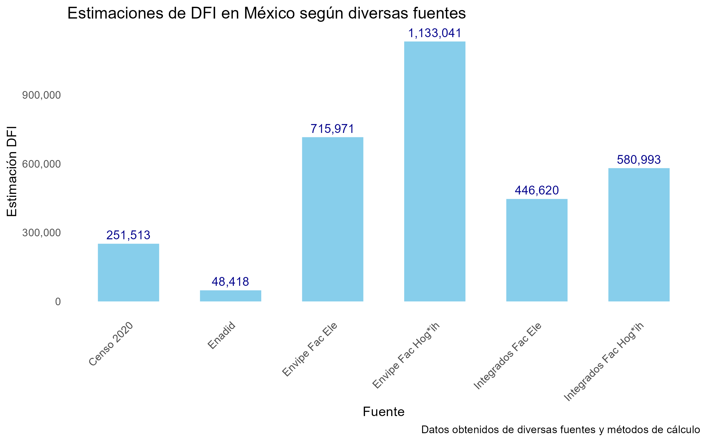
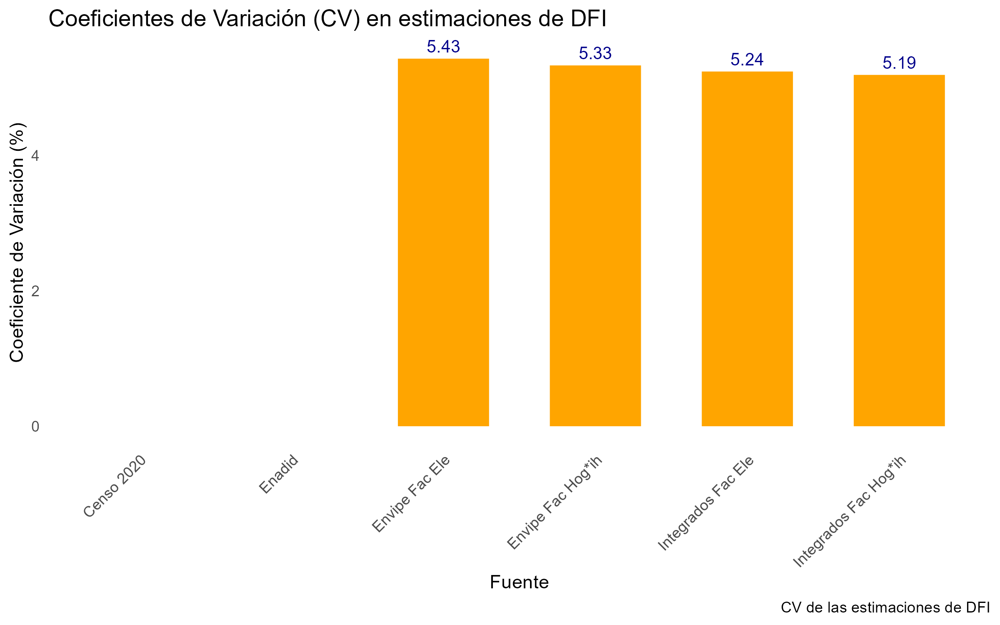
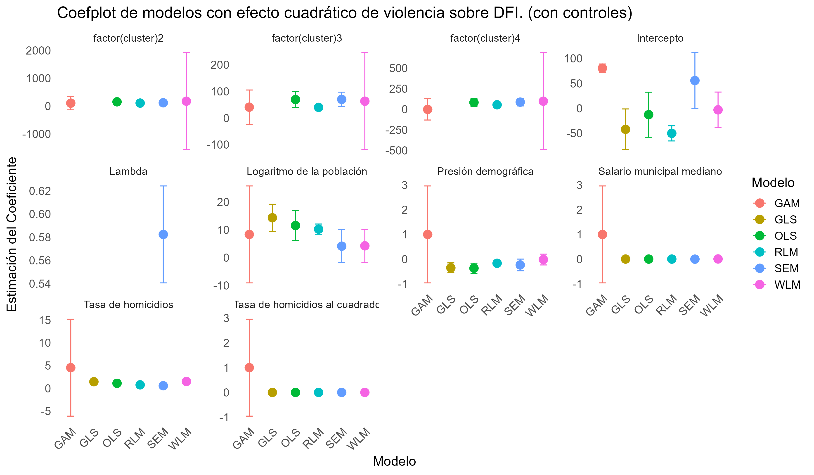
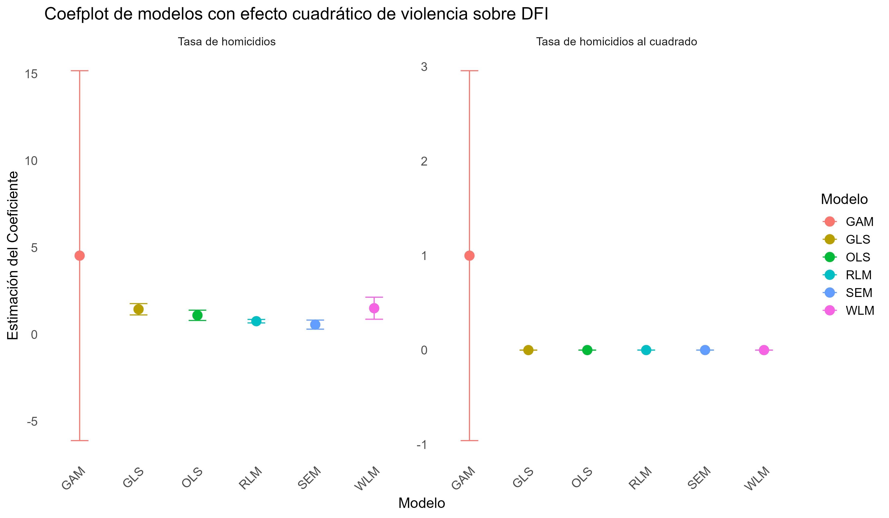
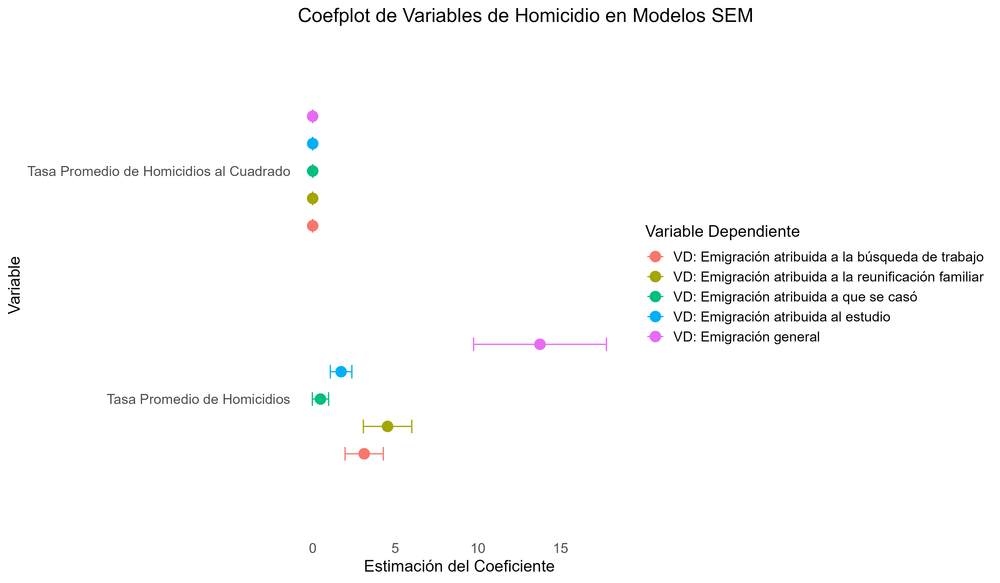
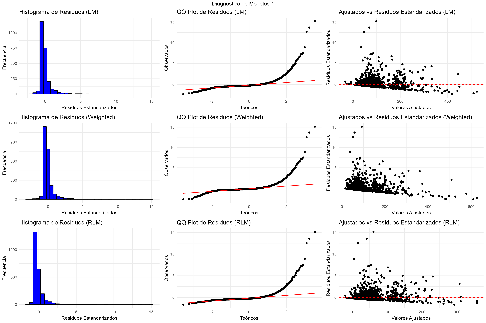
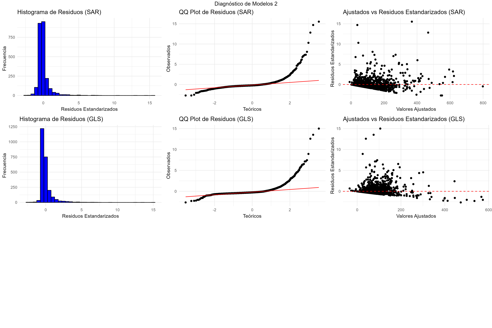
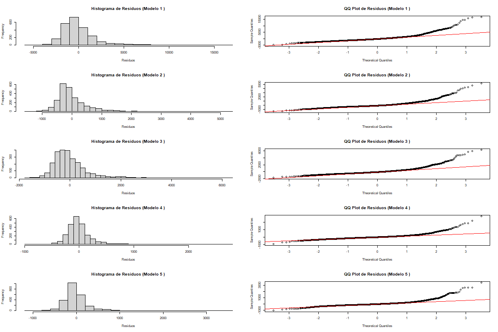

<style type="text/css">
.navbar {
  background-color: #0077C8 !important; /* Cambia este valor para ajustar el color del cintillo */
  border-color: #0077C8 !important; /* Opcional: cambia también el color del borde si es necesario */
}


TOC {
  color: #0077C8; 
}

.list-group-item.active, .list-group-item.active:focus, .list-group-item.active:hover {
    z-index: 2;
    color: #003057;
    background-color: #0077C8;
    border-color: #0077C8;
}

hr.cintillo {
  border: 3px solid #0077C8; /* Color y grosor del cintillo */
  margin: 20px 0; /* Espaciado arriba y abajo del cintillo */
}
</style>

<div style="color: #003057;">

```{r setup, include=FALSE}
knitr::opts_chunk$set(message=FALSE,warning=FALSE, cache=TRUE)
library(kableExtra)
library(dplyr)
```
<hr style="border: 3px solid#0077C8;" />

# 1. Principales resultados de la integración de datos de ENADID 2018 y ENVIPE 2018


Tras integrar y calibrar los datos de la ENVIPE 2018 y ENADID 2018, utilizando dos factores de expansión base solo para los datos de la ENVIPE 2018, los resultados obtenidos se compararon con las estimaciones basadas en la ENVIPE 2018 y ENADID 2018 sin ningún proceso de integración o calibración, y con los datos del Censo 2020. La cifra de DFI resultante de la integración y calibración asciende a 580,993 personas, casi el doble de la cifra del Censo 2020.
La Figura 5 y la Tabla 5 presentan estadísticas descriptivas de las estimaciones de personas en situación de DFI y sus coeficientes de variación (CV) a nivel nacional. Los CV obtenidos a partir de los datos integrados son menores que los de la ENVIPE 2018 y ENADID 2018 por separado, indicando una mayor precisión en las estimaciones al utilizar el método de cálculo del INEGI, que multiplica el factor de expansión para hogares por el número de integrantes del hogar.

<br><br>
<br><br>
<div style="text-align: center;">
  <p><strong>Figura 1. "Estimaciones de DFI en México según diversas fuentes integradas y no integradas",</strong></p>
   
  
</div>

  
<br><br>
<hr style="border: 3px solid#0077C8;" />


<br><br>
<br><br>
<div style="text-align: center;">
  <p><strong>Figura 2. "Estimaciones de DFI en México según diversas fuentes integradas y no integradas",</strong></p>
   
  
</div>

  
<br><br>
<hr style="border: 3px solid#0077C8;" />


# 2. Principales resultados de los modelos


Se encontró una relación no lineal entre la tasa promedio de homicidios y la tasa de personas que declararon haber migrado a causa de la violencia, sugiriendo un punto de inflexión a medida que la tasa aumenta. Esto sugiere que políticas de seguridad enfocadas en reducir los homicidios podrían tener efectos distintos en diferentes contextos.

La influencia positiva consistente de la población sugiere que el tamaño de la comunidad es un factor determinante en los resultados. Por otro lado, la variabilidad en el intercepto indica que factores no observados o específicos de cada modelo pueden jugar un papel importante en la explicación de la variación residual.

La inclusión de Lambda en el modelo SEM resalta la importancia de considerar la estructura espacial de los datos. Esto tiene implicaciones importantes para la interpretación de los resultados y sugiere que modelos que no capturan esta dependencia pueden generar estimaciones sesgadas.


<br><br>
<br><br>
<div style="text-align: center;">
  <p><strong>Figura 3. "Resultados del efecto no lineal de la violencia sobre el DFI, a partir de distintos modelos de regresión (con variables de control)",</strong></p>
   
  
</div>

  
<br><br>
<hr style="border: 3px solid#0077C8;" />


```{r, echo=FALSE}

# Crear el dataframe con los datos
tabla_efecto_cuadratico <- data.frame(
  Variable = c("(Intercepto)", "tasa_promedio_hom", "tasa_prom_cuadrado", 
               "salario_mun_mediano", "presion_demo", "ln_pob", 
               "factor(cluster)2", "factor(cluster)3", "factor(cluster)4", "lambda", "aic", "bic", 
               "bp_stat", "bp_pvalue", "jb_stat", "jb_pvalue", "moran_i", "moran_p", "indice de condicion"),
  `Modelo Lineal (OLS)` = c("-12.80041 [23.05144]", "1.09896*** [0.15108]", "-0.00051*** [0.00008]", 
                            "0.0034. [0.0019]", "-0.36665*** [0.10476]", "11.52312*** [2.77471]", 
                            "152.27207** [48.08874]", "68.99103*** [15.56738]", "82.98724** [26.14819]", "NA", 
                            "31698.83803", "31756.90092", "14.21724308", "0.076275852", "367775.2295", "0", "NA", "NA", "21.77"),
  `Modelo Lineal Robusto (RLM)` = c("-50.22812*** [7.77789]", "0.76124*** [0.05098]", "-0.00035*** [0.00003]", 
                                    "0.00352*** [0.00064]", "-0.16677*** [0.03535]", "10.23642*** [0.93623]", 
                                    "106.4918*** [16.22583]", "39.84091*** [5.25266]", "54.70832*** [8.82277]", "NA", 
                                    "31828.04858", "31886.11147", "14.21724308", "0.076275852", "359061.7597", "0", "NA", "NA", "21.77"),
  `Modelo Lineal Ponderado (WLM)` = c("-3.09726 [18.20422]", "1.50851*** [0.32374]", "-0.0007*** [0.00016]", 
                                      "0.008*** [0.00179]", "-0.01534 [0.11152]", "4.24538 [3.00555]", 
                                      "174.73194 [889.2882]", "62.91522 [92.7205]", "98.22413 [300.39051]", "NA", 
                                      "34665.08692", "34723.14982", "0.013807732", "1", "355806.6715", "0", "NA", "NA", "21.77"),
  `Modelo de Errores Espaciales (SEM)` = c("55.66853. [28.46245]", "0.56376*** [0.13328]", "-0.00027*** [0.00007]", 
                                           "0.00109 [0.00229]", "-0.23352. [0.12074]", "4.12048 [3.03994]", 
                                           "117.50333** [43.29778]", "69.69731*** [13.86591]", "86.99591*** [23.61548]", "0.58241*** [0.02134]", 
                                           "31150.77524", "31214.64442", "7.1917", "0.5161", "493931", "0", "-0.010337535", "0.799148798", "21.77"),
  `Mínimos Cuadrados Generalizados (GLS)` = c("-42.12217* [20.82881]", "1.44722*** [0.1661]", "-0.00068*** [0.00008]", 
                                              "0.004* [0.00186]", "-0.34873*** [0.10103]", "14.31234*** [2.47511]", 
                                              "NA", "NA", "NA", "NA", 
                                              "31682.4174", "31740.45583", "1.7036", "0.9888", "340855.8264", "0", "NA", "NA", "21.77"),
  `Modelo Aditivo Generalizado (GAM)` = c("80.507*** [4.254]", "4.5336*** [5.43214]", "0.99853** [0.99846]", 
                                          "1* [1]", "1** [1]", "8.33468*** [8.88202]", 
                                          "104.381 [123.148]", "40.533 [32.806]", "-1.525 [65.761]", "NA", 
                                          "31621.99198", "31743.15075", "14.21724308", "0.076275852", "376380.7126", "0", "NA", "NA", "21.77")
)

# Crear la tabla con kableExtra
tabla_efecto_cuadratico %>%
  kbl(caption = "Tabla 8. Efecto cuadrático de la violencia en el DFI en México", 
      booktabs = TRUE, 
      linesep = "") %>%
  kable_styling(full_width = FALSE, font_size = 12) %>%
  column_spec(1, bold = TRUE) %>%
  add_header_above(c(" " = 1, "Modelos" = 6)) %>%
  kable_styling(bootstrap_options = c("striped", "hover", "condensed", "responsive")) %>%
  footnote(general = "Errores estándar entre paréntesis. Significancia estadística: *p < 0.1, **p < 0.05, ***p < 0.01")

```


<br><br>
<br><br>
<div style="text-align: center;">
  <p><strong>Figura 4. "Resultados del efecto no lineal de la violencia sobre el DFI, a partir de distintos modelos de regresión",</strong></p>
   
  
</div>

  
<br><br>
<hr style="border: 3px solid#0077C8;" />

<br><br>
<br><br>
<div style="text-align: center;">
  <p><strong>Figura 5. "Efecto de la violencia sobre emigraciones atribuidas a causas distintas a la violencia",</strong></p>
   
  
</div>

  
<br><br>
<hr style="border: 3px solid#0077C8;" />
<br><br>
<br><br>

# 3. Diagnóstico de los modelos no lineales

<br><br>
<div style="text-align: center;">
  <p><strong>Figura 6. "Diagnóstico visual de modelos no lineales de DFI",</strong></p>
   
  
</div>

<br><br>  
<br><br>
<div style="text-align: center;">
  <p><strong>Figura 7. "Diagnóstico visual de modelos no lineales de DFI (continuación)",</strong></p>
  
  

</div>

<br><br>
<div style="text-align: center;">
  <p><strong>Figura 8. "Diagnóstico visual de modelos no lineales de emigraciones na atribuidas a la violencia",</strong></p>
   
  
  
</div>

  
<br><br>
<hr style="border: 3px solid#0077C8;" />

# 4. Resumen de resultados y futuras consideraciones 

<iframe src="resultados.html" style="width: 800px; height: 600px; border: none;"></iframe>

<br><br>
<hr style="border: 3px solid#0077C8;" />


# 5. Recomendaciones


<iframe src="recomendaciones_finales.html" style="width: 800px; height: 600px; border: none;"></iframe>

<br><br>
<hr style="border: 3px solid#0077C8;" />
